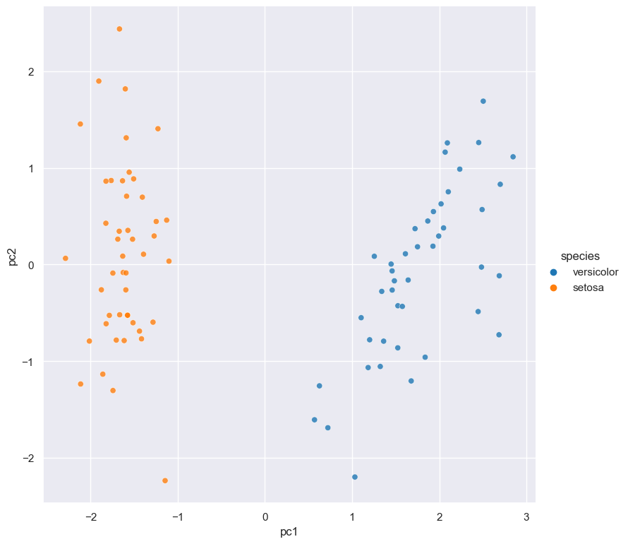

<p align="center">
  
</p>

# Hatch: a command line data analytics and plotting tool 

Hatch is a command line tool for analysing and visualising tabular data in CSV or TSV format.

At its core, Hatch provides a suite of commands, each of which carries out a common data analytics or plotting task.
Additionally, Hatch allows commands to be chained together into flexible analysis pipelines.

It is designed to be fast and convenient, and is particularly suited to data exploration tasks. Input files with large numbers of rows (> millions) are readily supported.

Hatch commands are highly customisable, however sensible defaults are applied. Therefore simple tasks are easy to express
and complex tasks are possible.

Hatch is implemented in [Python](http://www.python.org/) and makes extensive use of the [Pandas](https://pandas.pydata.org/), [Seaborn](https://seaborn.pydata.org/), and [Scikit-learn](https://scikit-learn.org/) libraries for data processing and plot generation.

# Documentation

Please consult the [Hatch Documentation](https://bjpop.github.io/hatch/index.html) for detailed information about installation and usage.

# Examples

### Simple example

Box plot of `sepal_length` for each species in the classic [iris dataset](https://github.com/mwaskom/seaborn-data/blob/master/iris.csv/):

```bash
cat iris.csv | hatch box -x species -y sepal_length
```

<p align="center">
  
</p>

### Advanved example 

The following example illustrates Hatch's ability to chain commands together:

```bash
cat iris.csv | hatch filter 'species != "virginica"' + \
                     sample 0.9 + \
                     pca + \
                     scatter -x pc1 -y pc2 --hue species
```

<p align="center">
  
</p>

In this example there are 4 commands that are executed in the following order:

1. The ``filter`` command selects all rows where ``species`` is not equal to ``virginica``.
2. The filtered rows are then passed to the ``sample`` command which randomly selects 90% of the remaining rows.
3. The sampled rows are then passed to the ``pca`` command which performs principal component analysis (PCA) as a data reduction step, yielding two extra columns in the data called ``pc1`` and ``pc2``.
4. Finally the pca-transformed data is passed to the `scatter` command which generates a scatter plot of ``pc1`` and ``pc2`` (the first two principal components).

# Licence

This program is released as open source software under the terms of [MIT License](https://raw.githubusercontent.com/bjpop/hatch/master/LICENSE).


# Authors

 * [Bernie Pope](http://www.berniepope.id.au/)
