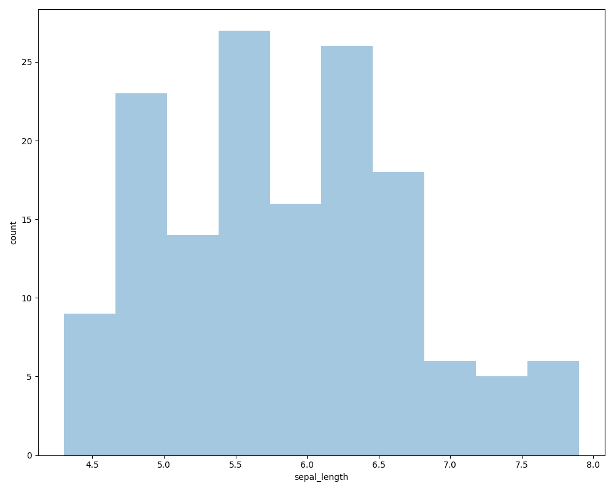
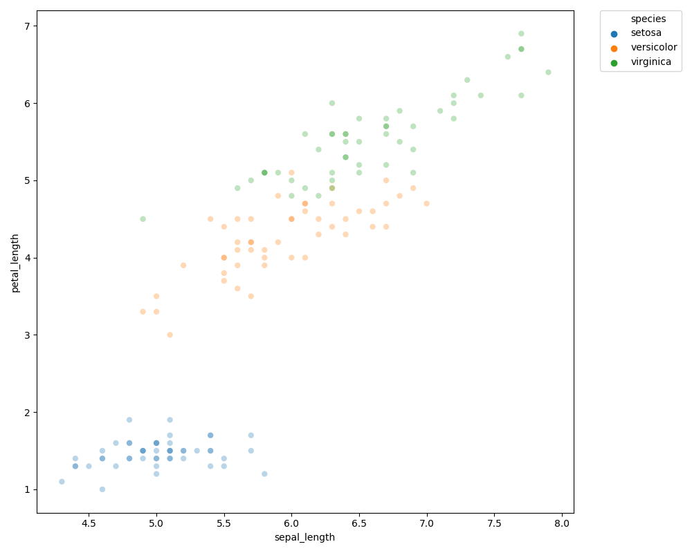
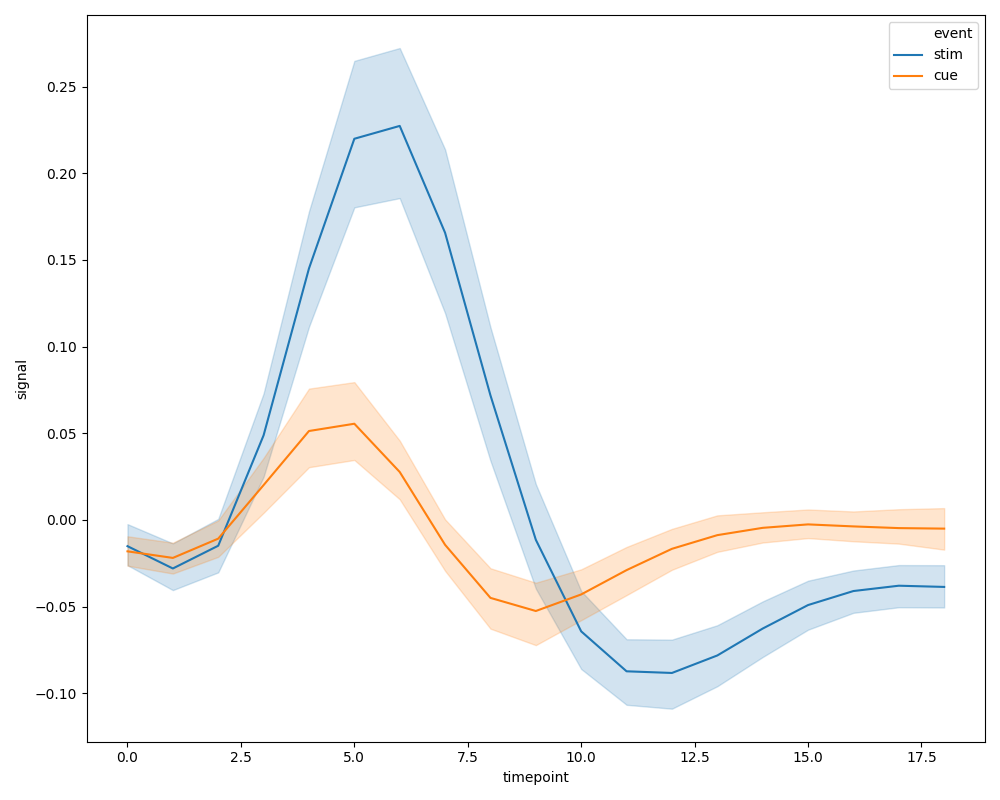
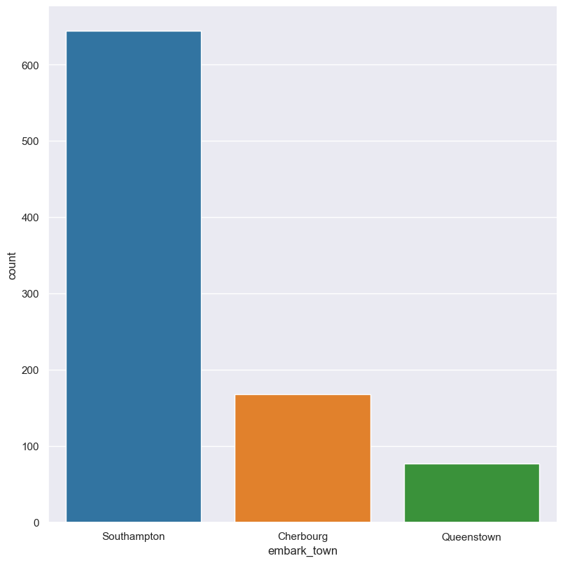
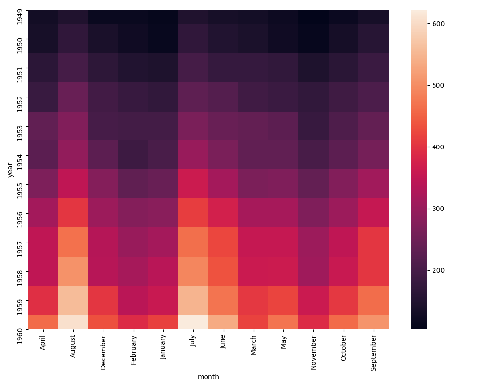
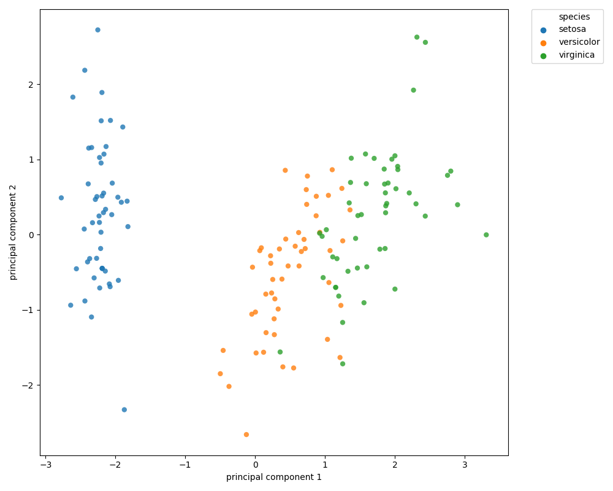

[](https://travis-ci.org/bjpop/hatch)

# Overview 

This program plots tabular data from input CSV (or TSV) files. Output plots are in PNG format. 

Hatch supports the following plot types:
 * Histograms (regular and cumulative)
 * Distributions (box, violin, strip, swarm and boxen)
 * Scatter plots
 * Line plots
 * Heatmaps
 * Counts (bar plots)
 * Principal components analysis (PCA)

It also supports filtering of rows and dynamic creation of new columns.

Hatch requires Python 3.6 or greater and relies heavily on the following libraries: [NumPy](https://numpy.org/), [SciPy](https://www.scipy.org/), [pandas](https://pandas.pydata.org/), [seaborn](https://seaborn.pydata.org/) (and hence [matplotlib](https://matplotlib.org/)), [scikit-learn](https://scikit-learn.org/).

In the examples below, `$` indicates the command line prompt.

# Licence

This program is released as open source software under the terms of [MIT License](https://raw.githubusercontent.com/bjpop/hatch/master/LICENSE).

# Installing

You can install hatch directly from the source code or build and run it from within Docker container.

## Installing directly from source code

Clone this repository: 
```
$ git clone https://github.com/bjpop/hatch
```

Move into the repository directory:
```
$ cd hatch
```

Python 3 is required for this software.

Base_counter can be installed using `pip` in a variety of ways (`$` indicates the command line prompt):

1. Inside a virtual environment:
```
$ python3 -m venv hatch_dev
$ source hatch_dev/bin/activate
$ pip install -U /path/to/hatch
```
2. Into the global package database for all users:
```
$ pip install -U /path/to/hatch
```
3. Into the user package database (for the current user only):
```
$ pip install -U --user /path/to/hatch
```

## Building the Docker container 

The file `Dockerfile` contains instructions for building a Docker container for hatch.

If you have Docker installed on your computer you can build the container like so:
```
$ docker build -t hatch .
```
See below for information about running hatch within the Docker container.

# General behaviour

Hatch can generate a number of differnt plot types, each of which can be selected on the command line:

```
$ hatch -h
usage: hatch [-h] [-v] {pca,scatter,hist,dist,line,count,heatmap} ...

Generate plots of tabular data

optional arguments:
  -h, --help            show this help message and exit
  -v, --version         show program's version number and exit

Plot type:
  {pca,scatter,hist,dist,line,count,heatmap}
                        sub-command help
    pca                 Principal components analysis
    scatter             Scatter plots of numerical data
    hist                Histograms of numerical data
    dist                Distributions of numerical data
    line                Line plots of numerical data
    count               Counts (bar plots) of categorical data
    heatmap             Heatmap of two categories with numerical values
```

As a simple example, if you want to plot a histogram of the `passengers` column from the file `flights.csv` you can run the following command:

```
hatch hist --columns passengers -- flights.csv 
```

In general, each type of plot accepts optional arguments that control its behaviour. Some of these are common across all plot types, and some are limited to specific plot types.

Help messages for each plot type can be requested with `-h` or `--help` after the plot type. For example, to get specific help about histogram plots, use:

```
hatch hist -h
```

## Input files

Hatch can either read data from a named input file, or if no file is specified, then it will read input from the standard input device (stdin).
The input file type must be either CSV or TSV. By default hatch will assume the data is in CSV format, but you can change the format with the `--filetype` argument, and choose TSV instead.
Hatch requires that the first row of the input file is the column headings.

For example, both of the usages below are valid:

Read from a named input file:
```
hatch count --columns class embark_town -- titanic.csv
```

Read from stdin:
```
hatch count --columns class embark_town < titanic.csv
```

Reading from stdin is particularly useful for pipeline commands:

```
some_command | hatch ...
```

When reading input from a named file hatch will use the stem of the input filename as the first part of the output file name. For example, if the input filename is called `titanic.csv` then then output filename will start with `titanic`. However, this behaviour can be overridden using the `--name` command line argument, where an alternative output filename prefix can be specified. When input is read from stdin hatch will choose `plot` to be the first part of the output file name, unless an alternative is specified by `--name`.

## Output files

Hatch produces PNG (graphics) files as its output. A single plot command may produce one or more such files, depending on how hatch is used. By default hatch names the output files based on the following information:
 * The prefix of the input data file name (this can be overridden).
 * The name(s) of the columns that have been selected for plotting.
 * Optionally the names of columns that have been selected for grouping or colouring.
 * The type of plot being produced.

For example, the following command:

```
hatch dist --columns sepal_length --group species -- iris.csv
```
produces an output file called `iris.sepal_length.species.box.png` by default, because:
 * `iris` is the prefix of the name of the input file `iris.csv`
 * `sepal_length` is the column that has been selected for plotting
 * `species` is the column that has been selected for grouping
 * `box` is the type of plot

If the input data is read from the standard input (stdin) instead of a named file, then the prefix of the output defaults to `plot`. For example, the following command:

```
hatch dist --columns sepal_length --group species < iris.csv
```
produces an output file called `plot.sepal_length.species.box.png` because the input data is read (redirected) from stdin.

The output prefix can be overridden with the `--prefix` command line option (regardless of whether the input comes from a named file or from stdin). For example:
```
hatch dist --columns sepal_length --group species --prefix flower < iris.csv
```
produces an output file called `flower.sepal_length.species.box.png`.


## Example test data

In the `data` directory in this repository we provide some sample test data for the sake of illustrating the plotting functionality of hatch.

The iris dataset is from the UCI Machine Learning Repository.
The CSV version was obtained from <a href="https://gist.github.com/curran/a08a1080b88344b0c8a7">Iris Data Set</a>, and can be found in the `data/iris.csv` file in this repository.

The flights dataset is from the `seaborn-data` repository that is used in the seaborn Python library documentation. The CSV version was obtaind from <a href="https://github.com/mwaskom/seaborn-data/blob/master/flights.csv">flights data</a>, and can be found in the `data/flights.csv` file in this repository.

The fmri dataset is from the `seaborn-data` repository that is used in the seaborn Python library documentation. The CSV version was obtaind from <a href="https://github.com/mwaskom/seaborn-data/blob/master/fmri.csv">fmri data</a>, and can be found in the `data/fmri.csv` file in this repository.

## Histograms

Plot distributions of selected columns as histograms.

### Simple example:
```
hatch hist --columns age -- titanic.csv
```

### Key options 
```
  --columns FEATURE [FEATURE ...]
                        Columns to plot
  --logy                Use a log scale on the veritical (Y) axis
  --xlim LOW HIGH LOW HIGH
                        Limit horizontal axis range to [LOW,HIGH]
  --ylim LOW HIGH LOW HIGH
                        Limit vertical axis range to [LOW,HIGH]
  --bins NUMBINS        Number of bins for histogram. Default: 100
  --cumulative          Generate cumulative histogram
```

### Full options 
```
$ hatch hist -h
usage: hatch hist [-h] [--outdir DIR] [--filetype FILETYPE] [--prefix NAME] [--logfile LOG_FILE] [--nolegend] [--filter EXPR] [--eval EXPR [EXPR ...]] [--navalues STR]
                  [--title STR] [--width SIZE] [--height SIZE] [--xlabel STR] [--ylabel STR] [--noxticklabels] [--noyticklabels] --columns FEATURE [FEATURE ...] [--logy]
                  [--xlim LOW HIGH LOW HIGH] [--ylim LOW HIGH LOW HIGH] [--bins NUMBINS] [--cumulative]
                  [DATA]

positional arguments:
  DATA                  Filepaths of input CSV/TSV file

optional arguments:
  -h, --help            show this help message and exit
  --outdir DIR          Name of optional output directory.
  --filetype FILETYPE   Type of input file. Allowed values: CSV, TSV. Otherwise inferred from filename extension.
  --prefix NAME         Name prefix for output files
  --logfile LOG_FILE    record program progress in LOG_FILE
  --nolegend            Turn off the legend in the plot
  --filter EXPR         Filter rows: only retain rows that make this expression True
  --eval EXPR [EXPR ...]
                        Construct new columns based on an expression
  --navalues STR        Treat values in this space separated list as NA values. Example: --navalues ". - !"
  --title STR           Plot title. By default no title will be added.
  --width SIZE          Plot width in inches. Default: 10
  --height SIZE         Plot height in inches. Default: 8
  --xlabel STR          Label for horizontal (X) axis
  --ylabel STR          Label for vertical (Y) axis
  --noxticklabels       Turn of horizontal (X) axis tick labels
  --noyticklabels       Turn of veritcal (Y) axis tick labels
  --columns FEATURE [FEATURE ...]
                        Columns to plot
  --logy                Use a log scale on the veritical (Y) axis
  --xlim LOW HIGH LOW HIGH
                        Limit horizontal axis range to [LOW,HIGH]
  --ylim LOW HIGH LOW HIGH
                        Limit vertical axis range to [LOW,HIGH]
  --bins NUMBINS        Number of bins for histogram. Default: 100
  --cumulative          Generate cumulative histogram
```

For example, plot histograms of selected columns of the example iris.csv dataset using 10 bins. 

```
$ hatch hist --columns sepal_length sepal_width petal_length petal_width --bins 10 -- iris.csv
```

Outputs go to:

```
iris.petal_length.histogram.png
iris.petal_width.histogram.png
iris.sepal_length.histogram.png
iris.sepal_width.histogram.png
```

Below is a histogram plot for sepal length for the iris data set (iris.sepal_length.histogram.png):



## Distributions

```
$ hatch dist -h
usage: hatch dist [-h] [--outdir DIR] [--filetype FILETYPE] [--name NAME]
                  [--logfile LOG_FILE] [--nolegend] [--filter EXPR]
                  [--navalues STR] [--title STR] [--width SIZE]
                  [--height SIZE] [--xlabel STR] [--ylabel STR] --columns
                  FEATURE [FEATURE ...] [--logy] [--ylim LOW HIGH LOW HIGH]
                  --group FEATURE [FEATURE ...] [--type {box,violin}]
                  [DATA]

positional arguments:
  DATA                  Filepaths of input CSV/TSV file

optional arguments:
  -h, --help            show this help message and exit
  --outdir DIR          Name of optional output directory.
  --filetype FILETYPE   Type of input file. Allowed values: CSV, TSV. Default:
                        CSV.
  --name NAME           Name prefix for output files
  --logfile LOG_FILE    record program progress in LOG_FILE
  --nolegend            Turn off the legend in the plot
  --filter EXPR         Filter rows: only retain rows that make this
                        expression True
  --navalues STR        Treat values in this space separated list as NA
                        values. Example: --navalues ". - !"
  --title STR           Plot title. By default no title will be added.
  --width SIZE          Plot width in inches. Default: 10
  --height SIZE         Plot height in inches. Default: 8
  --xlabel STR          Label for horizontal (X) axis
  --ylabel STR          Label for vertical (Y) axis
  --columns FEATURE [FEATURE ...]
                        Columns to plot
  --logy                Use a log scale on the veritical (Y) axis
  --ylim LOW HIGH LOW HIGH
                        Limit vertical axis range to [LOW,HIGH]
  --group FEATURE [FEATURE ...]
                        Plot distributions of of the columns where data are
                        grouped by these features
  --type {box,violin}   Type of plot. Default: box
```

For example, plot distributions of selected columns, grouped by their species, using violin plots:

```
hatch dist --columns sepal_length sepal_width petal_length petal_width --group species --type violin -- iris.csv
```

Outputs go to:

```
iris.petal_length.species.dist.png
iris.petal_width.species.dist.png
iris.sepal_length.species.dist.png
iris.sepal_width.species.dist.png
```

Below is a distribution plot for sepal length grouped by species for the iris data set (iris.sepal_length.species.dist.png):


## Scatter plots

```
$ hatch scatter -h
usage: hatch scatter [-h] [--outdir DIR] [--filetype FILETYPE] [--name NAME]
                     [--logfile LOG_FILE] [--nolegend] [--filter EXPR]
                     [--navalues STR] [--title STR] [--width SIZE]
                     [--height SIZE] [--xlabel STR] [--ylabel STR] --xy X,Y
                     [X,Y ...] [--logx] [--logy] [--xlim LOW HIGH LOW HIGH]
                     [--ylim LOW HIGH LOW HIGH] [--hue FEATURE]
                     [--dotsize FEATURE] [--dotalpha ALPHA]
                     [--dotlinewidth WIDTH]
                     [DATA]

positional arguments:
  DATA                  Filepaths of input CSV/TSV file

optional arguments:
  -h, --help            show this help message and exit
  --outdir DIR          Name of optional output directory.
  --filetype FILETYPE   Type of input file. Allowed values: CSV, TSV. Default:
                        CSV.
  --name NAME           Name prefix for output files
  --logfile LOG_FILE    record program progress in LOG_FILE
  --nolegend            Turn off the legend in the plot
  --filter EXPR         Filter rows: only retain rows that make this
                        expression True
  --navalues STR        Treat values in this space separated list as NA
                        values. Example: --navalues ". - !"
  --title STR           Plot title. By default no title will be added.
  --width SIZE          Plot width in inches. Default: 10
  --height SIZE         Plot height in inches. Default: 8
  --xlabel STR          Label for horizontal (X) axis
  --ylabel STR          Label for vertical (Y) axis
  --xy X,Y [X,Y ...]    Pairs of features to plot, format: name1,name2
  --logx                Use a log scale on the horizontal (X) axis
  --logy                Use a log scale on the veritical (Y) axis
  --xlim LOW HIGH LOW HIGH
                        Limit horizontal axis range to [LOW,HIGH]
  --ylim LOW HIGH LOW HIGH
                        Limit vertical axis range to [LOW,HIGH]
  --hue FEATURE         Name of feature (column headings) to use for colouring
                        the plotted data
  --dotsize FEATURE     Name of feature (column headings) to use for plotted
                        point size
  --dotalpha ALPHA      Alpha value for plotted points. Default: 0.5
  --dotlinewidth WIDTH  Line width value for plotted points. Default: 0
```

For example, scatter plots of "sepal_length verus sepal_width", "petal_length versus petal_width" and "sepal_length versus petal_length" with hue indicating species:
```
hatch scatter --xy sepal_length,sepal_width petal_length,petal_width sepal_length,petal_length --hue species -- iris.csv 
```

Outputs go to:
```
iris.petal_length.petal_width.scatter.png
iris.sepal_length.petal_length.scatter.png
iris.sepal_length.sepal_width.scatter.png
```

Below is the scatter plot for sepal length versus petal length with hue determined by species for the iris data set (iris.sepal_length.petal_length.scatter.png):



## Line plots

```
$ hatch line -h
usage: hatch line [-h] [--outdir DIR] [--filetype FILETYPE] [--name NAME]
                  [--logfile LOG_FILE] [--nolegend] [--filter EXPR]
                  [--navalues STR] [--title STR] [--width SIZE]
                  [--height SIZE] [--xlabel STR] [--ylabel STR] --xy X,Y
                  [X,Y ...] [--logy] [--xlim LOW HIGH LOW HIGH]
                  [--ylim LOW HIGH LOW HIGH] [--overlay] [--hue FEATURE]
                  [DATA]

positional arguments:
  DATA                  Filepaths of input CSV/TSV file

optional arguments:
  -h, --help            show this help message and exit
  --outdir DIR          Name of optional output directory.
  --filetype FILETYPE   Type of input file. Allowed values: CSV, TSV. Default:
                        CSV.
  --name NAME           Name prefix for output files
  --logfile LOG_FILE    record program progress in LOG_FILE
  --nolegend            Turn off the legend in the plot
  --filter EXPR         Filter rows: only retain rows that make this
                        expression True
  --navalues STR        Treat values in this space separated list as NA
                        values. Example: --navalues ". - !"
  --title STR           Plot title. By default no title will be added.
  --width SIZE          Plot width in inches. Default: 10
  --height SIZE         Plot height in inches. Default: 8
  --xlabel STR          Label for horizontal (X) axis
  --ylabel STR          Label for vertical (Y) axis
  --xy X,Y [X,Y ...]    Pairs of features to plot, format: name1,name2
  --logy                Use a log scale on the veritical (Y) axis
  --xlim LOW HIGH LOW HIGH
                        Limit horizontal axis range to [LOW,HIGH]
  --ylim LOW HIGH LOW HIGH
                        Limit vertical axis range to [LOW,HIGH]
  --overlay             Overlay line plots on the same axes, otherwise make a
                        separate plot for each
  --hue FEATURE         Name of feature (column headings) to group data for
                        line plot
```

For example, a line plot for the fmri dataset showing the relationship between timepoint and signal with separate lines for the event column: 
```
hatch hatch line --xy timepoint,signal --hue event -- fmri.csv 
```

Outputs go to:
```
fmri.timepoint.signal.line.png
```

Below is the line plot for timepoint versus signal grouped by the even column (fmri.timepoint.signal.line.png):



## Counts (bar plots) 

```
$ hatch count -h
usage: hatch count [-h] [--outdir DIR] [--filetype FILETYPE] [--name NAME]
                   [--logfile LOG_FILE] [--nolegend] [--filter EXPR]
                   [--navalues STR] [--title STR] [--width SIZE]
                   [--height SIZE] [--xlabel STR] [--ylabel STR] --columns
                   FEATURE [FEATURE ...] [--logy] [--hue FEATURE]
                   [DATA]

positional arguments:
  DATA                  Filepaths of input CSV/TSV file

optional arguments:
  -h, --help            show this help message and exit
  --outdir DIR          Name of optional output directory.
  --filetype FILETYPE   Type of input file. Allowed values: CSV, TSV. Default:
                        CSV.
  --name NAME           Name prefix for output files
  --logfile LOG_FILE    record program progress in LOG_FILE
  --nolegend            Turn off the legend in the plot
  --filter EXPR         Filter rows: only retain rows that make this
                        expression True
  --navalues STR        Treat values in this space separated list as NA
                        values. Example: --navalues ". - !"
  --title STR           Plot title. By default no title will be added.
  --width SIZE          Plot width in inches. Default: 10
  --height SIZE         Plot height in inches. Default: 8
  --xlabel STR          Label for horizontal (X) axis
  --ylabel STR          Label for vertical (Y) axis
  --columns FEATURE [FEATURE ...]
                        Columns to plot
  --logy                Use a log scale on the veritical (Y) axis
  --hue FEATURE         Name of feature (column headings) to group data for
                        count plot
```

For example, a bar plot for the titanic dataset showing the counts of values in the categorical columns `class` and `embark_town` 
```
hatch count --columns class embark_town -- titanic.csv
```

Outputs go to:
```
titanic.class.count.png
titanic.embark_town.count.png
```
Below is the bar plot for the `embark_town` column in the titanic dataset: 



## Heatmaps

```
$ hatch heatmap -h
usage: hatch heatmap [-h] [--outdir DIR] [--filetype FILETYPE] [--name NAME]
                     [--logfile LOG_FILE] [--nolegend] [--filter EXPR]
                     [--navalues STR] [--title STR] [--width SIZE]
                     [--height SIZE] [--xlabel STR] [--ylabel STR]
                     [--cmap COLOR_MAP_NAME] --rows FEATURE --columns FEATURE
                     --values FEATURE [--log]
                     [DATA]

positional arguments:
  DATA                  Filepaths of input CSV/TSV file

optional arguments:
  -h, --help            show this help message and exit
  --outdir DIR          Name of optional output directory.
  --filetype FILETYPE   Type of input file. Allowed values: CSV, TSV. Default:
                        CSV.
  --name NAME           Name prefix for output files
  --logfile LOG_FILE    record program progress in LOG_FILE
  --nolegend            Turn off the legend in the plot
  --filter EXPR         Filter rows: only retain rows that make this
                        expression True
  --navalues STR        Treat values in this space separated list as NA
                        values. Example: --navalues ". - !"
  --title STR           Plot title. By default no title will be added.
  --width SIZE          Plot width in inches. Default: 10
  --height SIZE         Plot height in inches. Default: 8
  --xlabel STR          Label for horizontal (X) axis
  --ylabel STR          Label for vertical (Y) axis
  --cmap COLOR_MAP_NAME
                        Use this color map, will use Seaborn default if not
                        specified
  --rows FEATURE        Interpret this feature (column of data) as the rows of
                        the heatmap
  --columns FEATURE     Interpret this feature (column of data) as the columns
                        of the heatmap
  --values FEATURE      Interpret this feature (column of data) as the values
                        of the heatmap
  --log                 Use a log scale on the numerical data
```

For example, 
```
hatch heatmap --rows year --columns month --values passengers -- flights.csv
```

Output will go to:
```
flights.year.month.passengers.heatmap.png
```

Below is a heatmap for the flights datset (flights.year.month.passengers.heatmap.png):



## Principal components analysis (PCA)

```
$ hatch pca -h
usage: hatch pca [-h] [--outdir DIR] [--filetype FILETYPE] [--name NAME]
                 [--logfile LOG_FILE] [--nolegend] [--filter EXPR]
                 [--navalues STR] [--title STR] [--width SIZE] [--height SIZE]
                 [--xlabel STR] [--ylabel STR] --columns FEATURE [FEATURE ...]
                 [--xlim LOW HIGH LOW HIGH] [--ylim LOW HIGH LOW HIGH]
                 [--hue FEATURE] [--dotsize FEATURE] [--dotalpha ALPHA]
                 [--dotlinewidth WIDTH] [--missing STRATEGY]
                 [DATA]

positional arguments:
  DATA                  Filepaths of input CSV/TSV file

optional arguments:
  -h, --help            show this help message and exit
  --outdir DIR          Name of optional output directory.
  --filetype FILETYPE   Type of input file. Allowed values: CSV, TSV. Default:
                        CSV.
  --name NAME           Name prefix for output files
  --logfile LOG_FILE    record program progress in LOG_FILE
  --nolegend            Turn off the legend in the plot
  --filter EXPR         Filter rows: only retain rows that make this
                        expression True
  --navalues STR        Treat values in this space separated list as NA
                        values. Example: --navalues ". - !"
  --title STR           Plot title. By default no title will be added.
  --width SIZE          Plot width in inches. Default: 10
  --height SIZE         Plot height in inches. Default: 8
  --xlabel STR          Label for horizontal (X) axis
  --ylabel STR          Label for vertical (Y) axis
  --columns FEATURE [FEATURE ...]
                        Columns to plot
  --xlim LOW HIGH LOW HIGH
                        Limit horizontal axis range to [LOW,HIGH]
  --ylim LOW HIGH LOW HIGH
                        Limit vertical axis range to [LOW,HIGH]
  --hue FEATURE         Name of feature (column headings) to use for colouring
                        the plotted data
  --dotsize FEATURE     Name of feature (column headings) to use for plotted
                        point size
  --dotalpha ALPHA      Alpha value for plotted points. Default: 0.5
  --dotlinewidth WIDTH  Line width value for plotted points. Default: 0
  --missing STRATEGY    How to deal with rows that contain missing data.
                        Allowed values: drop, imputemean, imputemedian,
                        imputemostfrequent. Default: drop.
```

For example, 
```
hatch pca --columns sepal_length sepal_width petal_length petal_width --hue species --dotalpha 0.8 iris.csv
```

Output will go to:
```
iris.pca.png
```

Below is a PCA plot for the iris datset (iris.pca.png):



# Filtering rows

The `--filter` command line option allows you to select rows to be included in the plot (with unselected rows excluded).
It takes a Python expression as its argument. Any rows that make the expression True are included in the plot, and all other
rows are excluded. The syntax of the expression follows the Pandas style.

Specifically it uses the notation provided by the [pandas.DataFrame.query](https://pandas.pydata.org/pandas-docs/stable/reference/api/pandas.DataFrame.query.html).

In the following command we select only those rows where the value in the `species` column is not equal to `setosa` (that is we exclude all
rows for setosa).

```
hatch scatter --filter 'species != "setosa"' --xy sepal_length,sepal_width --hue species -- iris.csv
```

Note that column names can be written as if they are ordinary variables, such as `species` above. However, if a column name has spaces in it (or other characters not
allowed by Python variables) then it can be surround in back-tick characters, as in:

```
hatch scatter --filter '`species` != "setosa"' --xy sepal_length,sepal_width --hue species -- iris.csv
```

The query syntax also supports complex boolean expressions (essentially anything that can be expressed in Python), for example:

```
hatch count --columns class embark_town --filter 'survived == 0 and sex == "male"' -- titanic.csv 
```

# Creating new columns dynamically

The `--eval` command line option allows you to create new columns dynamically. These new columns can be used subsequently in the plot.

For example, you can create a new column called `petal_area` by multiplying the values in the `petal_length` and `petal_width` columns (row wise). This new column
is added to the data. In the command below the new `petal_area` column is created and then subsquently selected for plotting in the `--columns` option.

```
hatch hist --eval 'petal_area = petal_length * petal_width' --columns petal_area -- iris.csv
```
The output is a file called `iris.petal_area.histogram.png`. 

The `--eval` command line option accepts one or more expressions to evaluate. This allows you to create multiple new columns, and they can refer to each other.
In the contrived example below, two new columns are created. First, `x` is created, being equal to `petal_length + 1` and then `y` is created, being equal to `x * 2`:

```
hatch hist --eval 'x = petal_length + 1' 'y = x * 2' --columns y -- iris.csv
```

# Running within the Docker container

The following section describes how to run hatch within the Docker container. It assumes you have Docker installed on your computer and have built the container as described above. 
The container behaves in the same way as the normal version of hatch, however there are some Docker-specific details that you must be aware of.

The general syntax for running hatch within Docker is as follows:
```
$ docker run -i hatch CMD
```
where CMD should be replaced by the specific command line invocation of hatch. Specific examples are below.

Display the help message:
```
$ docker run -i hatch hatch -h
```
Note: it may seem strange that `hatch` is mentioned twice in the command. The first instance is the name of the Docker container and the second instance is the name of the hatch executable that you want to run inside the container.

Display the version number:
```
$ docker run -i hatch hatch --version
```

Read from a single input FASTA file redirected from standard input:
```
$ docker run -i hatch hatch < file.CSV
```

Read from multuple input FASTA files named on the command line, where all the files are in the same directory. You must replace `DATA` with the absolute file path of the directory containing the FASTA files:  
```
$ docker run -i -v DATA:/in hatch hatch /in/file1.fasta /in/file2.fasta /in/file3.fasta
```
The argument `DATA:/in` maps the directory called DATA on your local machine into the `/in` directory within the Docker container.

Logging progress to a file in the directory OUT: 
```
$ docker run -i -v DATA:/in -v OUT:/out hatch-c hatch --log /out/logfile.txt /in/file1.fasta /in/file2.fasta /in/file3.fasta
```
Replace `OUT` with the absolute path of the directory to write the log file. For example, if you want the log file written to the current working directory, replace `OUT` with `$PWD`.
As above, you will also need to replace `DATA` with the absolite path to the directory containing your input FASTA files.

# Testing

## Unit tests

You can run the unit tests for hatch with the following commands:
```
$ cd hatch/python/hatch
$ python -m unittest -v hatch_test
```

## Test suite


# Bug reporting and feature requests

Please submit bug reports and feature requests to the issue tracker on GitHub:

[hatch issue tracker](https://github.com/bjpop/hatch/issues)
