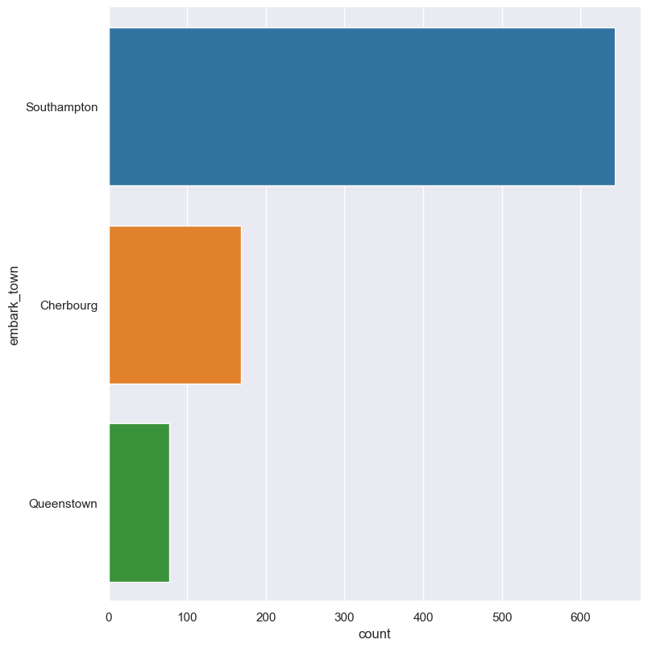
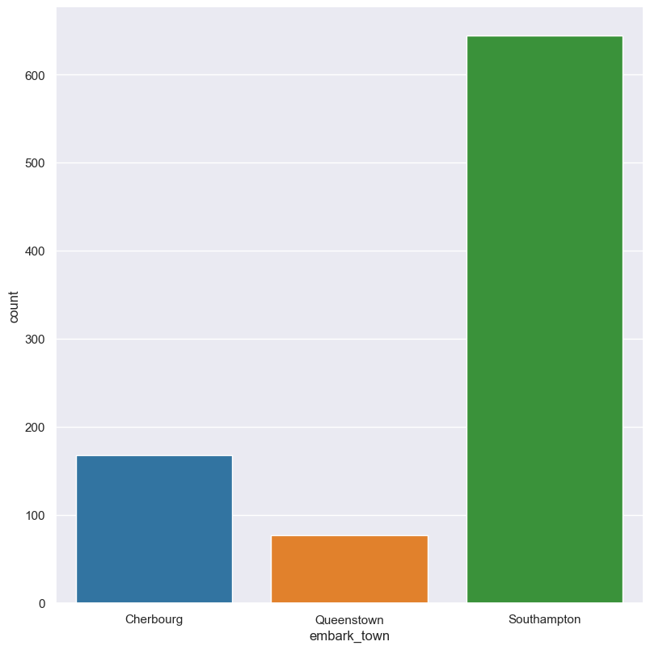
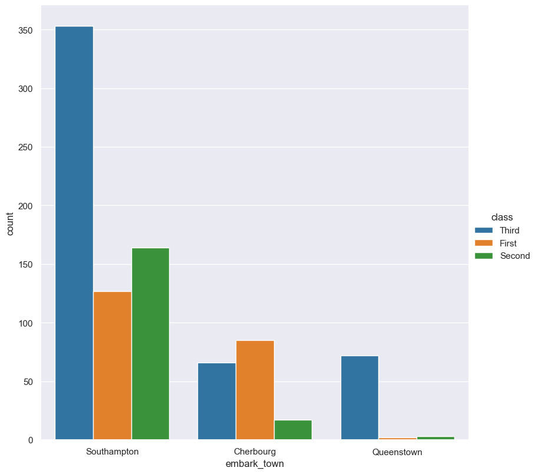
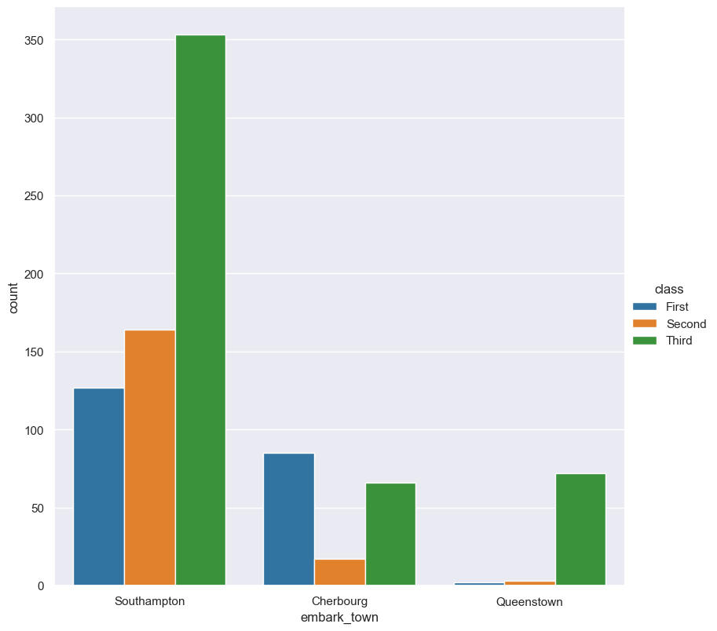

Count 
*****

Count plots show the frequency of values in categorical features using bars.

.. code-block:: bash

    hatch count <arguments> 

Count plots are based on Seaborn's `catplot <https://seaborn.pydata.org/generated/seaborn.catplot.html/>`_ library function, using the ``kind="count"`` option.

.. list-table::
   :widths: 1 2 1
   :header-rows: 1

   * - Argument
     - Description
     - Reference
   * - ``-h``
     - display help 
     - :ref:`count_help`
   * - ``-x FEATURE [FEATURE ...], --xaxis FEATURE [FEATURE ...]``
     - select feature for the X axis 
     - :ref:`count_feature_selection`
   * - ``-y FEATURE [FEATURE ...], --yaxis FEATURE [FEATURE ...]`` 
     - select feature for the Y axis 
     - :ref:`count_feature_selection`
   * - ``--order FEATURE [FEATURE ...]`` 
     - order of the plotted columns  
     - :ref:`count_order`
   * - ``--hue FEATURE [FEATURE ...]`` 
     - group features by hue 
     - :ref:`count_hue`
   * - ``--hueorder FEATURE [FEATURE ...]`` 
     - order of hue features
     - :ref:`Hue order <count_hueorder>`
   * - ``--logx``
     - log scale X axis 
     - :ref:`count_log`
   * - ``--logy``
     - log scale Y axis 
     - :ref:`count_log`
   * - ``--xlim BOUND BOUND``
     - range limit X axis 
     - :ref:`count_range`
   * - ``--ylim BOUND BOUND``
     - range limit Y axis 
     - :ref:`count_range`

Simple example
==============

Plot a count of the ``embark_town`` categorical feature from the ``titanic.csv`` input file:

.. code-block:: bash

    hatch count -x embark_town -- titanic.csv

The output of the above command is written to ``tips.tip.histogram.png``:

.. image:: ../images/titanic.embark_town.count.png
       :width: 600px
       :height: 600px
       :align: center
       :alt: Count plot showing the frequency of the categorical values in the embark_town feature from the titanic.csv file 

.. _count_help:

Getting help
============

The full set of command line arguments for count plots can be obtained with the ``-h`` or ``--help``
arguments:

.. code-block:: bash

    hatch count -h

.. _count_feature_selection:

Selecting features to plot
==========================

.. code-block:: 

  -x FEATURE [FEATURE ...], --xaxis FEATURE [FEATURE ...]
  -y FEATURE [FEATURE ...], --yaxis FEATURE [FEATURE ...]

Count plots can be plotted for categorical features (note if a numerical feature is selected it will be treated as categorical, which may
not give expected behaviour).

You can select the feature that you want to plot as a count using the ``-x`` (``--xargs``) or ``-y`` (``--yargs``)
arguments.

If ``-x`` (``--xargs``) is chosen the count columns will be plotted vertically.

If ``-y`` (``--yargs``) is chosen the count columns will be plotted horizontally.

In both cases you can specify more than one feature to plot; hatch will generate a separate count plot for
every feature specified.

The following command will generate separate histogram plots for ``sex``, ``class`` and ``embark_town``:

.. code-block:: bash

    hatch count -x sex class embark_town -- titanic.csv 

The outputs of the above command will be saved in the following 3 files:

.. code-block:: bash

    titanic.sex.count.png
    titanic.class.count.png
    titanic.embark_town.count.png 

Selecting a feature using the ``-y`` argument causes the count bars to be plotted
horizontally instead of vertically:

.. code-block:: bash

    hatch count -y embark_town -- titanic.csv

You may use both ``-x FEATURE [FEATURE ...]`` and ``-y FEATURE [FEATURE ...]`` in the same command line. 

.. _count_order:

Controlling the order of the plotted columns
============================================

.. code-block:: 

    --order FEATURE [FEATURE ...]

By default the order of the categorical features displayed in the count plot is determined from their occurrence in the input data.
This can be overridden with the ``--order`` argument, which allows you to specify the exact ordering of columns based on their values. 

In the following example the counts of the ``embark_town`` feature are displayed in the order of ``Cherbourg``, ``Queenstown``, ``Southampton``:

.. code-block:: bash

    hatch count -x embark_town --order Cherbourg Queenstown Southampton -- titanic.csv

.. _count_hue:

Grouping features with hue 
==========================

.. code-block:: 

  --hue FEATURE [FEATURE ...]

The feature being counted can be grouped based on another categorical feature using the ``--hue`` argument.

In the following example the counts of the ``embark_town`` feature are grouped by the ``class`` feature from the titanic data set:

.. code-block:: bash

    hatch count -x embark_town --hue class -- titanic.csv  

You can specify more than one feature to group by; hatch will generate a separate count plot for every ``hue`` feature specified.

.. _count_hueorder:

By default the order of the columns within each hue group is determined from their occurrence in the input data. 
This can be overridden with the ``--hueorder`` argument, which allows you to specify the exact ordering of columns within each hue group, based on their values. 

In the following example the ``class`` values are displayed in the order of ``First``, ``Second``, ``Third``: 

.. code-block:: bash

    hatch count -x embark_town --hue class --hueorder First Second Third -- titanic.csv  

.. _count_log:

Log scale of counts
===================

.. code-block:: 

  --logx
  --logy

Count values can be displayed in log (base 10) scale with ``--logx`` and ``--logy``. 

It only makes sense to log-scale the count axis (and not the categorical axis). Therefore, ``--logx`` should be used when categorical features are selected with ``-y``, and
conversely, ``--logy`` should be used when categorical features are selected with ``-x``.

For example, you can display a log scale of counts for the ``embark_town`` feature (when the feature is displayed on the X-axis) like so. Note carefully that the categorical
data is displayed on the X-axis (``-x``), therefore the ``--logy`` argument should be used to log-scale the counts:

.. code-block:: bash

    hatch count -x embark_town --logy -- titanic.csv  

.. _count_range:

Range limits
============

.. code-block:: 

  --xlim LOW HIGH 
  --ylim LOW HIGH

The range of displayed count values can be restricted with ``--xlim`` and ``--ylim``. Each of these flags takes two numerical values as arguments that represent the lower and upper bounds of values to be displayed.

It only makes sense to range-limit the count axis (and not the categorical axis). Therefore, ``--xlim`` should be used when categorical features are selected with ``-y``, and
conversely, ``--ylim`` should be used when categorical features are selected with ``-x``.

For example, you can display range-limited count for the ``embark_town`` feature (when the feature is displayed on the X-axis) like so. Note carefully that the categorical
data is displayed on the X-axis (``-x``), therefore the ``--ylim`` argument should be used to range-limit the counts: 

.. code-block:: bash

    hatch count -x embark_town --ylim 100 300 -- titanic.csv
