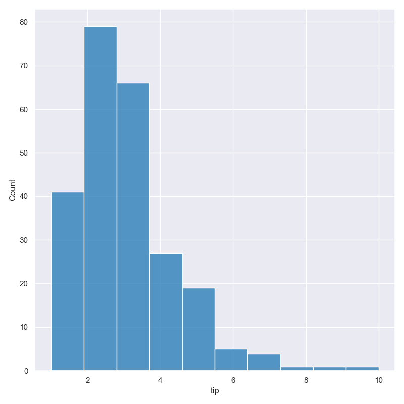

Histogram
*********

Plot distributions of selected numerical or categorical features as histograms.

.. code-block:: bash

    hatch hist <arguments> 

Histograms are based on Seaborn's `histplot <https://seaborn.pydata.org/generated/seaborn.histplot.html/>`_ library function.

.. list-table::
   :widths: 1 2 1
   :header-rows: 1

   * - Argument
     - Description
     - Reference
   * - ``-h``
     - display help 
     - :ref:`hist_help`
   * - ``-x FEATURE, --xaxis FEATURE``
     - select feature for the X axis 
     - :ref:`hist_feature_selection`
   * - ``-y FEATURE, --yaxis FEATURE`` 
     - select feature for the Y axis 
     - :ref:`hist_feature_selection`
   * - ``--bins NUM``
     - number of bins 
     - :ref:`hist_bins`
   * - ``--cumulative``
     - plot a cumulative histogram 
     - :ref:`hist_cumulative`

.. _hist_example:

Simple example
==============

Plot a histogram of the ``tip`` amount from the ``tips.csv`` input file:

.. code-block:: bash

    hatch hist -x tip -- tips.csv

The output of the above command is written to ``tips.tip.histogram.png``:

.. image:: ../images/tips.tip.histogram.png
       :width: 600px
       :height: 600px
       :align: center
       :alt: Histogram plot showing the distribution of tip amounts for the tips data set

.. _hist_help:

Getting help
============

The full set of command line arguments for histograms can be obtained with the ``-h`` or ``--help``
arguments:

.. code-block:: bash

    hatch hist -h

.. _hist_feature_selection:

Selecting features to plot
==========================

.. code-block:: 

  -x FEATURE, --xaxis FEATURE
                        Feature to plot along the X axis
  -y FEATURE, --yaxis FEATURE
                        Feature to plot along the Y axis

Histograms can be plotted for both numerical features and for categorical features. Numerical data is binned
and the histogram shows the counts of data points per bin. Catergorical data is shown as a count plot with a
column for each categorical value in the specified feature.

You can select the feature that you want to plot as a histogram using the ``-x`` (``--xaxis``) or ``-y`` (``--yaxis``)
arguments.

If ``-x`` (``--xaxis``) is chosen the histogram columns will be plotted vertically.

If ``-y`` (``--yaxis``) is chosen the histogram columns will be plotted horizontally.

.. note::

    You may not use both ``-x FEATURE`` and ``-y FEATURE`` in the same command line for histogram plots.

See :ref:`the example <hist_example>` above for a vertical axis plot.
For comparison, the following command uses ``-y tip`` to plot a histogram of ``tip`` horizontally:

.. code-block:: bash

    hatch hist -y tip -- tips.csv

.. _hist_bins:

Controlling the number of bins used
===================================

By default hatch will try to automatically pick an appropriate number of bins for the
selected feature.

However, this can be overridden by specifying the required number of bins to use with the ``--bins`` 
argument like so:

.. code-block:: bash

    hatch hist -x tip --bins 5 -- tips.csv

.. _hist_cumulative:

Cumulative histograms 
=====================

.. code-block:: 

  --cumulative          Generate cumulative histogram

Cumulative histograms can be plotted with the ``--cumulative`` argument.  

.. code-block:: bash

    hatch hist -x tip --cumulative -- tips.csv

.. image:: ../images/tips.tip.histogram.cumulative.png
       :width: 600px
       :height: 600px
       :align: center
       :alt: Histogram plot showing the distribution of tip amounts for the tips data set in cumulative style

