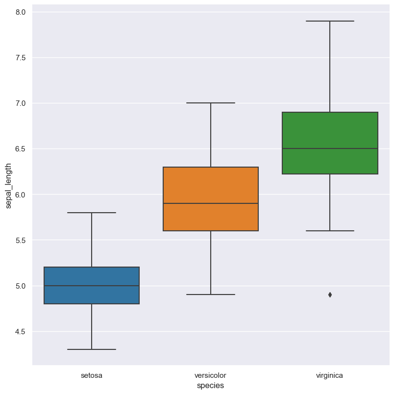

.. hatch documentation master file, created by
   sphinx-quickstart on Wed Oct 14 18:01:41 2020.
   You can adapt this file completely to your liking, but it should at least
   contain the root `toctree` directive.

Hatch: a command line plotting and data analytics tool
******************************************************

Hatch is a command line tool for analysing and visualising data.

It takes input from tabular data in CSV or TSV format and produces high-quality plots (charts, graphs) as output.

It is designed to be fast and convenient, and is particularly suited to data exploration tasks. Input files with large numbers of rows (> millions) are readily supported.

The following plot types are provided:

 * :doc:`Histogram <histogram/>`
 * :doc:`Count <count/>`
 * :doc:`Scatter <scatter/>`
 * Distributions

     * :doc:`Box <violin/>`
     * :doc:`Violin <violin/>`
     * :doc:`Swarm <swarm/>`
     * :doc:`Strip <strip/>`
     * :doc:`Boxen <boxen/>`

 * Central tendency: 

     * :doc:`Point <point/>`
     * :doc:`Bar <bar/>`
    
 * :doc:`Line <line/>`
 * :doc:`Heatmap <heatmap/>`
 * :doc:`Principal components analysis (PCA) <pca/>`

It also supports expressive :doc:`row filtering <filter/>` and :doc:`dynamic computation of new columns <eval/>`.

Hatch is implemented in `Python <http://www.python.org/>`_ and makes extensive use of the `Pandas <https://pandas.pydata.org/>`_, `Seaborn <https://seaborn.pydata.org/>`_, and `Scikit-learn <https://scikit-learn.org/>`_ libraries for data processing and plot generation.

Hatch plots are highly customisable, however for most cases sensible defaults are applied.

Example command 
---------------

The following Hatch command generates a box plot of data from a file called ``iris.csv``, the Y-axis
represents the ``sepal_length`` numerical feature, and the X-axis is grouped by the ``species`` feature.
The goal of this plot is to show the distribution of sepal length of the three different species of iris
flowers contained in the data set.

.. code-block:: bash

   hatch box -x species -y sepal_length iris.csv

The above command generates an output file called ``iris.sepal_length.species.box.png`` that
contains the following box plot:

License
-------

Hatch is open source software and is licensed under the terms of the `MIT license <https://raw.githubusercontent.com/bjpop/hatch/master/LICENSE>`_.

.. toctree::
   :caption: Overview
   :hidden:

   self
   license
   installation 
   example_input_data

.. toctree::
   :caption: General behaviour 
   :hidden:

   command_line_syntax 
   input_output 

.. toctree::
   :caption: Plotting 
   :hidden:

   histogram 
   count
   scatter
   box
   violin
   swarm
   strip
   boxen
   point
   bar
   line
   heatmap
   clustermap
   pca

 
.. toctree::
   :caption: Statistics 
   :hidden:

   info 
   correlation 

.. toctree::
   :hidden:
   :maxdepth: 1
   :caption: Data maniupulation 

   save 
   filter 
   eval 
   sample

.. toctree::
   :hidden:
   :maxdepth: 1
   :caption: Facets 

   facets 

.. toctree::
   :hidden:
   :maxdepth: 1
   :caption: Plot aesthetics 

   aesthetics 

.. toctree::
   :hidden:
   :maxdepth: 1
   :caption: Advanced topics 

   docker

.. toctree::
   :hidden:
   :maxdepth: 1
   :caption: Development

   contributing
   bug_reports
   feature_requests
