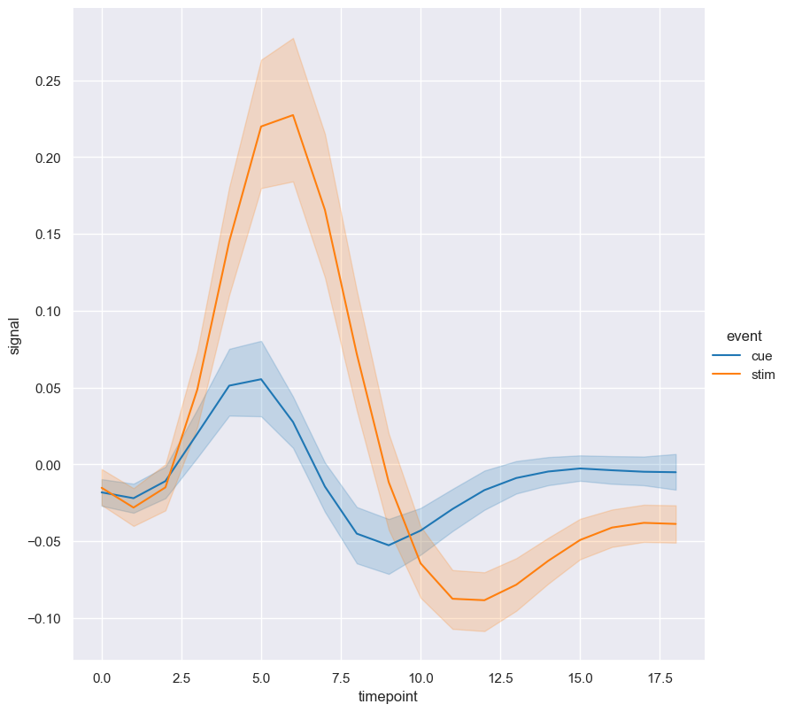

Line
****

Line plots comparing two numerical features, optionally grouped by categorical features.

If multiple Y values are provided for each X value then the plot will show an estimate of the central tendency of X and confidence interval for the estimate.

.. code-block:: bash

    hatch line <arguments>

Line plots are based on Seaborn's `relplot <https://seaborn.pydata.org/generated/seaborn.catplot.html>`_ library function, using the ``kind="line"`` option.

.. list-table::
   :widths: 1 2 1
   :header-rows: 1

   * - Argument
     - Description
     - Reference
   * - ``-h``
     - display help
     - :ref:`line_help`
   * - ``-x FEATURE [FEATURE ...], --xaxis FEATURE [FEATURE ...]``
     - select feature for the X axis
     - :ref:`line_feature_selection`
   * - ``-y FEATURE [FEATURE ...], --yaxis FEATURE [FEATURE ...]``
     - select feature for the Y axis
     - :ref:`line_feature_selection`
   * - ``--hue FEATURE [FEATURE ...]``
     - group features by hue
     - :ref:`line_hue`
   * - ``--hueorder FEATURE [FEATURE ...]``
     - order of hue features
     - :ref:`Hue order <line_hueorder>`
   * - ``--logy``
     - log scale Y axis 
     - :ref:`line_log`
   * - ``--xlim BOUND BOUND``
     - range limit X axis 
     - :ref:`line_range`
   * - ``--ylim BOUND BOUND``
     - range limit Y axis 
     - :ref:`line_range`
   * - ``--row FEATURE [FEATURE ...], -r FEATURE [FEATURE ...]``
     - feature to use for facet rows 
     - :ref:`line_facets`
   * - ``--col FEATURE [FEATURE ...], -c FEATURE [FEATURE ...]``
     - feature to use for facet columns 
     - :ref:`line_facets`
   * - ``--colwrap INT``
     - wrap the facet column at this width, to span multiple rows
     - :ref:`line_facets`

Simple example
==============

A line plot showing the relationship between ``timepoint`` on the X axis and ``signal`` on the Y axis for the ``fmri.csv`` dataset:

.. code-block:: bash

    hatch line -x timepoint -y signal -- fmri.csv  

The output of the above command is written to ``fmri.signal.timepoint.line.png``:

.. _line_help:

Getting help
============

The full set of command line arguments for line plots can be obtained with the ``-h`` or ``--help``
arguments:

.. code-block:: bash

    hatch line -h

.. _line_feature_selection:

Selecting features to plot
==========================

.. code-block:: 

  -x FEATURE [FEATURE ...], --xaxis FEATURE [FEATURE ...]
  -y FEATURE [FEATURE ...], --yaxis FEATURE [FEATURE ...]

Line plots show an indepdent numerical feature on the X axis and a depdendent numerical feature on the Y axis.

.. _line_hue:

Grouping features with hue 
==========================

.. code-block:: 

  --hue FEATURE [FEATURE ...]

The data can be grouped by a categorical feature with the ``--hue`` argument.

In the following example ``signal`` is plotted against ``timepoint`` for the two different classes of the ``event`` feature in the ``fmri.csv`` dataset:

.. code-block:: bash

    hatch line -x timepoint -y signal --hue event -- fmri.csv

.. _line_hueorder:

By default the order of the columns within each hue group is determined from their occurrence in the input data. 
This can be overridden with the ``--hueorder`` argument, which allows you to specify the exact ordering of columns within each hue group, based on their values. 

In the following example the classes of ``event`` are displayed in the order ``cue``, ``stim``:

.. code-block:: bash

        hatch line -x timepoint -y signal --hue event --hueorder cue stim -- fmri.csv

.. _line_log:

Log scale of numerical distribution 
===================================

.. code-block:: 

  --logx
  --logy

The distribution of numerical values can be displayed in log (base 10) scale with ``--logx`` and ``--logy``. 

It only makes sense to log-scale the numerical axis (and not the categorical axis). Therefore, ``--logx`` should be used when numerical features are selected with ``-x``, and
conversely, ``--logy`` should be used when numerical features are selected with ``-y``.

For example, you can display a log scale line plot for the ``signal`` feature like so:

.. code-block:: bash

    hatch line -x timepoint -y signal --logy -- fmri.csv 

.. _line_range:

Range limits
============

.. code-block:: 

  --xlim LOW HIGH 
  --ylim LOW HIGH

The range of displayed numerical distributions can be restricted with ``--xlim`` and ``--ylim``. Each of these flags takes two numerical values as arguments that represent the lower and upper bounds of the range to be displayed.

It only makes sense to range-limit the numerical axis (and not the categorical axis). Therefore, ``--xlim`` should be used when numerical features are selected with ``-x``, and
conversely, ``--ylim`` should be used when numerical features are selected with ``-y``.

For example, you can display range-limited range for the ``timepoint`` feature like so:

.. code-block:: bash

    hatch line -x timepoint -y signal --xlim 7.5 12.5 -- fmri.csv 

.. _line_facets:

Facets
======

.. code-block:: 

 --row FEATURE [FEATURE ...], -r FEATURE [FEATURE ...]
 --col FEATURE [FEATURE ...], -c FEATURE [FEATURE ...]
 --colwrap INT

Line plots can be further divided into facets, generating a matrix of line plots, where a numerical value is
further categorised by up to 2 more categorical features.

See the :doc:`facet documentation <facets/>` for more information on this feature.
