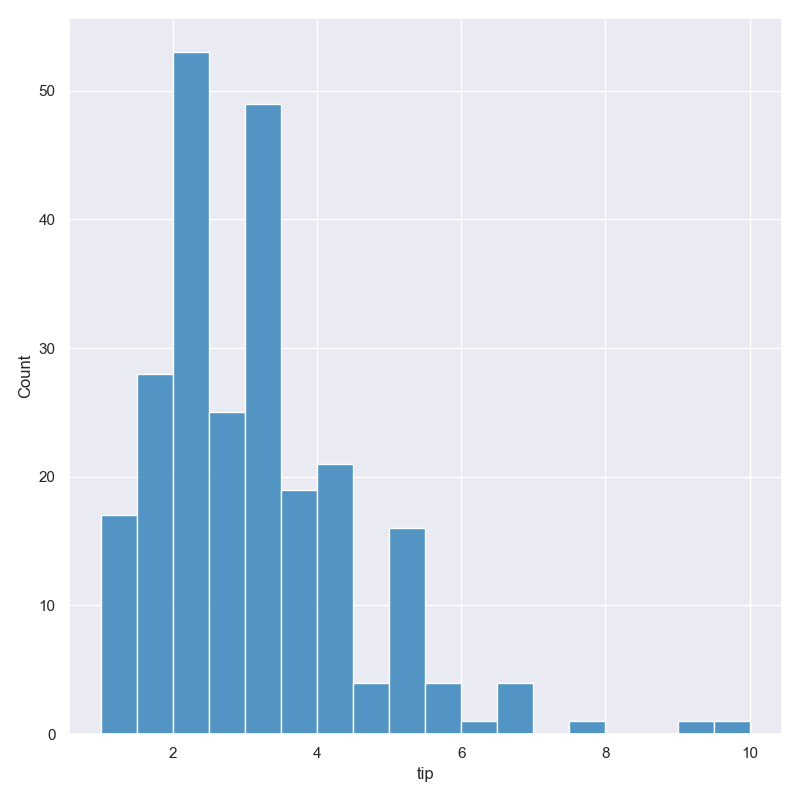
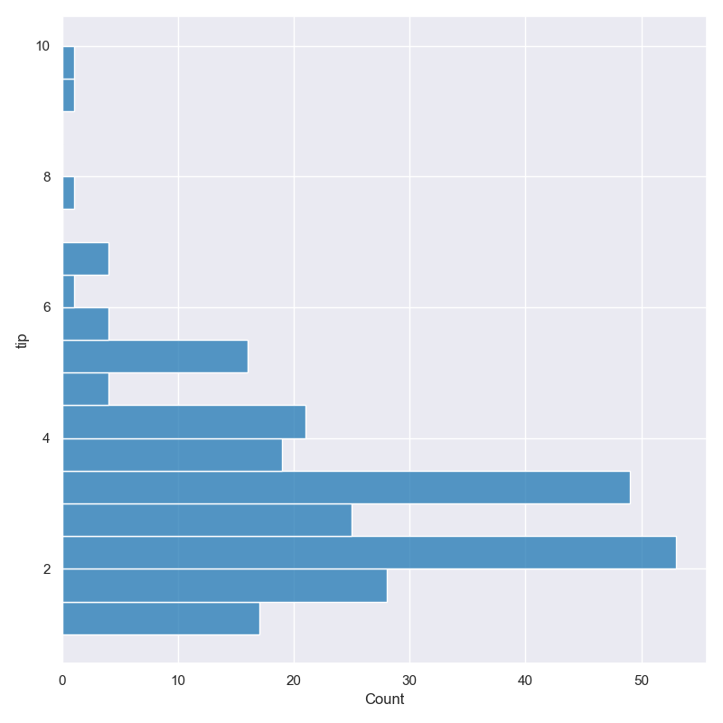
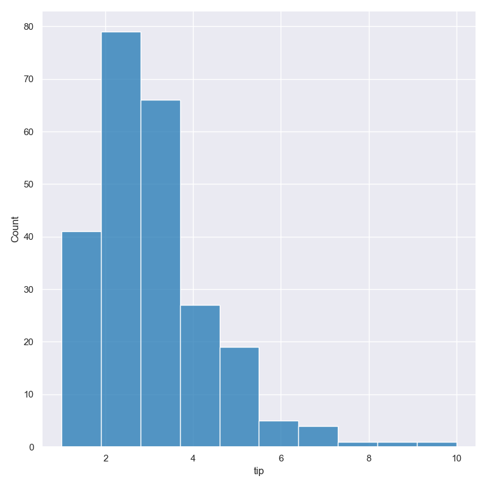
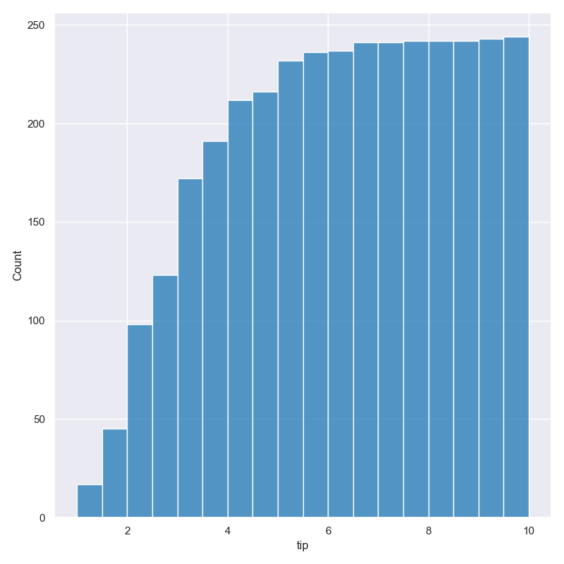

Point plot
**********

Plot distributions of selected numerical or categorical features as histograms.

Plots are based on Seaborn's `histplot <https://seaborn.pydata.org/generated/seaborn.histplot.html/>`_ library function.

Simple example
==============

Plot a histogram of the ``tip`` amount from the ``tips.csv`` input file:

.. code-block:: bash

    hatch hist -x tip -- tips.csv

The output of the above command is written to ``tips.tip.histogram.png``:

Getting help
============

The full set of command line arguments for histograms can be obtained with the ``-h`` or ``--help``
arguments:

.. code-block:: bash

    hatch hist -h

Selecting features to plot
==========================

.. code-block:: 

  -x FEATURE [FEATURE ...], --xaxis FEATURE [FEATURE ...]
                        Feature to plot along the X axis
  -y FEATURE [FEATURE ...], --yaxis FEATURE [FEATURE ...]
                        Feature to plot along the Y axis

Histograms can be plotted for both numerical features and for categorical features. Numerical data is binned
and the histogram shows the counts of data points per bin. Catergorical data is shown as a count plot with a
column for each categorical value in the specified feature.

You can select the feature that you want to plot as a histogram using the ``-x`` (``--xargs``) or ``-y`` (``--yargs``)
arguments.

If ``-x`` (``--xargs``) is chosen the histogram columns will be plotted vertically.

If ``-y`` (``--yargs``) is chosen the histogram columns will be plotted horizontally.

In both cases you can specify more than one feature to plot; hatch will generate a separate histogram plot for
every feature specified.

The following command will generate separate histogram plots for ``total_bill``, ``tip`` and ``day``:

.. code-block:: bash

    hatch hist -x total_bill tip day -- tips.csv

The outputs of the above command will be saved in the following 3 files:

.. code-block:: bash

    tips.total_bill.histogram.png
    tips.tip.histogram.png
    tips.day.histogram.png

Selecting the ``tip`` feature using the ``-y`` argument causes the histogram bars to be plotted
horizontally instead of vertically:

.. code-block:: bash

    hatch hist -y tip -- tips.csv

You may use both ``-x FEATURE [FEATURE ...]`` and ``-y FEATURE [FEATURE ...]`` in the same command line. 

Controlling the number of bins used
===================================

By default hatch will try to automatically pick an appropriate number of bins for the
selected feature.

However, this can be overridden by specifying the required number of bins to use with the ``--bins`` 
argument like so:

.. code-block:: bash

    hatch hist -x tip --bins 5 -- tips.csv

Cumulative histograms 
=====================

.. code-block:: 

  --cumulative          Generate cumulative histogram

Cumulative histograms can be plotted with the ``--cumulative`` argument.  

.. code-block:: bash

    hatch hist -x tip --cumulative -- tips.csv

