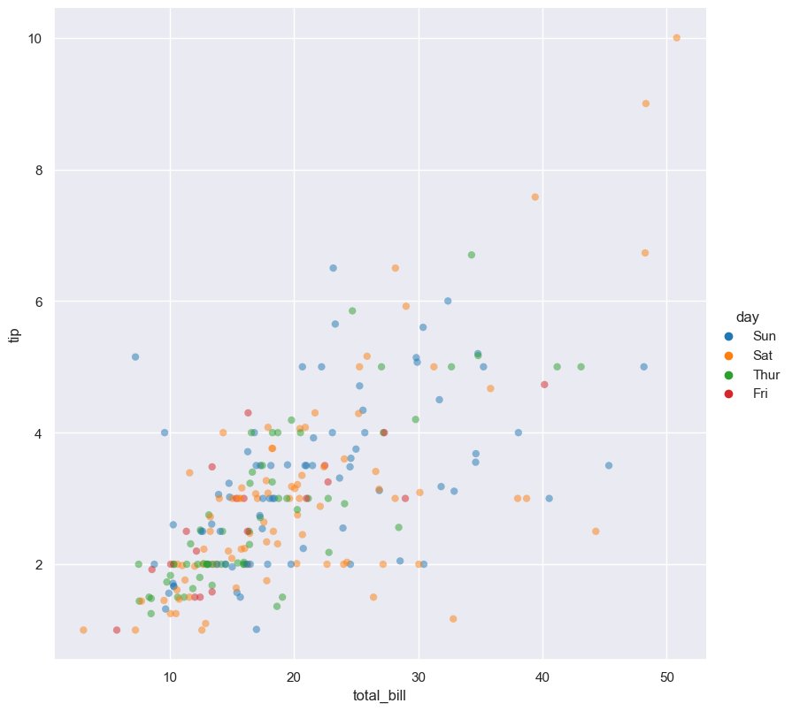
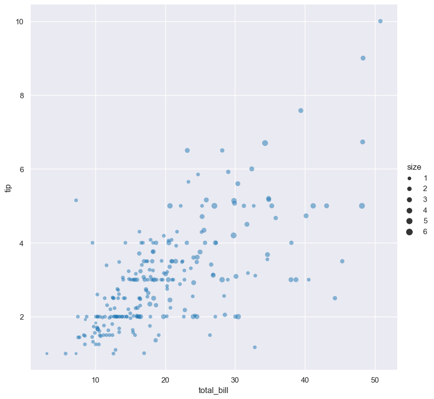
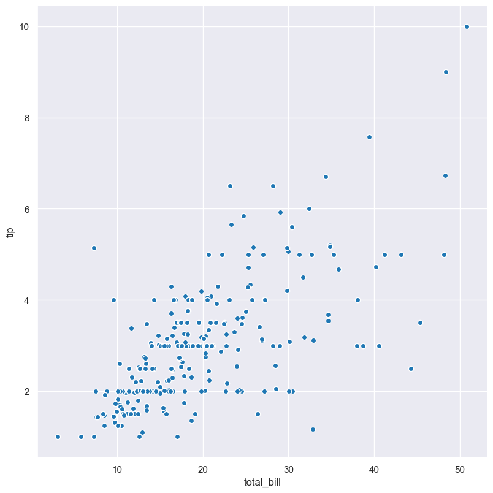

Scatter
*******

Scatter plots show the relationship between two numerical features as a scatter of data points.

.. code-block:: bash

    hatch scatter <arguments>

Scatter plots are based on Seaborn's `relplot <https://seaborn.pydata.org/generated/seaborn.relplot.html/>`_ library function, using the ``kind="scatter"`` option.

.. list-table::
   :widths: 1 2 1
   :header-rows: 1

   * - Argument
     - Description
     - Reference
   * - ``-h``
     - display help
     - :ref:`scatter_help`
   * - ``-x FEATURE [FEATURE ...], --xaxis FEATURE [FEATURE ...]``
     - select feature for the X axis
     - :ref:`scatter_feature_selection`
   * - ``-y FEATURE [FEATURE ...], --yaxis FEATURE [FEATURE ...]``
     - select feature for the Y axis
     - :ref:`scatter_feature_selection`
   * - ``--hue FEATURE [FEATURE ...]``
     - group features by hue
     - :ref:`scatter_hue`
   * - ``--hueorder FEATURE [FEATURE ...]``
     - order of hue features
     - :ref:`Hue order <scatter_hueorder>`
   * - ``--dotsize FEATURE``
     - scale the size of plotted dots based on a feature 
     - :ref:`scatter_dotsize`
   * - ``--dotalpha ALPHA``
     - alpha value for plotted points, default: 0.5  
     - :ref:`scatter_dotalpha_linewidth`
   * - ``--dotlinewidth WIDTH``
     - line width value for plotted points, default: 0
     - :ref:`scatter_dotalpha_linewidth`
   * - ``--logy``
     - log scale Y axis 
     - :ref:`scatter_log`
   * - ``--xlim BOUND BOUND``
     - range limit X axis 
     - :ref:`scatter_range`
   * - ``--ylim BOUND BOUND``
     - range limit Y axis 
     - :ref:`scatter_range`
   * - ``--row FEATURE [FEATURE ...], -r FEATURE [FEATURE ...]``
     - feature to use for facet rows 
     - :ref:`scatter_facets`
   * - ``--col FEATURE [FEATURE ...], -c FEATURE [FEATURE ...]``
     - feature to use for facet columns 
     - :ref:`scatter_facets`


Simple example
==============

Scatter plot of the ``tip`` numerical feature compared to the ``total_bill`` numerical feature from the ``tips.csv`` input file:

.. code-block:: bash

    hatch scatter -x total_bill -y tip -- tips.csv 

The output of the above command is written to ```tips.tip.total_bill.scatter.png`:


.. _scatter_help:

Getting help
============

The full set of command line arguments for scatter plots can be obtained with the ``-h`` or ``--help``
arguments:

.. code-block:: bash

    hatch scatter -h

.. _scatter_feature_selection:

Selecting features to plot
==========================

.. code-block:: 

  -x FEATURE [FEATURE ...], --xaxis FEATURE [FEATURE ...]
  -y FEATURE [FEATURE ...], --yaxis FEATURE [FEATURE ...]

Scatter plots can be plotted for two numerical features, one on each of the axes.

You may specifiy multiple numerical features for ``-x`` and ``-y``. 
Hatch will generate a separate plot for each combination of the features. 

.. _scatter_hue:

Colouring data points with hue 
==============================

.. code-block:: 

  --hue FEATURE [FEATURE ...]

The data points can be coloured by an additional numerical or categorical feature with the ``--hue`` argument.

In the following example the data points in a scatter plot comparing ``tip`` and ``total_bill`` are
coloured by their corresponding categorical ``day`` value: 

.. code-block:: bash

    hatch scatter -x total_bill -y tip --hue day -- tips.csv 



When the ``--hue`` paramter specifies a numerical feature the colour scale is graduated.
For example, in the following scatter plot the numerical ``size`` feature is used for the ``--hue``
argument:

.. code-block:: bash

    hatch scatter -x total_bill -y tip --hue size -- tips.csv 

.. image:: ../images/tips.tip.total_bill.size.scatter.png
       :width: 600px
       :height: 600px
       :align: center
       :alt: Scatter plot comparing tip and total_bill coloured by size 

You can specify more than one feature to colour by; hatch will generate a separate scatter plot for every ``hue`` feature specified.

.. _scatter_hueorder:

By default the order of the columns within each hue group is determined from their occurrence in the input data. 
This can be overridden with the ``--hueorder`` argument, which allows you to specify the exact ordering of columns within each hue group, based on their values. 

.. _scatter_dotsize:

Scaling dot size
================

.. code-block:: 

    --dotsize FEATURE 

The size of plotted dots in the scatter plot can be scaled according the a numerical feature with the ``--dotsize`` argument.

In the following example, the dot size is scaled according to the value of the ``size`` feature
in ``tips.csv``:

.. code-block:: bash

    hatch scatter -x total_bill -y tip --dotsize size -- tips.csv



.. _scatter_dotalpha_linewidth:

Dot alpha transparency and border linewidth
===========================================

.. code-block:: 

    --dotalpha ALPHA 
    --dotlinewidth WIDTH

By default the alpha transparency value of scatter plot dots is set to 0.5, and the dot border linewidth is set to 0. These can be overridden with the ``--dotalpha`` and ``--dotlinewidth`` arguments
respectively.

In the following example, the dot alpha is set to 1 and the boder line width is set to 1.

.. code-block:: bash

    hatch scatter -x total_bill -y tip --dotalpha 1 --dotlinewidth 1 -- tips.csv



.. _scatter_log:

Log scale of numerical distribution 
===================================

.. code-block:: 

  --logx
  --logy

The distribution of numerical values can be displayed in log (base 10) scale with ``--logx`` and ``--logy``. 

It only makes sense to log-scale the numerical axis (and not the categorical axis). Therefore, ``--logx`` should be used when numerical features are selected with ``-x``, and
conversely, ``--logy`` should be used when numerical features are selected with ``-y``.

For example, you can display a log scale scatter plot for the ``age`` feature grouped by ``class`` (when the distribution of ``age`` is displayed on the Y axis) like so. Note carefully that the numerical data is displayed on the Y-axis (``-y``), therefore the ``--logy`` argument should be used to log-scale the numerical distribution:

.. code-block:: bash

    hatch scatter -y age -x class --logy -- titanic.csv 

.. _scatter_range:

Range limits
============

.. code-block:: 

  --xlim LOW HIGH 
  --ylim LOW HIGH

The range of displayed numerical distributions can be restricted with ``--xlim`` and ``--ylim``. Each of these flags takes two numerical values as arguments that represent the lower and upper bounds of the range to be displayed.

It only makes sense to range-limit the numerical axis (and not the categorical axis). Therefore, ``--xlim`` should be used when numerical features are selected with ``-x``, and
conversely, ``--ylim`` should be used when numerical features are selected with ``-y``.

For example, you can display range-limited range for the ``age`` feature grouped by ``class`` (when the distribution of ``age`` is displayed on the Y axis) like so.
Note carefully that the numerical 
data is displayed on the Y-axis (``-y``), therefore the ``--ylim`` argument should be used to range-limit the distribution: 

.. code-block:: bash

    hatch scatter -y age -x class --ylim 10 30 -- titanic.csv

.. _scatter_facets:

Facets
======

.. code-block:: 

 --row FEATURE [FEATURE ...], -r FEATURE [FEATURE ...]
 --col FEATURE [FEATURE ...], -c FEATURE [FEATURE ...]

Scatter plots can be further divided into facets, generating a matrix of scatter plots, where a numerical value is
further categorised by up to 2 more categorical features.

See the :doc:`facet documentation <facets/>` for more information on this feature.
