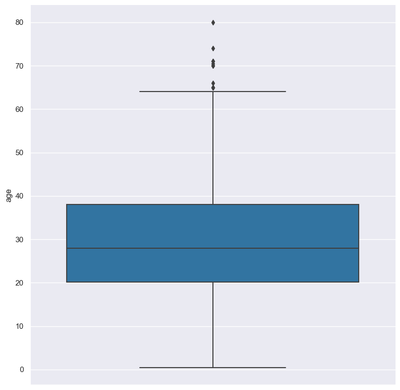
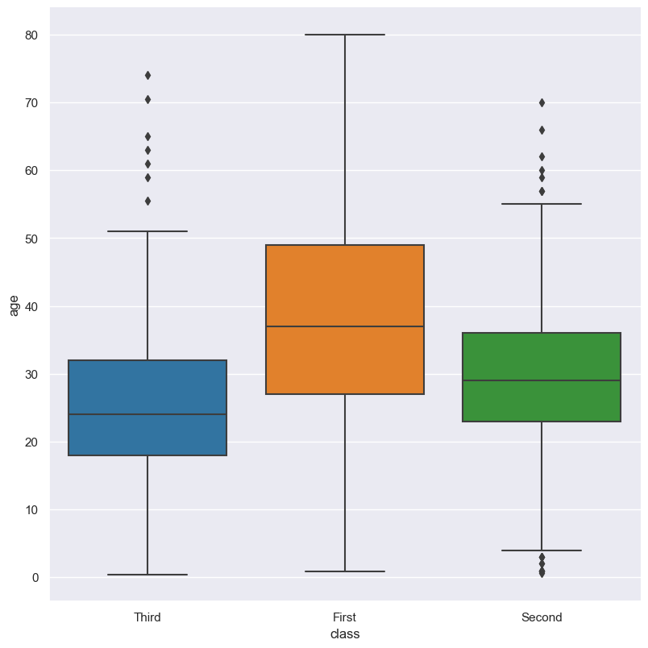
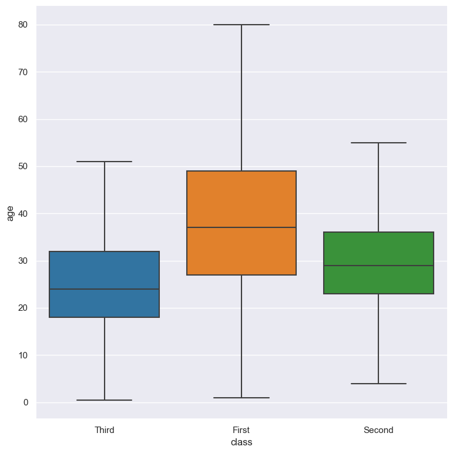
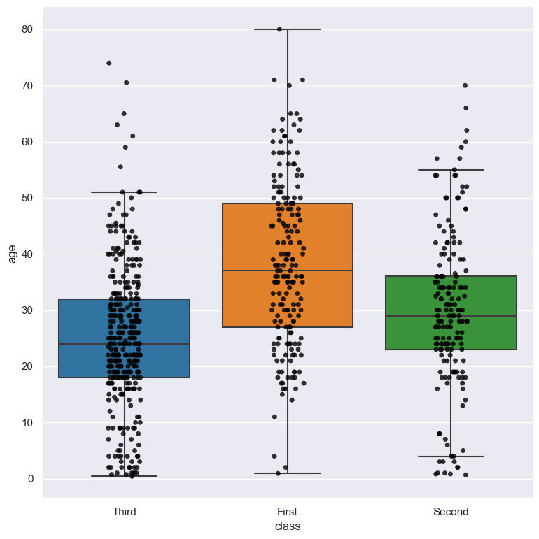
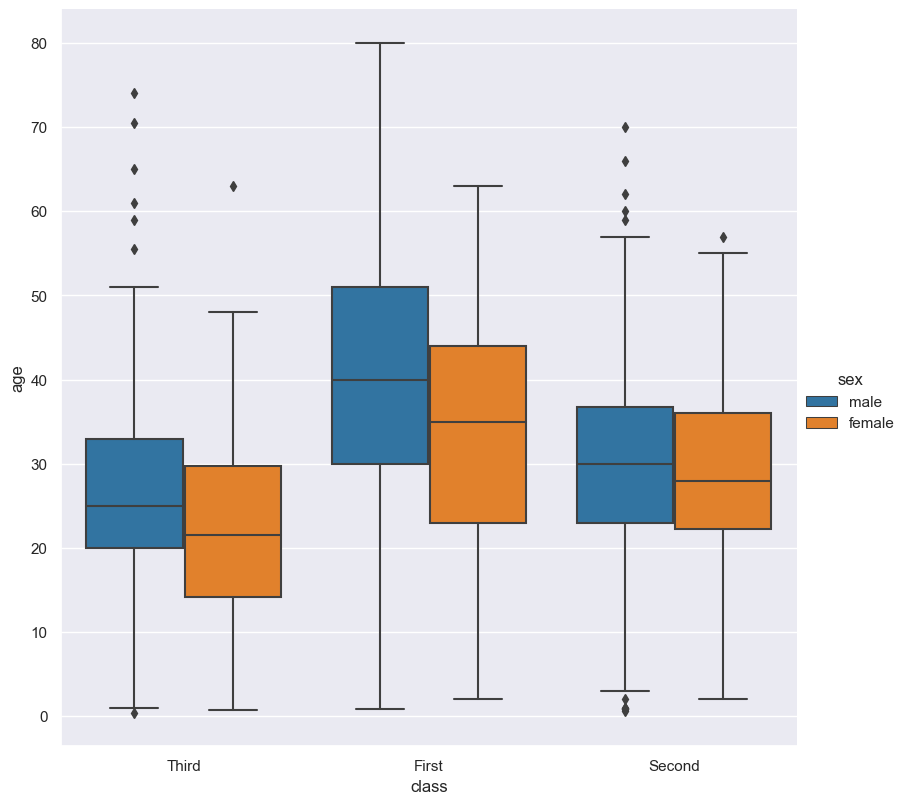
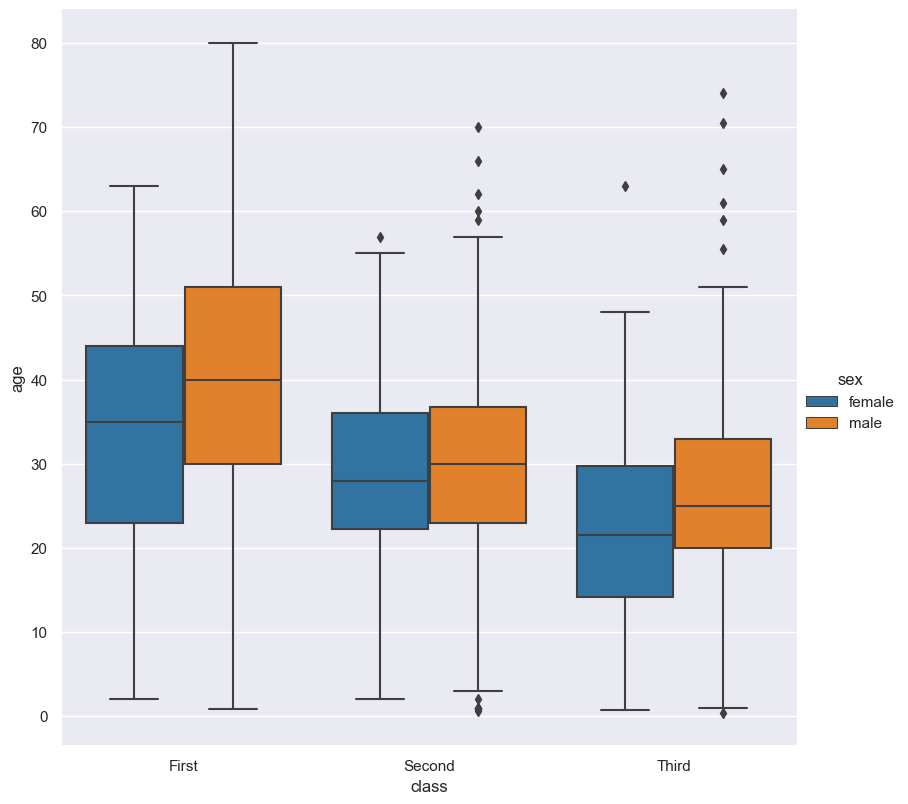
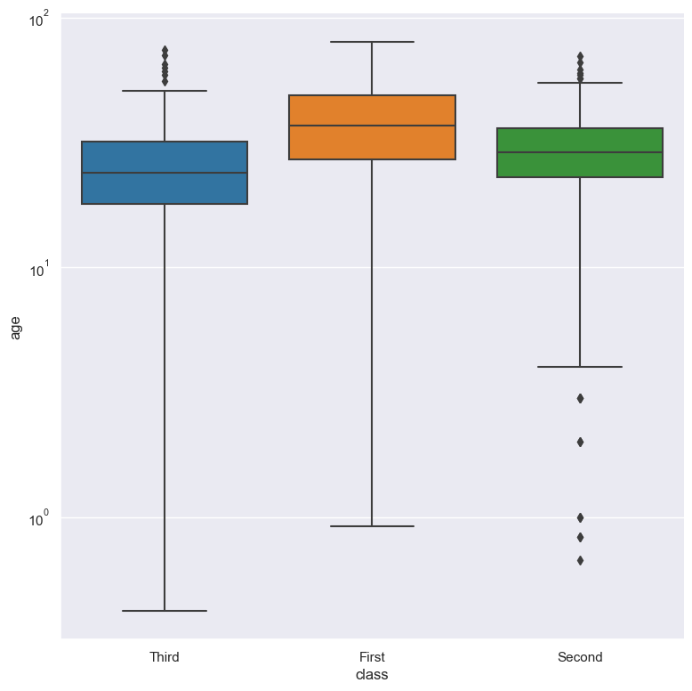
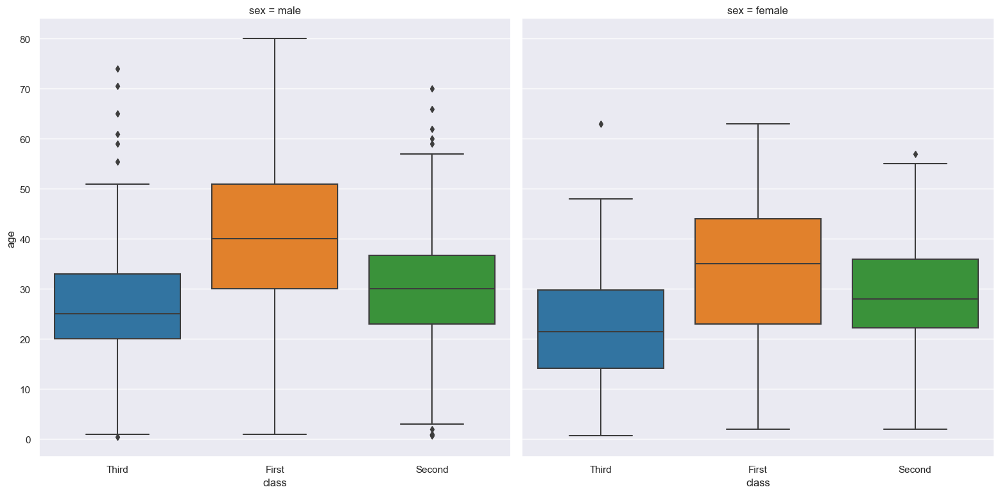

.. _box:

box 
===

Box (or box-and-whisker) plots show the distribution of values in a numerical column optionally grouped by categorical columns.
The distribution of a numerical column is displayed using the inter-quartile range, with outliers shown as separate diamond shaped points.

Usage
-----

.. code-block:: text 

    gurita box [-h] [-x COLUMN] [-y COLUMN] ... other arguments ... 

Arguments
---------

.. list-table::
   :widths: 25 20 10
   :header-rows: 1
   :class: tight-table

   * - Argument
     - Description
     - Reference
   * - ``-h``
     - display help
     - :ref:`help <box_help>`
   * - * ``-x COLUMN``
       * ``--xaxis COLUMN``
     - select column for the X axis
     - :ref:`X axis <box_column_selection>`
   * - * ``-y COLUMN``
       * ``--yaxis COLUMN``
     - select column for the Y axis
     - :ref:`Y axis <box_column_selection>`
   * - ``--orient {v,h}``
     - orientation of plot. v = vertical, h = horizontal. Default: v.
     - :ref:`orient <box_orient>`
   * - ``--nooutliers``
     - do not display outlier data
     - :ref:`no outliers <box_no_outliers>`
   * - ``--strip``
     - overlay data points using a strip plot
     - :ref:`strip <box_strip>`
   * - ``--order VALUE [VALUE ..]``
     - control the order of the plotted boxes 
     - :ref:`order <box_order>`
   * - ``--hue COLUMN``
     - group columns by hue
     - :ref:`hue <box_hue>`
   * - ``--hueorder VALUE [VALUE ...]``
     - order of hue columns
     - :ref:`hue order <box_hueorder>`
   * - ``--logx``
     - log scale X axis 
     - :ref:`log X axis <box_log>`
   * - ``--logy``
     - log scale Y axis 
     - :ref:`log Y axis <box_log>`
   * - ``--xlim BOUND BOUND``
     - range limit X axis 
     - :ref:`limit X axis <box_range>`
   * - ``--ylim BOUND BOUND``
     - range limit Y axis 
     - :ref:`limit Y axis <box_range>`
   * - * ``--row COLUMN``
       * ``-r COLUMN``
     - column to use for facet rows 
     - :ref:`facet rows <box_facets>`
   * - * ``--col COLUMN``
       * ``-c COLUMN``
     - column to use for facet columns 
     - :ref:`facet colums <box_facets>`
   * - ``--colwrap INT``
     - wrap the facet column at this width, to span multiple rows
     - :ref:`facet wrap <box_facets>`

See also
--------

Similar functionality to box plots are provided by:

 * :doc:`Violin plots <violin/>`
 * :doc:`Swarm plots <swarm/>`
 * :doc:`Strip plots <strip/>` 
 * :doc:`Boxen plots <boxen/>` 

Box plots are based on Seaborn's `catplot <https://seaborn.pydata.org/generated/seaborn.catplot.html>`_ library function, using the ``kind="box"`` option.

Simple example
--------------

Box plot of the ``age`` numerical column from the ``titanic.csv`` input file:

.. code-block:: bash

    gurita box -y age < titanic.csv 

The output of the above command is written to ``box.age.png``:

|

The plotted numerical column can be divided into groups based on a categorical column.
In the following example the distribution of ``age`` is shown for each value in the ``class`` column:

.. code-block:: bash

    gurita box -y age -x class < titanic.csv 

The output of the above command is written to ``box.class.age.png``:

|

.. _box_help:

Getting help
------------

The full set of command line arguments for box plots can be obtained with the ``-h`` or ``--help``
arguments:

.. code-block:: bash

    gurita box -h

.. _box_column_selection:

Selecting columns to plot
--------------------------

.. code-block:: 

  -x COLUMN, --xaxis COLUMN
  -y COLUMN, --yaxis COLUMN

Box plots can be plotted for numerical columns and optionally grouped by categorical columns.

If no categorical column is specified, a single column box plot will be generated showing
the distribution of the numerical column.

.. note:: 

    .. _box_orient:

    By default the orientation of the box plot is vertical. In this scenario
    the numerical column is specified by ``-y``, and the (optional) categorical column is specified
    by ``-x``.
    
    However, the orientation of the box plot can be made horizontal using the ``--orient h`` argument.
    In this case the sense of the X and Y axes are swapped from the default, and thus
    the numerical column is specified by ``-x``, and the (optional) categorical column is specified
    by ``-y``.

In the following example the distribution of ``age`` is shown for each value in the ``class`` column,
where the boxes are plotted horizontally:

.. code-block:: bash

    gurita box -x age -y class --orient h < titanic.csv

.. image:: ../images/box.age.class.png
       :width: 600px
       :height: 600px
       :align: center
       :alt: Box plot showing the distribution of age for each class in the titanic data set, shown horizontally

|

.. _box_no_outliers:

Turn off display of outlier points
----------------------------------

Outlier data points are shown in box plots by default as small diamonds. This can be turned off with the ``--nooutliers`` option.

This can be particularly useful in conjunction with ``--strip``, because the outlier points will also be shown as circular dots, and it can be confusing to see both
displayed at the same time.

.. code-block:: bash

    gurita box -y age -x class --nooutliers < titanic.csv 

|

.. _box_strip:

Overlay data points using a strip plot
--------------------------------------

Individual data points can be overlaid on top of the box plot using the ``--strip`` option.

.. code-block:: bash

    gurita box -y age -x class --strip --nooutliers < titanic.csv 

Note that in the example above we also turn off the display of outlier points with ``--nooutliers``.

|

.. _box_order:

Controlling the order of the boxes 
----------------------------------

.. code-block:: 

    --order VALUE [VALUE ...]

By default the order of the categorical columns displayed in the box plot is determined from their occurrence in the input data.
This can be overridden with the ``--order`` argument, which allows you to specify the exact ordering of columns based on their values. 

In the following example the box columns of the ``class`` column are displayed in the order of ``First``, ``Second``, ``Third``:

.. code-block:: bash

    gurita box -y age -x class --order First Second Third < titanic.csv

.. image:: ../images/box.class.age.order.png
       :width: 600px
       :height: 600px
       :align: center
       :alt: Box plot showing the distribution of age for each class in the titanic data set, shown in a specified order

|

.. _box_hue:

Grouping columns with hue 
--------------------------

.. code-block:: 

  --hue COLUMN

The data can be further grouped by an additional categorical column with the ``--hue`` argument.

In the following example the distribution of ``age`` is shown for each value in the ``class`` column, and further sub-divided by the ``sex`` column:

.. code-block:: bash

    gurita box -y age -x class --hue sex < titanic.csv

|

.. _box_hueorder:

By default the order of the columns within each hue group is determined from their occurrence in the input data. 
This can be overridden with the ``--hueorder`` argument, which allows you to specify the exact ordering of columns within each hue group, based on their values. 

In the following example the ``sex`` values are displayed in the order of ``female``, ``male``: 

.. code-block:: bash

    gurita box -y age -x class --hue sex --hueorder female male < titanic.csv

.. image:: ../images/box.class.age.sex.hueorder.png 
       :width: 700px
       :height: 600px
       :align: center
       :alt: Box plot showing the distribution of age for each class in the titanic data set, grouped by class and sex, with ordering specified for sex 

|

It is also possible to use both ``--order`` and ``--hueorder`` in the same command. For example, the following command controls
the order of both the ``class`` and ``sex`` categorical columns:

.. code-block:: bash

    gurita box -y age -x class --order First Second Third --hue sex --hueorder female male < titanic.csv

|

.. _box_log:

Log scale
---------

.. code-block:: 

  --logx
  --logy

The distribution of numerical values can be displayed in log (base 10) scale with ``--logx`` and ``--logy``. 

It only makes sense to log-scale the numerical axis (and not the categorical axis). Therefore, ``--logx`` should be used when numerical columns are selected with ``-x``, and
conversely, ``--logy`` should be used when numerical columns are selected with ``-y``.

For example, you can display a log scale box plot for the ``age`` column grouped by ``class`` (when the distribution of ``age`` is displayed on the Y axis) like so. Note carefully that the numerical data is displayed on the Y-axis (``-y``), therefore the ``--logy`` argument should be used to log-scale the numerical distribution:

.. code-block:: bash

    gurita box -y age -x class --logy < titanic.csv 

|

.. _box_range:

Axis range limits
-----------------

.. code-block:: 

  --xlim LOW HIGH 
  --ylim LOW HIGH

The range of displayed numerical distributions can be restricted with ``--xlim`` and ``--ylim``. Each of these flags takes two numerical values as arguments that represent the lower and upper bounds of the range to be displayed.

It only makes sense to range-limit the numerical axis (and not the categorical axis). Therefore, ``--xlim`` should be used when numerical columns are selected with ``-x``, and
conversely, ``--ylim`` should be used when numerical columns are selected with ``-y``.

For example, you can display range-limited range for the ``age`` column grouped by ``class`` (when the distribution of ``age`` is displayed on the Y axis) like so.
Note carefully that the numerical 
data is displayed on the Y-axis (``-y``), therefore the ``--ylim`` argument should be used to range-limit the distribution: 

.. code-block:: bash

    gurita box -y age -x class --ylim 10 30 < titanic.csv

.. _box_facets:

Facets
------

.. code-block:: 

 --row COLUMN, -r COLUMN
 --col COLUMN, -c COLUMN
 --colwrap INT

Box plots can be further divided into facets, generating a matrix of box plots, where a numerical value is
further categorised by up to 2 more categorical columns.

See the :doc:`facet documentation <facets/>` for more information on this feature.

The following command creates a faceted box plot where the ``sex`` column is used to determine the facet columns:

.. code-block:: bash

    gurita box -y age -x class --col sex < titanic.csv

|
