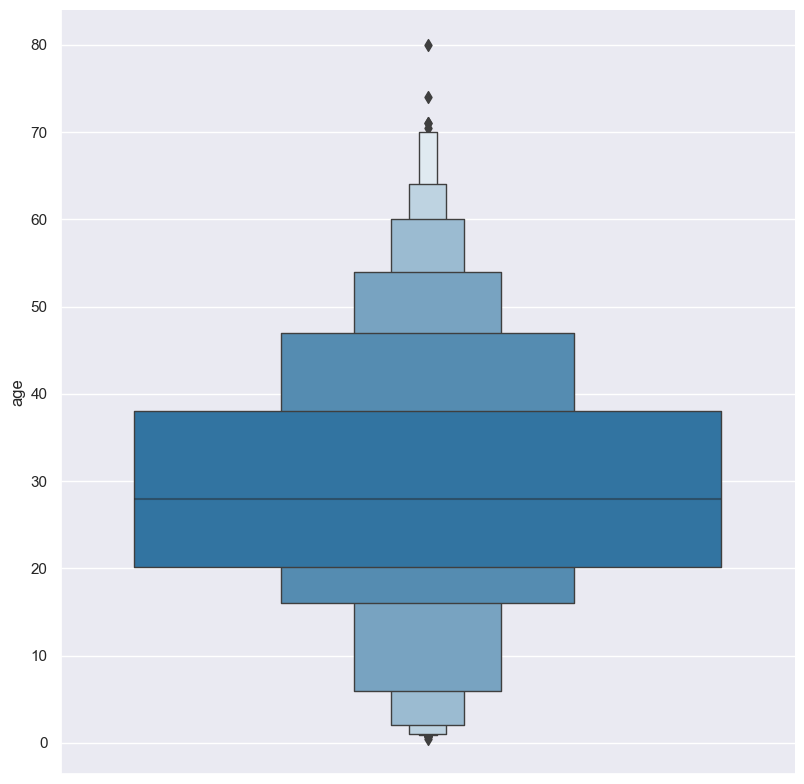
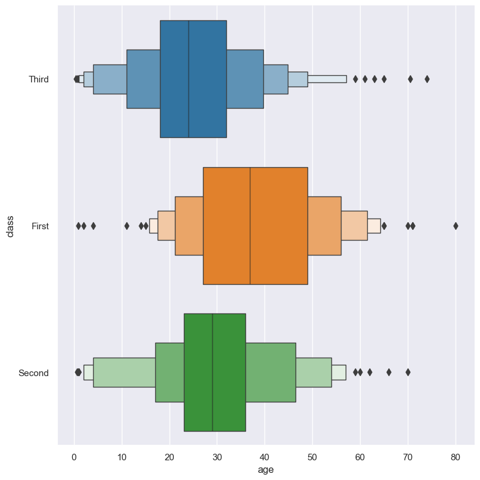
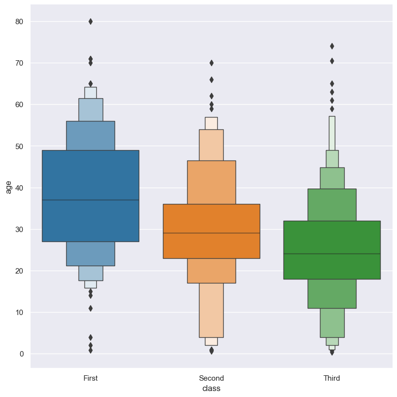
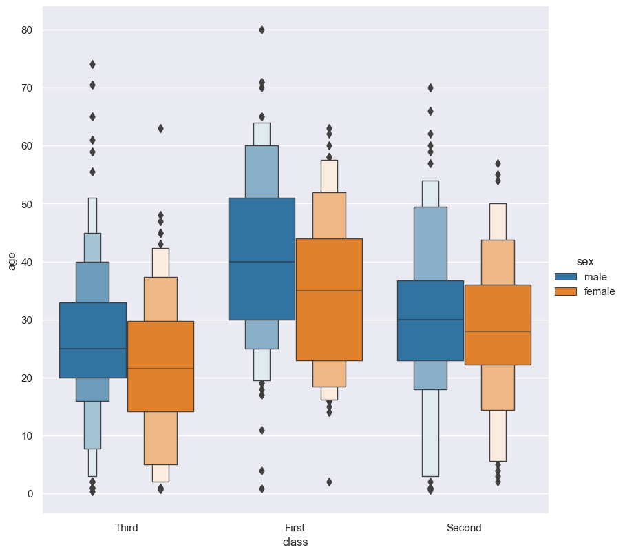
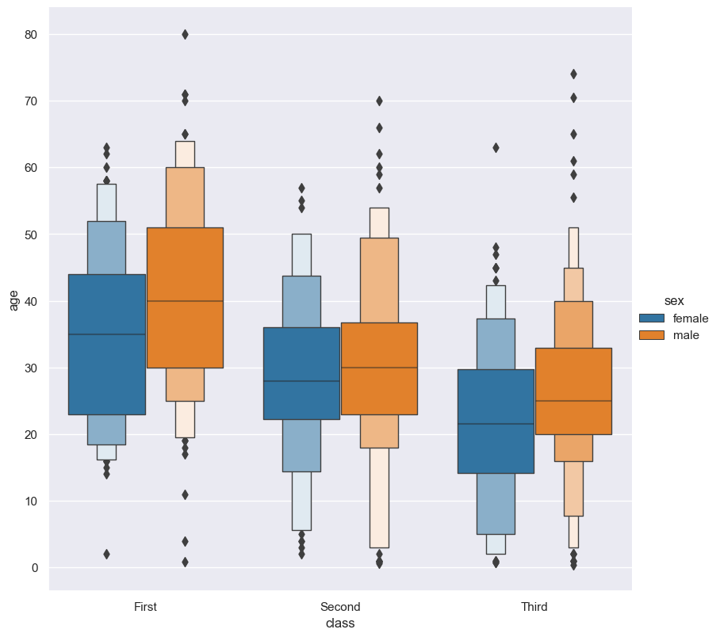

.. _boxen:

boxen
=====

Boxen plots show the distribution of values in a numerical column optionally grouped by categorical columns.

Usage
-----

.. code-block:: text 

    gurita boxen [-h] [-x COLUMN] [-y COLUMN] ... other arguments ... 

Arguments
---------

.. list-table::
   :widths: 25 20 10
   :header-rows: 1
   :class: tight-table

   * - Argument
     - Description
     - Reference
   * - ``-h``
     - display help
     - :ref:`help <boxen_help>`
   * - * ``-x COLUMN``
       * ``--xaxis COLUMN``
     - select column for the X axis
     - :ref:`X axis <boxen_column_selection>`
   * - * ``-y COLUMN``
       * ``--yaxis COLUMN``
     - select column for the Y axis
     - :ref:`Y axis <boxen_column_selection>`
   * - ``--orient {v,h}``
     - Orientation of plot. Allowed values: v = vertical, h = horizontal. Default: v.
     - :ref:`orient <boxen_orient>`
   * - ``--order VALUE [VALUE ...]``
     - controlling the order of the plotted boxen 
     - :ref:`order <boxen_order>`
   * - ``--hue COLUMN``
     - group columns by hue
     - :ref:`hue <boxen_hue>`
   * - ``--hueorder VALUE [VALUE...]``
     - order of hue columns
     - :ref:`hue order <boxen_hueorder>`
   * - ``--logx``
     - log scale X axis 
     - :ref:`log X axis <boxen_log>`
   * - ``--logy``
     - log scale Y axis 
     - :ref:`log Y axis <boxen_log>`
   * - ``--xlim BOUND BOUND``
     - range limit X axis 
     - :ref:`limit X axis <boxen_range>`
   * - ``--ylim BOUND BOUND``
     - range limit Y axis 
     - :ref:`limit Y axis <boxen_range>`
   * - ``--frow COLUMN``
     - column to use for facet rows 
     - :ref:`facet rows <boxen_facets>`
   * - ``--fcol COLUMN``
     - column to use for facet columns 
     - :ref:`facet columns <boxen_facets>`
   * - ``--fcolwrap INT``
     - wrap the facet column at this width, to span multiple rows
     - :ref:`facet wrap <boxen_facets>`

See also
--------

Similar functionality to boxen plots are provided by:

 * :doc:`Box plots <box/>`
 * :doc:`Violin plots <violin/>`
 * :doc:`Swarm plots <swarm/>` 
 * :doc:`Strip plots <strip/>` 

Boxen plots are based on Seaborn's `catplot <https://seaborn.pydata.org/generated/seaborn.catplot.html>`_ library function, using the ``kind="boxen"`` option.

Simple example
--------------

Boxen plot of the ``age`` numerical column from the ``titanic.csv`` input file:

.. code-block:: bash

    gurita boxen -y age < titanic.csv 

The output of the above command is written to ``boxen.age.png``:

|

The plotted numerical column can be divided into groups based on a categorical column.
In the following example the distribution of ``age`` is shown for each value in the ``class`` column:

.. code-block:: bash

    gurita boxen -y age -x class < titanic.csv 

The output of the above command is written to ``boxen.class.age.png``:

.. image:: ../images/boxen.class.age.png 
       :width: 600px
       :height: 600px
       :align: center
       :alt: Boxen plot showing the distribution of age for each class in the titanic data set

|

.. _boxen_help:

Getting help
------------

The full set of command line arguments for boxen plots can be obtained with the ``-h`` or ``--help``
arguments:

.. code-block:: bash

    gurita boxen -h

.. _boxen_column_selection:

Selecting columns to plot
--------------------------

.. code-block:: 

  -x COLUMN, --xaxis COLUMN 
  -y COLUMN, --yaxis COLUMN

Boxen plots can be plotted for numerical columns and optionally grouped by categorical columns.

If no categorical column is specified, a single column boxen plot will be generated showing
the distribution of the numerical column.

.. note:: 

    .. _boxen_orient:

    By default the orientation of the boxen plot is vertical. In this scenario
    the numerical column is specified by ``-y``, and the (optional) categorical column is specified
    by ``-x``.
    
    However, the orientation of the boxen plot can be made horizontal using the ``--orient h`` argument.
    In this case the sense of the X and Y axes are swapped from the default, and thus
    the numerical column is specified by ``-x``, and the (optional) categorical column is specified
    by ``-y``.

In the following example the distribution of ``age`` is shown for each value in the ``class`` column,
where the boxes are plotted horizontally:

.. code-block:: bash

    gurita boxen -x age -y class --orient h < titanic.csv

|

.. _boxen_order:

Controlling the order of the boxes
----------------------------------

.. code-block:: 

    --order VALUE [VALUE ...]

By default the order of the categorical columns displayed in the boxen plot is determined from their occurrence in the input data.
This can be overridden with the ``--order`` argument, which allows you to specify the exact ordering of columns based on their values. 

In the following example the boxen columns of the ``class`` column are displayed in the order of ``First``, ``Second``, ``Third``:

.. code-block:: bash

    gurita boxen -y age -x class --order First Second Third < titanic.csv

|

.. _boxen_hue:

Grouping columns with hue 
--------------------------

.. code-block:: 

  --hue COLUMN [COLUMN ...]

The data can be further grouped by an additional categorical column with the ``--hue`` argument.

In the following example the distribution of ``age`` is shown for each value in the ``class`` column, and further sub-divided by the ``sex`` column:

.. code-block:: bash

    gurita boxen -y age -x class --hue sex < titanic.csv

|

.. _boxen_hueorder:

By default the order of the columns within each hue group is determined from their occurrence in the input data. 
This can be overridden with the ``--hueorder`` argument, which allows you to specify the exact ordering of columns within each hue group, based on their values. 

In the following example the ``sex`` values are displayed in the order of ``female``, ``male``: 

.. code-block:: bash

    gurita boxen -y age -x class --hue sex --hueorder female male < titanic.csv

.. image:: ../images/boxen.age.class.sex.hueorder.png 
       :width: 600px
       :height: 600px
       :align: center
       :alt: Count plot showing the frequency of the categorical values in the embark_town column from the titanic.csv file, grouped by the class column, displayed in a specified order

|

It is also possible to use both ``--order`` and ``--hueorder`` in the same command. For example, the following command controls
the order of both the ``class`` and ``sex`` categorical columns:

.. code-block:: bash

    gurita boxen -y age -x class --order First Second Third --hue sex --hueorder female male < titanic.csv

|

.. _boxen_log:

Log scale
---------

.. code-block:: 

  --logx
  --logy

The distribution of numerical values can be displayed in log (base 10) scale with ``--logx`` and ``--logy``. 

It only makes sense to log-scale the numerical axis (and not the categorical axis). Therefore, ``--logx`` should be used when numerical columns are selected with ``-x``, and
conversely, ``--logy`` should be used when numerical columns are selected with ``-y``.

For example, you can display a log scale boxen plot for the ``age`` column grouped by ``class`` (when the distribution of ``age`` is displayed on the Y axis) like so. Note carefully that the numerical data is displayed on the Y-axis (``-y``), therefore the ``--logy`` argument should be used to log-scale the numerical distribution:

.. code-block:: bash

    gurita boxen -y age -x class --logy -- titanic.csv 

.. _boxen_range:

Axis range limits
-----------------

.. code-block:: 

  --xlim LOW HIGH 
  --ylim LOW HIGH

The range of displayed numerical distributions can be restricted with ``--xlim`` and ``--ylim``. Each of these flags takes two numerical values as arguments that represent the lower and upper bounds of the range to be displayed.

It only makes sense to range-limit the numerical axis (and not the categorical axis). Therefore, ``--xlim`` should be used when numerical columns are selected with ``-x``, and
conversely, ``--ylim`` should be used when numerical columns are selected with ``-y``.

For example, you can display range-limited range for the ``age`` column grouped by ``class`` (when the distribution of ``age`` is displayed on the Y axis) like so.
Note carefully that the numerical 
data is displayed on the Y-axis (``-y``), therefore the ``--ylim`` argument should be used to range-limit the distribution: 

.. code-block:: bash

    gurita boxen -y age -x class --ylim 10 30 -- titanic.csv

.. _boxen_facets:

Facets
------

.. code-block:: 

 --frow COLUMN
 --fcol COLUMN
 --fcolwrap INT

Boxen plots can be further divided into facets, generating a matrix of boxen plots, where a numerical value is
further categorised by up to 2 more categorical columns.

See the :doc:`facet documentation <facets/>` for more information on this feature.
