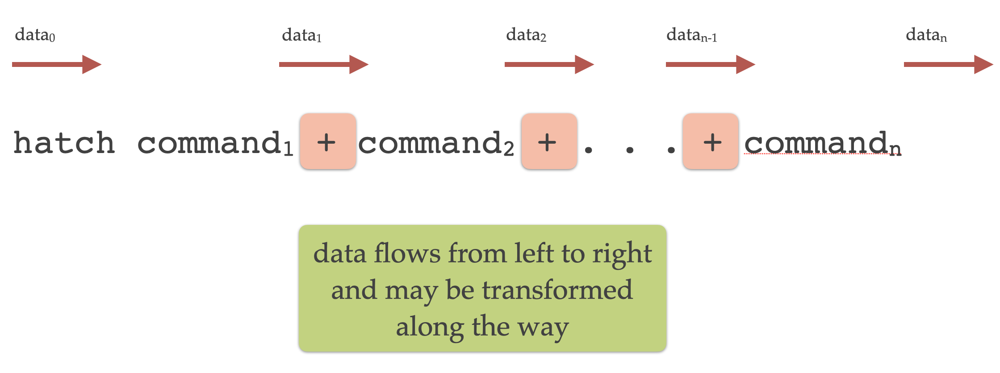

Command line syntax
*******************

Hatch provides a suite of commands, each carrying out a specific task. 

Commands can be chained together in a modular fashion for more complex analysis pipelines.

.. _single_command:

Commands
========

Hatch commands have the following structure:

.. code-block:: bash

    hatch <command> [arguments]

where ``<command>`` is the command name (e.g. ``hist`` or ``pca``), and ``arguments`` is a list of options that control the behaviour of the command. In some cases the ``arguments`` could be empty.

See the :ref:`list of commands <list_of_commands>` below for the full list of available commands.

For instance, the following invocation of Hatch will plot a histogram of the ``passengers`` column from the file ``flights.csv`` read from standard input:

.. code-block:: bash

    hatch hist -x passengers < flights.csv

In the above example ``hist -x passengers`` is a single command. ``hist`` is the name of the command for plotting histograms, and ``-x passengers`` is an argument that tells the command to use the ``passengers`` feature from the data on the X axis. The notation ``< flights.csv`` redirects the contents of the ``flights.csv`` file into the standard input of Hatch.  See the section on :ref:`input and output <input_output>` for more information about input and output files.

Types of commands
-----------------

Commands fall into four types:

1. input/output: reading and writing input data
2. plotting: visualising data as plots
3. transformation: manipulating and analysing the data
4. summary information: getting an overview of the data 

.. _command_chain:

Command chaining
================

In more complex cases mulitple commands can be chained together into a pipeline. Hatch uses the plus sign ``+`` to separate each command in the chain: 

.. code-block:: bash

    hatch <command_1> + <command_2> + ... + <command_n>

Each command has its own optional arguments, so the chaining syntax is more completely characterised as follows:

.. code-block:: bash

    hatch <command_1> [arguments_1] + <command_2> [arguments_2] + ... + <command_n> [arguments_n]

The idea with command chaining is to build a *pipeline* of data transformation and plotting. This allows you to build complex analytics processes by joining commands together in sequence. 

The most important detail about command chaining is that data flows from left to right in the chain, as illustrated in the following diagram:

Each command in the chain *may* transform the data before passing it along to the next command.

.. note::

   **Motivation for command chaining using +**

   The ``+`` operator in Hatch acts like the pipe operator ``|`` in the Unix shell. The main advantage of the ``+`` operator compared to ``|`` is that data is transferred between consecutive commands very efficiently.

   It is *possible* to join Hatch commands into a pipeline using the ``|`` shell operator, like so:
  
    .. code-block:: bash

        hatch <command_1> [arguments_1] | hatch <command_2> [arguments_2] 

   Note that this requires the Hatch program to be invoked multiple times in the same pipeline.

   The main downside of using ``|`` pipelines is that it requires the entire dataset to be serialised into a text stream between each
   command. This is redundant, inefficient, and therefore slow, particularly for large datasets. 

   The ``+`` operator lets you compose a pipeline using a single invocation of Hatch and *most importantly* data is passed between
   successive commands in the chain very efficiently. There is no serialisation to a text stream in between commands. Therefore using ``+`` will
   be much faster than ``|``, especially for complex pipelines and large datasets.

Command chaining example
------------------------

The following is a more advanced example of command chaining in Hatch, consisting of four commands:

.. code-block:: bash

    cat iris.csv | hatch filter 'species != "virginica"' + \
                         sample 0.9 + \
                         pca + \
                         scatter -x pc1 -y pc2 --hue species

The above command is split over multiple lines for clarity, using the backslash ``\`` to split lines.

Equivalently, the same command can be written in a single line, like so (where backslashes are no longer required):

.. code-block:: bash

    cat iris.csv | hatch filter 'species != "virginica"' + sample 0.9 + pca + scatter -x pc1 -y pc2 --hue species

To understand how it works it is useful to break it down into parts.

To begin with, the contents of the file ``iris.csv`` is piped into the standard input of Hatch:

.. code-block:: bash

   cat iris.csv | hatch ... 

Note we could also have used input redirection to achieve the same behaviour:

.. code-block:: bash

   hatch ... < iris.csv

This data is then passed through the chain of commands from left to right. Along the way the data may be transformed, displayed or plotted.

The first command in the chain is a filter:

.. code-block:: bash

   filter 'species != "virginica"' 

This retains data rows where the filter condition is true and discards the data rows where it is false. In this case the filter keeps only those
data rows where the ``species`` feature is not equal (``!=``) to the value ``virginica``. 

In this example, the input to the ``filter`` command is the original contents of
``iris.csv`` and the output is a filtered version of the data set. Therefore the ``filter`` command *transforms* the data, and the transformed
data is fed into the next command in the chain, moving left to right.

The second command in the chain is a random sampling of the data:

.. code-block:: bash

   sample 0.9 

This randomly retains 90% (0.9) data rows from its input and discards the rest. Similar to ``filter``, the ``sample`` command *transforms* the data, and the
transformed data is fed into the next command in the chain, moving left to right.

The net result of the two commands we have discussed so far is to remove all the data rows where ``species`` equals ``virginica``, and then a random selection of
90% of those rows are kept (and thus 10% are removed).

The third command in the chain is a principal component analysis (PCA):

.. code-block:: bash

   pca 

This computes the first two (by default) principal components of its input data (considering only the numerical columns). Again, this is a transformation of
the data. The interesting thing about ``pca`` is that it retains all the data rows in the input and *appends* extra columns to each row. In this case
it adds columns called ``pc1`` and ``pc2`` representing the first two principal components. You can optionally request more principal components to be computed,
and in those cases more columns would be added, one for each component.

The fourth (and last) command in the chain creates a scatter plot:

.. code-block:: bash

    scatter -x pc1 -y pc2 --hue species

The X and Y axes of the scatter plot are defined by the options ``-x pc1 -y pc2``. Here you can see that the axes are defined to correspond to columns in the data. In this
case they are ``pc1`` and ``pc2`` respectively, which are new columns that were added to the data by the previous ``pca`` command. The option ``--hue species`` assigns colours
to points in the scatter plot based on the ``species`` categorical column. In this example 
Hatch defaults to saving the plot in a file called ``hatch.pc1.pc2.species.scatter.png``, however, as with all defaults, this can be overridden.

.. note::

   There are a number of things to note about command chains:

   * Plotting and summary information commands do not modify the data. They simply perform their respective task on the current data set (such as making a plot) and then pass the same data along unchanged to the next command in the chain.
   * If the last command in a chain is a transformation Hatch will assume that you want the transformed data to be sent to the standard output, so it will do this automatically for you.
   * If the last command in a chain is a plotting command, then Hatch will assume that your primary goal was to generate the plot, and therefore it will not automatically send the data to the standard output at the end. You can override
     this behaviour by adding an explicit ``stdout`` command at the end of the chain.
   * You may have more than one plotting command in a chain.

.. _help:

Getting help
============

The ``-h`` or ``--help`` command line arguments give an overview of Hatch's command line syntax:

.. code-block:: bash

    hatch -h

Help information for each command can be requested with ``-h`` or ``--help``
after the command name. For example, to get specific help about histograms, use:

.. code-block:: bash

    hatch hist -h

This will display a detailed help message for the ``hist`` command.

.. _version:

Version number
==============

The ``--version`` (``-v``) command line argument causes Hatch to print its version number.

.. _list_of_commands:

List of commands
****************

Input and output commands
=========================

.. list-table::
   :widths: 1 2
   :header-rows: 1

   * - Command
     - Description
   * - :doc:`in <in>`
     - Read CSV/TSV data from a named input file
   * - :doc:`out <out>`
     - Write the current dataset to a file in CSV/TSV format
   * - :doc:`stdin <stdin>`
     - Read a CSV/TSV file from standard input
   * - :doc:`stdout <stdout>`
     - Print the current dataset to the standard output in CSV/TSV format

Plotting commands
=================

.. list-table::
   :widths: 1 2
   :header-rows: 1

   * - Command 
     - Description
   * - :doc:`bar <bar>`
     - Bar plot of categorical feature
   * - :doc:`box <box>`
     - Plot distrbution of numerical column using box-and-whiskers
   * - :doc:`boxen <boxen>`
     - Plot distrbution of numerical column using boxes for quantiles
   * - :doc:`clustermap <clustermap>`
     - Clustered heatmap of two categorical columns
   * - :doc:`count <count>`
     - Plot count of categorical columns using bars
   * - :doc:`heatmap <heatmap>`
     - Heatmap of two categorical columns
   * - :doc:`hist <histogram>`
     - Histogram of numerical or categorical feature
   * - :doc:`line <line>`
     - Line plot of numerical feature
   * - :doc:`lmplot <lmplot>`
     - Regression plot (linear model)
   * - :doc:`pair <pair>`
     - Pair plot of numerical features
   * - :doc:`point <point>`
     - Point plot of numerical feature
   * - :doc:`scatter <scatter>`
     - Scatter plot of two numerical columns
   * - :doc:`strip <strip>`
     - Plot distrbution of numerical column using dotted strip
   * - :doc:`swarm <swarm>`
     - Plot distrbution of numerical column using dot swarm
   * - :doc:`violin <violin>`
     - Plot distrbution of numerical column using violin

Transformation commands
=======================

.. list-table::
   :widths: 1 2
   :header-rows: 1

   * - Command 
     - Description
   * - :doc:`corr <corr>`
     - Pairwise correlation between numerical columns
   * - :doc:`cut <cut>`
     - Select a subset of columns by name
   * - :doc:`dropna <dropna>`
     - Drop rows or columns containing missing values (NA)
   * - :doc:`eval <eval>`
     - Compute new columns for each row with an expression
   * - :doc:`filter <filter>`
     - Filter rows with a logical expression
   * - :doc:`gmm <gmm>`
     - Gaussian mixture model clustering
   * - :doc:`head <head>`
     - Select the first N rows in the data
   * - :doc:`isnorm <isnorm>`
     - Test whether numerical features differ from a normal distribution
   * - :doc:`kmeans <kmeans>`
     - k-means clustering
   * - :doc:`melt <melt>`
     - Reshape a wide format dataset into a long format dataset
   * - :doc:`outlier <outlier>`
     - Detect outliers in numerical columns using interquartile range
   * - :doc:`pca <pca>`
     - Principal component analysis (PCA)
   * - :doc:`pivot <pivot>`
     - Reshape a long format dataset into a wide format dataset
   * - :doc:`sample <sample>`
     - Randomly sample rows
   * - :doc:`sort <sort>`
     - Sort based on columns in precedence from left to right
   * - :doc:`tail <tail>`
     - Select the last N rows in the data
   * - :doc:`zscore <zscore>`
     - Compute Z-score for numerical columns

Summary information commands
============================

.. list-table::
   :widths: 1 2
   :header-rows: 1

   * - Command 
     - Description
   * - :doc:`describe <describe>`
     - Show summary information about the input data set
   * - :doc:`pretty <pretty>`
     - Pretty print a fragment of the data set
   * - :doc:`unique <unique>`
     - Print the unique values from a column
