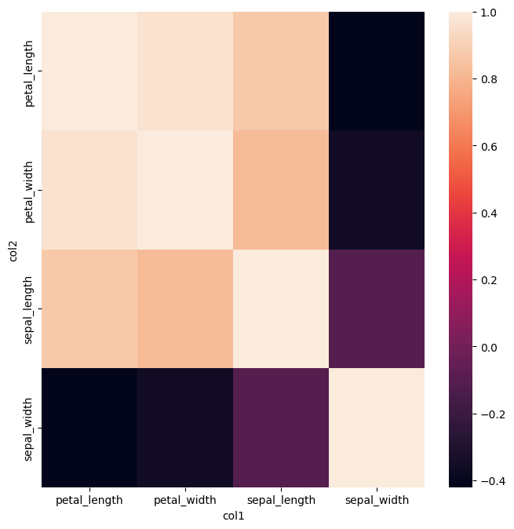

.. _corr:

corr
====

Compute the pairwise correlation between numerical fields using one of `Pearson <https://en.wikipedia.org/wiki/Pearson_correlation_coefficient>`_,
`Kendall <https://en.wikipedia.org/wiki/Kendall_rank_correlation_coefficient>`_ or
`Spearman <https://en.wikipedia.org/wiki/Spearman%27s_rank_correlation_coefficient>`_ methods.

For a selection of N numerical columns, the output will be a table containing all NxN pairwise comparisons.

For visualisation the output of the ``corr`` command can be fed into the :doc:`heatmap <heatmap>` command. 

Usage
-----

.. code-block:: bash

   gurita corr [-h] [-c [COLUMN ...]] [--method {pearson,kendall,spearman}] 

Arguments
---------

.. list-table::
   :widths: 25 20 10
   :header-rows: 1
   :class: tight-table

   * - Argument
     - Description
     - Reference
   * - * ``-h``
       * ``--help``
     - display help for this command
     - :ref:`help <corr_help>`
   * - * ``-c [COLUMN ...]``
       * ``--col [COLUMN ...]``
     - select columns to correlate pairwise (default: select all numerical columns) 
     - :ref:`columns <corr_columns>`
   * - * ``--method {pearson,kendall,spearman}``
     - method for determining correlation (default: pearson) 
     - :ref:`method <corr_method>`

Simple example
--------------

Compute the correlation between ``sepal_width`` and ``sepal_length`` from the ``iris.csv`` data set:

.. code-block:: text

    gurita corr -c sepal_length sepal_width < iris.csv 

The output of the above command is a table with three columns: ``col1``, ``col2`` and ``corr``, such that ``col1`` and ``col2`` show the names of the
input columns being correlated, and ``corr`` shows their numerical correlation value.

.. literalinclude:: example_outputs/iris.corr.sepal_length.sepal_width.txt  
   :language: none

In the above example we specify two columns for comparison and the output is a table with four data rows. This is because each column is compared pairwise with itself and with the other columns symmetrically. 

.. _corr_help:

Getting help
------------

The full set of command line arguments for correlations can be obtained with the ``-h`` or ``--help``
arguments:

.. code-block:: text

    gurita corr -h

.. _corr_columns:

Selecting columns to correlate 
------------------------------

.. code-block::

  -c [COLUMN ...], --col [COLUMN ...]

By default, if no columns are specified explicitly, all numerical columns in the data set will be chosen for comparison.

For example, the following command performs pairise correlation on all numerical columns in the ``iris.csv`` file:

.. code-block:: text

   gurita corr < iris.csv

There are four numerical columns in ``iris.csv``, so the output contains all 4x4 symmetric comparisons:

.. literalinclude:: example_outputs/iris.corr.txt  
   :language: none

Specific numerical columns can be specified for comparison using ``-c`` (or ``--col``).

For example, we can compare ``sepal_length`` with ``petal_length`` and ``petal_width`` like so:

.. code-block:: text

   gurita corr -c sepal_length petal_length petal_width < iris.csv

The output of the above command is shown below:

.. literalinclude:: example_outputs/iris.sepal_length.petal_length.petal_width.txt
   :language: none

.. note::

   Non-numerical columns specified as arguments to ``-c`` (``--col``) are ignored. 

.. _corr_method:

Correlation method
------------------

.. code-block::

   --method {pearson,kendall,spearman}  

Pairwise correlation can be computed in one of three ways:

1. `pearson <https://en.wikipedia.org/wiki/Pearson_correlation_coefficient>`_
2. `kendall <https://en.wikipedia.org/wiki/Kendall_rank_correlation_coefficient>`_
3. `spearman <https://en.wikipedia.org/wiki/Spearman%27s_rank_correlation_coefficient>`_

If no method is specified then ``pearson`` will be chosen by defualt.

The example below computes the pairwise correlation between ``sepal_width`` and ``sepal_length`` from the ``iris.csv`` data set using the ``spearman`` method:

.. code-block:: text

    gurita corr --col sepal_length sepal_width --method spearman < iris.csv

The output of the above command is shown below. Note that the results are similar to, but slightly different from the outputs from the ``pearson`` method
shown in the simple example above.

.. literalinclude:: example_outputs/iris.corr.sepal_length.sepal_width.spearman.txt
   :language: none

.. _corr_heatmap:

Plotting a heatmap of pairwise correlations
-------------------------------------------

Conveniently, the output of the ``corr`` command can be easily plotted as a :ref:`heatmap <heatmap>` using command chaining, like so:

.. code-block:: text

    gurita corr + heatmap -x col1 -y col2 -v corr < iris.csv  

In this example we compute the correlation of all four numerical columns in ``iris.csv`` and then feed the result of that command into the ``heatmap`` command
using :ref:`command chaining <command_chain>`.

The X and Y axes of the heatmap are set to the ``col1`` and ``col2`` output columns from ``corr``, and the value shown in the heatmap cells is set to the ``corr`` column.

The output plot resulting from the above command is shown below: 

