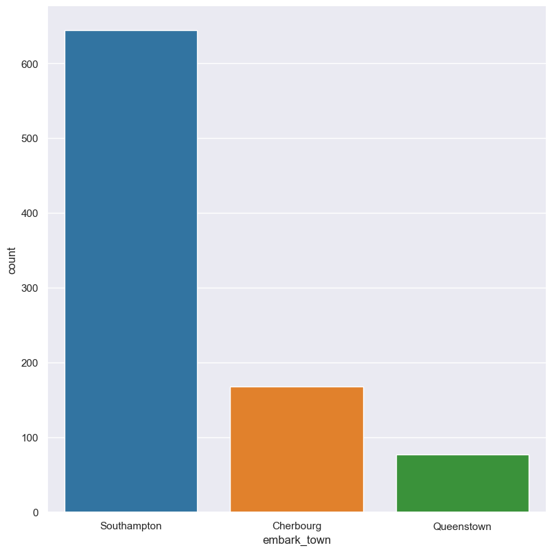
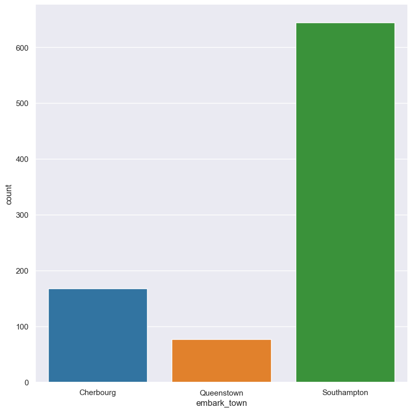
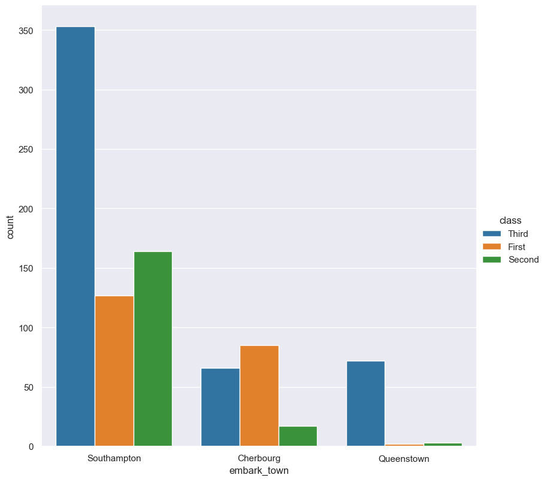
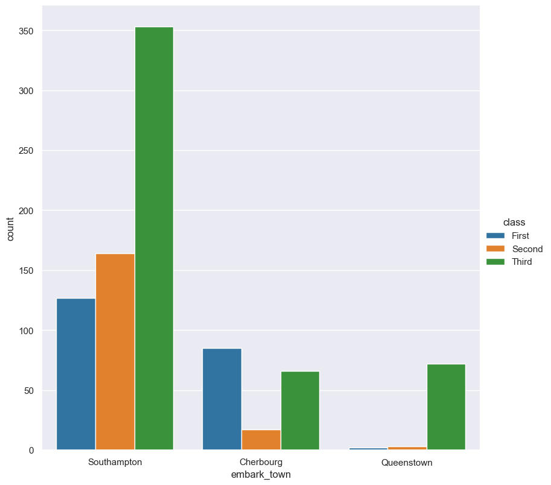
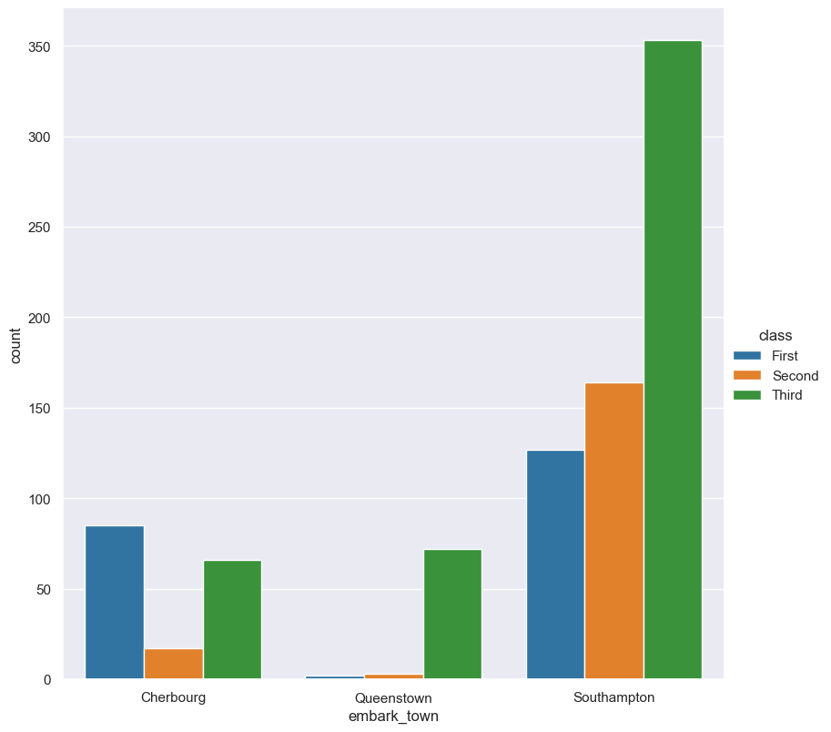
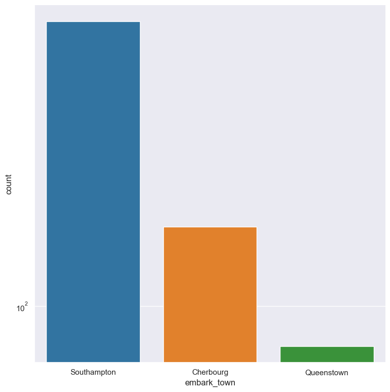
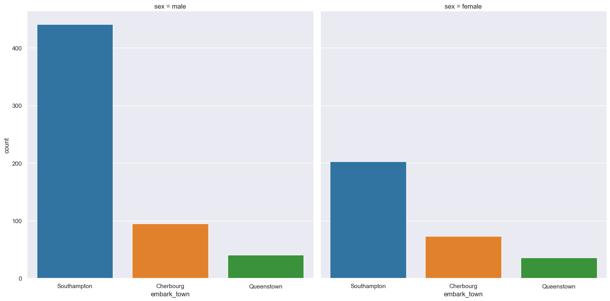

.. _count:

count 
=====

Count plots show the frequency of values within categorical columns using bars.

.. code-block:: bash

    gurita count <arguments> 

Count plots are based on Seaborn's `catplot <https://seaborn.pydata.org/generated/seaborn.catplot.html>`_ library function, using the ``kind="count"`` option.

.. list-table::
   :widths: 25 20 10
   :header-rows: 1
   :class: tight-table

   * - Argument
     - Description
     - Reference
   * - ``-h``
     - display help 
     - :ref:`help <count_help>`
   * - * ``-x COLUMN``
       * ``--xaxis COLUMN``
     - select column for the X axis 
     - :ref:`X axis <count_column_selection>`
   * - * ``-y COLUMN``
       * ``--yaxis COLUMN`` 
     - select column for the Y axis 
     - :ref:`Y axis <count_column_selection>`
   * - ``--order VALUE [VALUE ...]`` 
     - order of the plotted columns  
     - :ref:`order <count_order>`
   * - ``--hue COLUMN`` 
     - group columns by hue 
     - :ref:`hue <count_hue>`
   * - ``--hueorder VALUE [VALUE ...]`` 
     - order of hue columns
     - :ref:`hue order <count_hueorder>`
   * - ``--logx``
     - log scale X axis 
     - :ref:`log X axis <count_log>`
   * - ``--logy``
     - log scale Y axis 
     - :ref:`log Y axis <count_log>`
   * - ``--xlim BOUND BOUND``
     - range limit X axis 
     - :ref:`limit X axis <count_range>`
   * - ``--ylim BOUND BOUND``
     - range limit Y axis 
     - :ref:`limit Y axis <count_range>`
   * - * ``--row COLUMN``
       * ``-r COLUMN``
     - column to use for facet rows
     - :ref:`facet rows <count_facets>`
   * - * ``--col COLUMN``
       * ``-c COLUMN``
     - column to use for facet columns
     - :ref:`facet columns <count_facets>`
   * - ``--colwrap INT``
     - wrap the facet column at this width, to span multiple rows
     - :ref:`facet wrap <count_facets>`

.. _count_example:

Simple example
--------------

Plot a count of the ``embark_town`` categorical column from the ``titanic.csv`` input file:

.. code-block:: bash

    gurita count -x embark_town < titanic.csv

The output of the above command is written to ``count.embark_town.png``:

|

.. _count_help:

Getting help
------------

The full set of command line arguments for count plots can be obtained with the ``-h`` or ``--help``
arguments:

.. code-block:: bash

    gurita count -h

.. _count_column_selection:

Selecting columns to plot
--------------------------

.. code-block:: 

  -x COLUMN, --xaxis COLUMN
  -y COLUMN, --yaxis COLUMN

Count plots can be plotted for categorical columns.

.. note::

    If a numerical column is selected for a count plot it will be treated as categorical, which may
    not give expected behaviour.

    You may not use both ``-x COLUMN`` and ``-y COLUMN`` in the same command line for count plots.

You can select the column that you want to plot as a count using the ``-x`` (``--xaxis``) or ``-y`` (``--yaxis``)
arguments.

If ``-x`` (``--xaxis``) is chosen the count columns will be plotted vertically.

If ``-y`` (``--yaxis``) is chosen the count columns will be plotted horizontally.

See :ref:`the example <count_example>` above for a vertical axis plot.
For comparison, the following command uses ``-y embark_town`` to plot a histogram of ``embark_town`` horizontally:

.. code-block:: bash

    gurita count -y embark_town < titanic.csv

.. image:: ../images/count.embark_town.y.png
       :width: 600px
       :height: 600px
       :align: center
       :alt: Count plot showing the frequency of the categorical values in the embark_town column from the titanic.csv file, plotted horizontally

|

.. _count_order:

Controlling the order of the bars 
---------------------------------

.. code-block:: 

    --order VALUE [VALUE ...]

By default the order of the categorical columns displayed in the count plot is determined from their occurrence in the input data.
This can be overridden with the ``--order`` argument, which allows you to specify the exact ordering of columns based on their values. 

In the following example the counts of the ``embark_town`` column are displayed in the order of ``Cherbourg``, ``Queenstown``, ``Southampton``:

.. code-block:: bash

    gurita count -x embark_town --order Cherbourg Queenstown Southampton < titanic.csv

|

.. _count_hue:

Grouping columns with hue 
--------------------------

.. code-block:: 

  --hue COLUMN

The column being counted can be grouped based on another categorical column using the ``--hue`` argument.

In the following example the counts of the ``embark_town`` column are grouped by the ``class`` column from the titanic data set:

.. code-block:: bash

    gurita count -x embark_town --hue class < titanic.csv  

|

.. _count_hueorder:

By default the order of the columns within each hue group is determined from their occurrence in the input data. 
This can be overridden with the ``--hueorder`` argument, which allows you to specify the exact ordering of columns within each hue group, based on their values. 

In the following example the ``class`` values are displayed in the order of ``First``, ``Second``, ``Third``: 

.. code-block:: bash

    gurita count -x embark_town --hue class --hueorder First Second Third < titanic.csv  

|

It is possible to use both ``--order`` and ``--hueorder`` in the same command. For example, the following command controls the order of both 
the ``embark_town`` and ``class`` categorical columns:

.. code-block:: bash

    gurita count -x embark_town --hue class --order Cherbourg Queenstown Southampton \
                --hueorder First Second Third < titanic.csv

|

.. _count_log:

Log scale 
---------

.. code-block:: 

  --logx
  --logy

Count values can be displayed in log (base 10) scale with ``--logx`` and ``--logy``. 

It only makes sense to log-scale the count axis (and not the categorical axis). Therefore, ``--logx`` should be used when categorical columns are selected with ``-y``, and
conversely, ``--logy`` should be used when categorical columns are selected with ``-x``.

For example, you can display a log scale of counts for the ``embark_town`` column (when the column is displayed on the X-axis) like so. Note carefully that the categorical
data is displayed on the X-axis (``-x``), therefore the ``--logy`` argument should be used to log-scale the counts:

.. code-block:: bash

    gurita count -x embark_town --logy < titanic.csv  

|

.. _count_range:

Axis range limits
-----------------

.. code-block:: 

  --xlim LOW HIGH 
  --ylim LOW HIGH

The range of displayed count values can be restricted with ``--xlim`` and ``--ylim``. Each of these flags takes two numerical values as arguments that represent the lower and upper bounds of values to be displayed.

It only makes sense to range-limit the count axis (and not the categorical axis). Therefore, ``--xlim`` should be used when categorical columns are selected with ``-y``, and
conversely, ``--ylim`` should be used when categorical columns are selected with ``-x``.

For example, you can display range-limited count for the ``embark_town`` column (when the column is displayed on the X-axis) like so. Note carefully that the categorical
data is displayed on the X-axis (``-x``), therefore the ``--ylim`` argument should be used to range-limit the counts: 

.. code-block:: bash

    gurita count -x embark_town --ylim 100 300 < titanic.csv

.. _count_facets:

Facets
------

.. code-block:: 

 -r COLUMN, --row COLUMN
 -c COLUMN, --col COLUMN
 --colwrap INT

Count plots can be further divided into facets, generating a matrix of count plots. 

See the :doc:`facet documentation <facets/>` for more information on this feature.

The follow command creates a faceted bar plot where the ``sex`` column is used to determine the facet columns:

.. code-block:: bash

    gurita count -x embark_town --col sex < titanic.csv 

|
