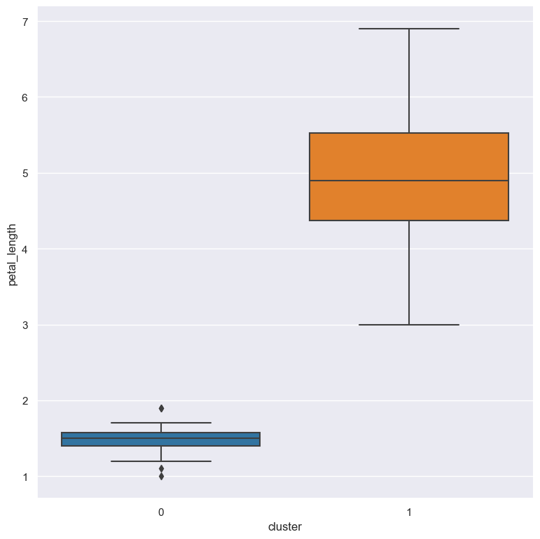

.. _gmm:

gmm (Gaussian mixture model)
============================

The `Gaussian mixture model (GMM) <https://en.wikipedia.org/wiki/https://en.wikipedia.org/wiki/Mixture_model#Gaussian_mixture_model>`_  identifies clusters in numerical data 
by finding a mixture of Gaussian probability distributions that best model the data.

The number of clusters to detect is specified as a parameter.

The ``gmm`` command adds a new column to the dataset storing the cluster label for the corresponding datapoint on each row.  

Clustering does not work with missing values, so rows with missing (NA) values in the clustered columns are automatically removed before clustering.

Usage
-----

.. code-block:: text

    gurita gmm [-h] [-c COLUMN [COLUMN ...]] [--name NAME] [-n NCLUSTERS] [--maxiter MAXITER] 

Arguments
---------

.. list-table::
   :widths: 25 20 10
   :header-rows: 1
   :class: tight-table

   * - Argument
     - Description
     - Reference
   * - * ``-h``
       * ``--help``
     - display help for this command
     - :ref:`help <gmm_help>`
   * - * ``-c COLUMN [COLUMN...]``
       * ``--columns COLUMN [COLUMN...]``
     - apply clustering to specified numerical columns
     - :ref:`gmm columns <gmm_columns>`
   * - * ``-n NCLUSTERS``
       * ``--nclusters NCLUSTERS``
     - identify this many clusters in the data 
     - :ref:`number of clusters <gmm_num_clusters>`
   * - ``--name NAME``
     - choose a column name for the new cluster label column (default: cluster)
     - :ref:`new column name <gmm_name>`
   * - ``--maxiter MAXITER``
     - Number of expectation maximisation iterations (default: 100)
     - :ref:`EM iterations <gmm_maxiter>`

See also
--------

:doc:`k-means clustering <kmeans/>` provides another way to cluster data. 

Simple example
--------------

The following command clusters the numerical columns in the ``iris.csv`` file: 

.. code-block:: text

   gurita gmm < iris.csv

The output is quite long so we can adjust the command to look at only the first few rows using the :doc:`head <head>` command:

.. code-block:: text

   gurita gmm + head < iris.csv 

The output of the above command is as follows:

.. code-block:: text

   sepal_length,sepal_width,petal_length,petal_width,species,cluster
   5.1,3.5,1.4,0.2,setosa,1
   4.9,3.0,1.4,0.2,setosa,1
   4.7,3.2,1.3,0.2,setosa,1
   4.6,3.1,1.5,0.2,setosa,1
   5.0,3.6,1.4,0.2,setosa,1

A new categorical column called ``cluster`` is added to the dataset, this holds the cluster labels for the datapoint on each row.  

Each cluster is labelled using a natural number (0,1,2 ...).

We can get an overview of the new ``cluster`` by using the ``describe`` command after clustering:

.. code-block:: text

    gurita gmm + describe -c cluster < iris.csv

The output of the above command is shown below:

.. code-block:: text

               cluster
    count       150
    unique        2
    top           0
    freq        100

We can see that there are 150 data points (150 rows) and 2 unique values in the ``cluster`` column (these are the labels 0 and 1). The most frequent
label is 0 which occurs 100 times (and thus the label 1 must occur 150-100=50 times).

.. note::

   Despite the use of numbers for cluster labels, Gurita treats them as categorical values. 

   This is beneficial when it comes to plotting data using cluster labels because it means that the plots will correctly
   interpret the labels as catergorical values and render them accordingly.

For example we might like to make a box plot comparing the ``petal_length`` across the two clusters:

.. code-block:: text

    gurita gmm + box -x cluster -y petal_length < iris.csv 

The output of the above command is written to ``box.cluster.petal_length.png``:

|

.. _gmm_help:

Getting help
------------

The full set of command line arguments for ``gmm`` can be obtained with the ``-h`` or ``--help``
arguments:

.. code-block:: text

    gurita gmm -h

.. _gmm_columns:

Cluster data from specified numerical columns
---------------------------------------------

.. code-block:: text

   -c NAME [NAME ...], --columns NAME [NAME ...]

By default, if no column names are specified, clustering is performed on all of the numerical columns in the dataset.

However it is possible to perform clustering on a specific subset of columns via the ``-c/--columns`` argument.

For example, the following command performs GMM clustering on just the columns ``sepal_length``, ``sepal_width``,  and ``petal_length`` (and hence ignores the ``petal_width`` column):

.. code-block:: text

    gurita gmm -c sepal_length sepal_width petal_length < iris.csv

.. note::

   Non-numeric columns will be ignored by ``gmm`` even if they are specified as arguments to ``-c/--columns``.

.. _gmm_num_clusters:

Choose number of clusters to identify
-------------------------------------

.. code-block:: text

   -n NCLUSTERS, --nclusters NCLUSTERS  

By default ``gmm`` identifies two clusters in the data. However, this can be changed with the ``-n/--nclusters`` argument.

For example, the following command finds three clusters in the ``iris.csv`` file:

.. code-block:: text

   gurita gmm -n 3 < iris.csv

We can check the number of values in each cluster using the ``grouby`` command:

.. code-block:: text

    gurita gmm -n 3 + groupby -k cluster < iris.csv  

The output of the above command is shown below:

.. code-block:: text

   cluster,size
   0,50
   1,55
   2,45

We can observe three clusters labelled 0,1,2 with 50,55,45 members respectively.

.. _gmm_name:

Choose a name for the new cluster label column
----------------------------------------------

.. code-block:: text

    --name NAME 

The ``gmm`` command adds an extra categorical column called ``cluster`` to the dataset to store the cluster labels for each row. 

The cluster labels are natural numbers (non-negative integers) from 0 upwards (0, 1, 2, ...).

on to the number of the component, for example ``pc1`` for the first component, ``pc2`` for the second component and so on.

The name of the extra column can be changed with the ``--name`` argument.

The following command specifies that ``group`` should be used as the prefix for the newly added columns:

.. code-block:: text

   gurita gmm --name group < iris.csv

By chaining this command with ``head`` we can inspect the first few rows of the output:

.. code-block:: text

   gurita gmm --name group + head < iris.csv

The output of the above command is as follows:

.. code-block:: text

   sepal_length,sepal_width,petal_length,petal_width,species,group
   5.1,3.5,1.4,0.2,setosa,1
   4.9,3.0,1.4,0.2,setosa,1
   4.7,3.2,1.3,0.2,setosa,1
   4.6,3.1,1.5,0.2,setosa,1
   5.0,3.6,1.4,0.2,setosa,1

Observe that the new cluster label column is called ``group``.

.. _gmm_maxiter:

Choose the maximum number of expectation maximisation iterations to perform
---------------------------------------------------------------------------

.. code-block:: text

    --maxiter MAXITER 

The maximum number of expectation maximisation iterations defaults to 100, it can be changed with the argument ``--maxiter``.

For example, the following command sets the maximum number of expectation maximisation iterations to 1000:

.. code-block:: text

   gurita gmm --maxiter 1000 < iris.csv 
