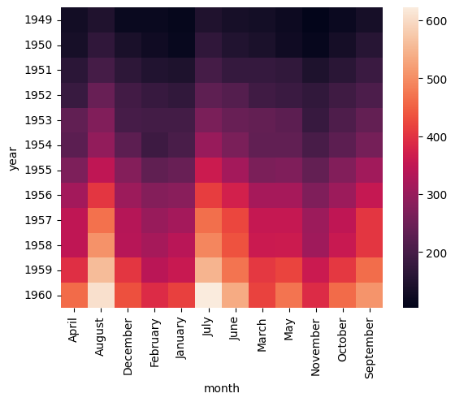
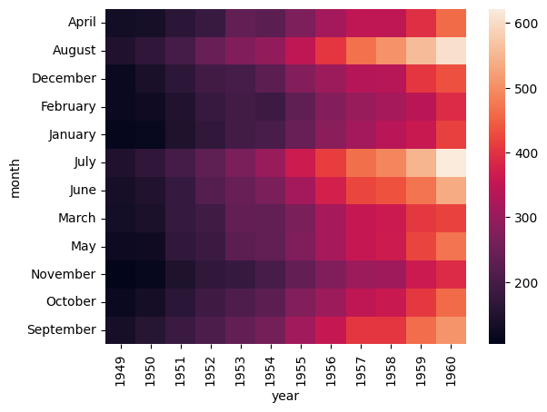
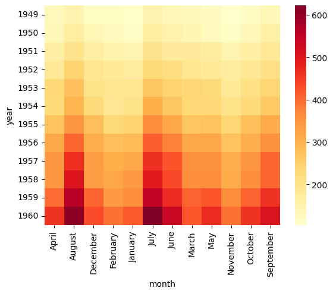
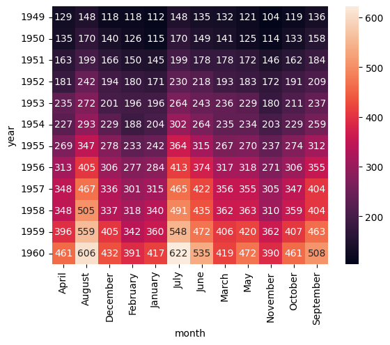
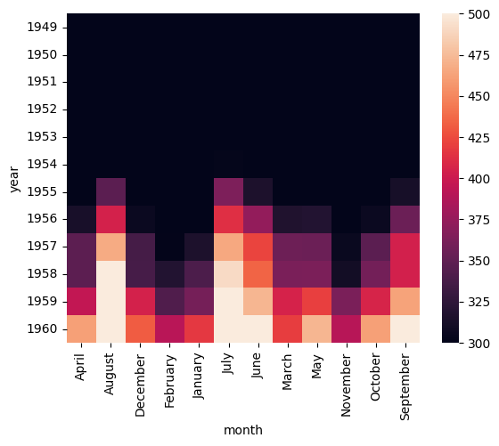
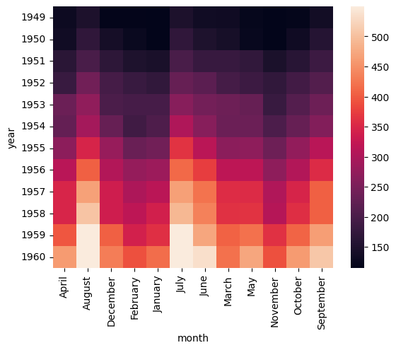
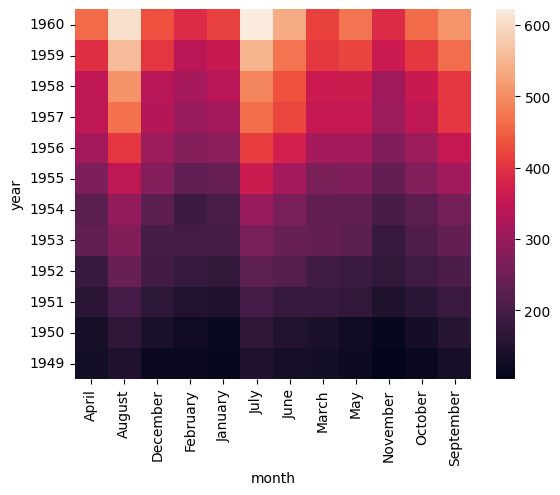
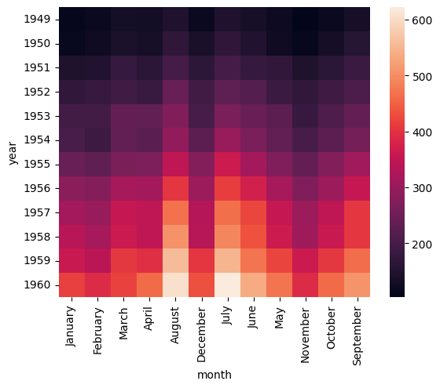

.. _heatmap:

heatmap
=======

Heatmap showing the relationship between two categorical features and a numerical feature.

.. code-block:: text

    hatch heatmap <arguments>

Heatmap plots are based on Seaborn's `heatmap <https://seaborn.pydata.org/generated/seaborn.heatmap.html/>`__ library function.

.. list-table::
   :widths: 25 20 10
   :header-rows: 1
   :class: tight-table

   * - Argument
     - Description
     - Reference
   * - ``-h``
     - display help
     - :ref:`help <heatmap_help>`
   * - * ``-x COLUMN``
       * ``--xaxis COLUMN``
     - select categorial feature for the X axis
     - :ref:`X axis <heatmap_feature_selection>`
   * - * ``-y COLUMN``
       * ``--yaxis COLUMN``
     - select categorical feature for the Y axis
     - :ref:`Y axis <heatmap_feature_selection>`
   * - * ``-v COLUMN``
       * ``--val COLUMN``
     - select intensity value for heatmap 
     - :ref:`value <heatmap_feature_selection>`
   * - ``--cmap COLOR_MAP_NAME``
     - colour map for the heat map 
     - :ref:`colour map <heatmap_cmap>`
   * - ``--annot [FORMAT]``
     - show the value as text in cells 
     - :ref:`annotate <heatmap_annot>`
   * - ``--vmin NUM``
     - minimum anchor value for the colormap
     - :ref:`minimum colormap value <heatmap_vmin>`
   * - ``--vmax NUM``
     - maximum anchor value for the colormap
     - :ref:`maximum colormap value <heatmap_vmax>`
   * - ``--robust``
     - use robust quantiles to set colormap range 
     - :ref:`robust quantiles <heatmap_robust>`
   * - ``--sortx [{a,d}]]``
     - sort the X axis by value, allowed values: a, d. a=ascending, d=descending, default: a. 
     - :ref:`sort X axis <heatmap_sortx>`
   * - ``--sorty [{a,d}]]``
     - sort the Y axis by value, allowed values: a, d. a=ascending, d=descending, default: a. 
     - :ref:`sort Y axis <heatmap_sorty>`
   * - ``--orderx VALUE [VALUE ...]``
     - order the X axis according to a given list of values
     - :ref:`order X axis by value <heatmap_orderx>`
   * - ``--ordery VALUE [VALUE ...]``
     - order the Y axis according to a given list of values
     - :ref:`order Y axis by value <heatmap_ordery>`

.. _heatmap_simple_example:

Simple example
--------------

Heatmap showing the number of ``passengers`` by ``month`` and ``year``
in the ``flights.csv`` data set:

.. code-block:: text

    hatch heatmap -y year -x month -v passengers < flights.csv  

The output of the above command is written to ``heatmap.month.year.png``:

|

.. _heatmap_help:

Getting help
------------

The full set of command line arguments for heatmap plots can be obtained with the ``-h`` or ``--help``
arguments:

.. code-block:: text

    hatch heatmap -h

.. _heatmap_feature_selection:

Selecting features to plot
--------------------------

.. code-block:: 

  -x COLUMN, --xaxis COLUMN 
  -y COLUMN, --yaxis COLUMN

The X and Y axes of a heatmap must be categorical features. The data must be formatted such that in each row the pair of values (X, Y) is unique (not repeated).
If your data is not in this format it may be possible to transform it into this format using :doc:`pivot <pivot>`.

The example below shows the same heatmap :ref:`the simple example above <heatmap_simple_example>` but with the month on the Y axis and the year on the X axis:

.. code-block:: text

    hatch heatmap -y month -x year -v passengers < flights.csv

|

.. _heatmap_cmap:

Colour map 
----------

.. code-block:: 

  --cmap COLOR_MAP_NAME 

The colour map used in the heatmap can be set explicitly using ``--cmap`` with the name of the colour map as its argument.

Hatch uses `Matlplotlib's colour map names <https://matplotlib.org/stable/gallery/color/colormap_reference.html/>`_ (because Hatch uses Seaborn to draw that heatmap, and Seaborn is built on top of Matplotlib)/ 

The example below uses the ``YlOrRd`` (yellow-orange-red) colour map:

.. code-block:: text

    hatch heatmap -y year -x month -v passengers --cmap YlOrRd < flights.csv  

|

.. _heatmap_log:

.. _heatmap_range:

.. _heatmap_annot:

Show the value as text in each cell 
-----------------------------------

.. code-block:: 

  --annot [FORMAT] 

The ``--annot`` option will display the numerical value as text in each cell of the heatmap. The optional argument ``FORMAT`` is a string that specifies how to display the numeric value as text. 
The format string uses `Python's format specification language <https://docs.python.org/3/library/string.html#format-specification-mini-language>`_. It defaults to ``d`` which displays the value as
a decimal integer.

For real numbers (floating point) you may want to use a format like ``.2g`` which will display the number in scientific notation with 2 decimal places.

.. code-block:: text

    hatch heatmap -y year -x month -v passengers --annot < flights.csv  

|

.. _heatmap_vmin:
.. _heatmap_vmax:
.. _heatmap_robust:

Control the range of values used in the colour map
--------------------------------------------------

.. code-block:: 

  --vmin NUM
  --vmax NUM
  --robust 

The upper and lower bounds of the values displayed in the heatmap are chosen from the data by default, but they can be ajusted with ``--vmin`` and ``--vmax``, setting the lower and upper bounds respectively.
It is possible to set one or both bounds at the same time.

In the example below the lower bound is set to 250 and the upper bound is set to 550. Values outside these bounds are clamped to the bounding values.

We observe that in this example data set it wasn't until the early 1950s that the number of passengers per flight exceeded 250, hence the predominance of black cells in the top part of the plot. 

.. code-block:: text

   hatch heatmap -y year -x month -v passengers --vmin 250 --vmax 550  < flights.csv

|

Alternatively, the ``--robust`` argument will cause the maximum and minimum values to be chosen based on quantiles, which can be desirable when extreme outliers occur in the data. 
Note that ``--robust`` may not be used at the same time as ``--vmin`` and/or ``--vmax``.

.. code-block:: text

   hatch heatmap -y year -x month -v passengers --robust < flights.csv

|

.. _heatmap_sortx:
.. _heatmap_sorty:
.. _heatmap_orderx:
.. _heatmap_ordery:

Control the order of the columns and rows 
-----------------------------------------

.. code-block:: text

   --sortx [{a,d}]]
   --sorty [{a,d}]]
   --orderx VALUE [VALUE]
   --ordery VALUE [VALUE]

The default ordering of values on the X and Y axis is determined by their relative order in the input data. In many cases this is not the best order to display in the heatmap.

Therefore the order of the values on the axes can be either sorted, using ``--sortx`` and ``--sorty``, or manually specified using ``--orderx`` and ``--ordery``. 

Both sort arguments accept an optional argument that specifies the direction of the sort: ``a`` for ascending and ``d`` for descending, where the *order* of rows is considered from top to bottom and the *order* of columns is considered
from left to right.

Categorical features will be sorted alphabetically. Numerical features will be sorted numerically.

If a specific order of values is required then this can be achived with ``--orderx`` and ``--ordery``. Both of these arguments require one or more values to be specified, though it is possible to specify only a subset of all the possible
values. Any unlisted values will be ordered arbitrarily. This can be useful when the relative order of only a few values is important.

The example below generates a heatmap with the values on the Y axes displayed in descending sorted order:

.. code-block:: text

   hatch heatmap -y year -x month -v passengers --sorty d < flights.csv

|

The example below generates a heatmap with the first four values on the X axis shown in a specific order, namely: January, February, March, April. Note that the complete ordering of the twelve possible months is not specified. Thus the last eight months are shown in an arbitary order. If we wanted to specifiy the full order then the first eleven months would need to be specified.

.. code-block:: text

   hatch heatmap -y year -x month -v passengers --orderx January February March April < flights.csv

|
