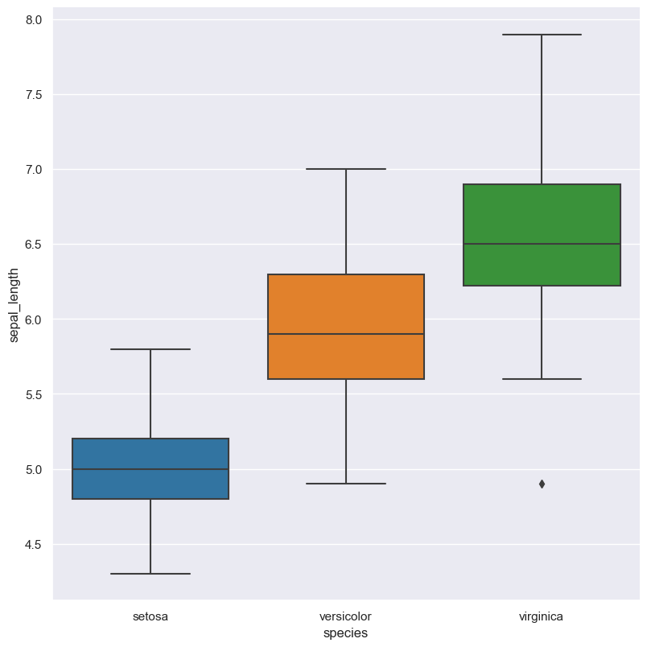
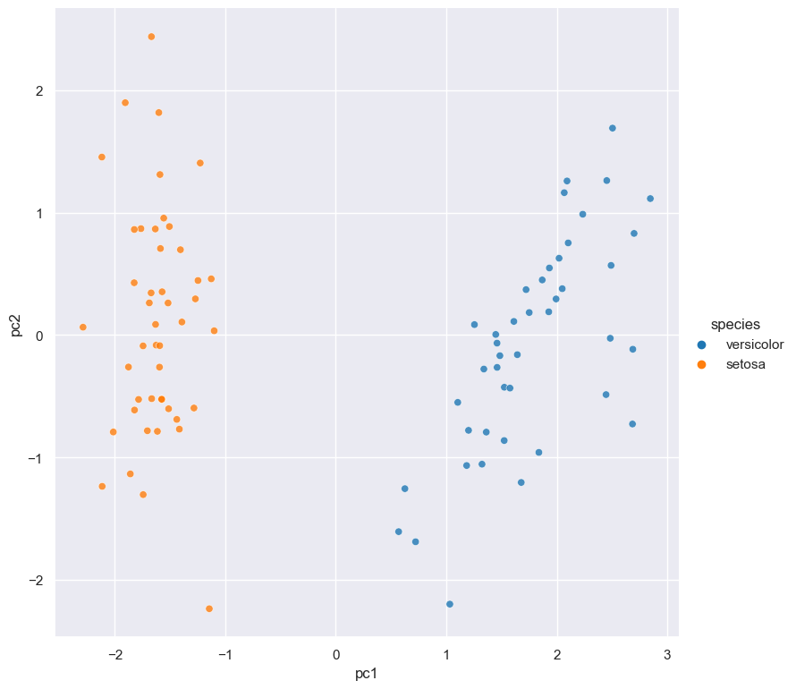

.. gurita documentation master file, created by
   sphinx-quickstart on Wed Oct 14 18:01:41 2020.
   You can adapt this file completely to your liking, but it should at least
   contain the root `toctree` directive.

Gurita: a command line data analytics and plotting tool
*******************************************************

Gurita is a command line tool for transforming, analysing, and visualising tabular data in CSV or TSV format.

At its core Gurita provides a suite of commands, each of which carries out a common data analytics or plotting task.
Additionally, Gurita allows commands to be :ref:`chained together <command_chain>` into flexible analysis pipelines.

It is designed to be fast and convenient, and is particularly suited to data exploration tasks. Input files with large numbers of rows (> millions) are readily supported.

Gurita commands are highly customisable, however sensible defaults are applied. Therefore simple tasks are easy to express
and complex tasks are possible.

Gurita is implemented in `Python <http://www.python.org/>`_ and makes extensive use of the `Pandas <https://pandas.pydata.org/>`_, `Seaborn <https://seaborn.pydata.org/>`_, and `Scikit-learn <https://scikit-learn.org/>`_ libraries for data processing and plot generation.

Simple example
--------------

The following examples use the `iris.csv <https://github.com/mwaskom/seaborn-data/blob/master/iris.csv/>`_ dataset as input. The file contains 150 data rows (plus one heading row) and 5 columns.
A pretty display of the first and last 5 rows of the data can be viewed using the following command: 

.. code-block:: bash

   cat iris.csv | gurita pretty

The command generates the following output that is displayed on the terminal:

.. code-block:: bash

   sepal_length  sepal_width  petal_length  petal_width   species
            5.1          3.5           1.4          0.2    setosa
            4.9          3.0           1.4          0.2    setosa
            4.7          3.2           1.3          0.2    setosa
            4.6          3.1           1.5          0.2    setosa
            5.0          3.6           1.4          0.2    setosa
  ...                    ...           ...          ...       ...
            6.7          3.0           5.2          2.3 virginica
            6.3          2.5           5.0          1.9 virginica
            6.5          3.0           5.2          2.0 virginica
            6.2          3.4           5.4          2.3 virginica
            5.9          3.0           5.1          1.8 virginica

  [150 rows x 5 columns]

The following command generates a box plot from ``iris.csv``, such that the Y-axis
represents the ``sepal_length`` numerical column, and the X-axis is grouped by the ``species`` categorical column.
The goal of this plot is to show the distribution of sepal length of the three different species of iris
flowers contained in the data set.

.. code-block:: bash

   cat iris.csv | gurita box -x species -y sepal_length

The above command generates an output file called ``box.species.sepal_length.png`` 
containing the following figure:

|

If we wanted to see the median value of ``sepal_length`` for each ``species`` we can do this with the
following ``groupby`` command:

.. code-block:: text 

   cat iris.csv | gurita groupby --key species --val sepal_length --fun median 

.. code-block:: text 

   species,sepal_length_median
   setosa,5.0
   versicolor,5.9
   virginica,6.5

You can see that the corresponding median values match up with the values shown in the box plot.

Advanced example
----------------

The next example illustrates Gurita's ability to :ref:`chain commands <command_chain>` together: 

.. code-block:: bash

    cat iris.csv | gurita filter 'species != "virginica"' \
                          + sample 0.9 \
                          + pca \
                          + scatter -x pc1 -y pc2 --hue species

The above command has been written on mulitple lines for clarity. Note that the backslash ``\`` indicates a line
break in the command line syntax.

Equivalently, the same command can be written in a single line, like so (where backslashes are no longer required):

.. code-block:: bash

    cat iris.csv | gurita filter 'species != "virginica"' + sample 0.9 + pca + scatter -x pc1 -y pc2 --hue species

In the command line syntax supported by Gurita, the plus sign ``+`` separates each command in a chain. This notation
is fairly novel to Gurita and not something commonly seen in other command line programs.

Input is read from the file called ``iris.csv`` on standard input and data is passed from left to right in the chain.
Commands can modify the data as it is passed along.

In this example there are four commands that are executed in the following order:

1. The ``filter 'species != "virginica"'`` command selects all rows where ``species`` is not equal to ``virginica``.
2. The filtered rows are then passed to the ``sample 0.9`` command which randomly selects 90% of the remaining rows.
3. The sampled rows are then passed to the ``pca`` command which performs principal component analysis (PCA), yielding two extra columns in the data called ``pc1`` and ``pc2``.
4. Finally the pca-transformed data is passed to the ``scatter -x pc1 -y pc2 --hue species``  command which generates a scatter plot of ``pc1`` and ``pc2`` (the first two principal components), and colours the points in the plot based on the categorical ``species`` column.

The output of this entire Gurita command is the scatter plot below that is saved in a file called ``scatter.pc1.pc2.species.png``

|

An interesting aspect of this example is that additional columns are added to the data in the ``pca`` step, and these extra columns
are then used to define the axes of the following scatter plot.

Command chaining allows complex transformations to be combined together and makes Gurita a very powerful tool.

.. toctree::
   :caption: Overview
   :hidden:

   self
   license
   installation 
   example_input_data

.. toctree::
   :caption: General behaviour 
   :hidden:

   command_line_syntax 
   list_of_commands 
   input_output 
   input
   output
   missing
   plotting 
   aesthetics 
   facets 

.. toctree::
   :titlesonly:
   :hidden:
   :caption: Commands 

   io_commands
   plotting_commands
   transformation_commands
   summary_commands

.. toctree::
   :hidden:
   :maxdepth: 1
   :caption: Development

   contributing
   bug_reports
   feature_requests
