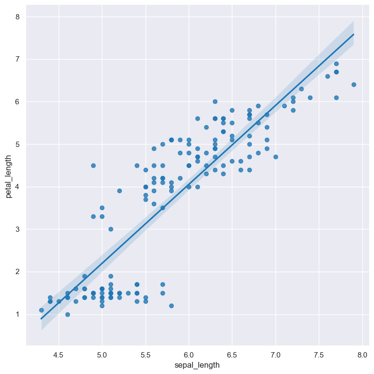
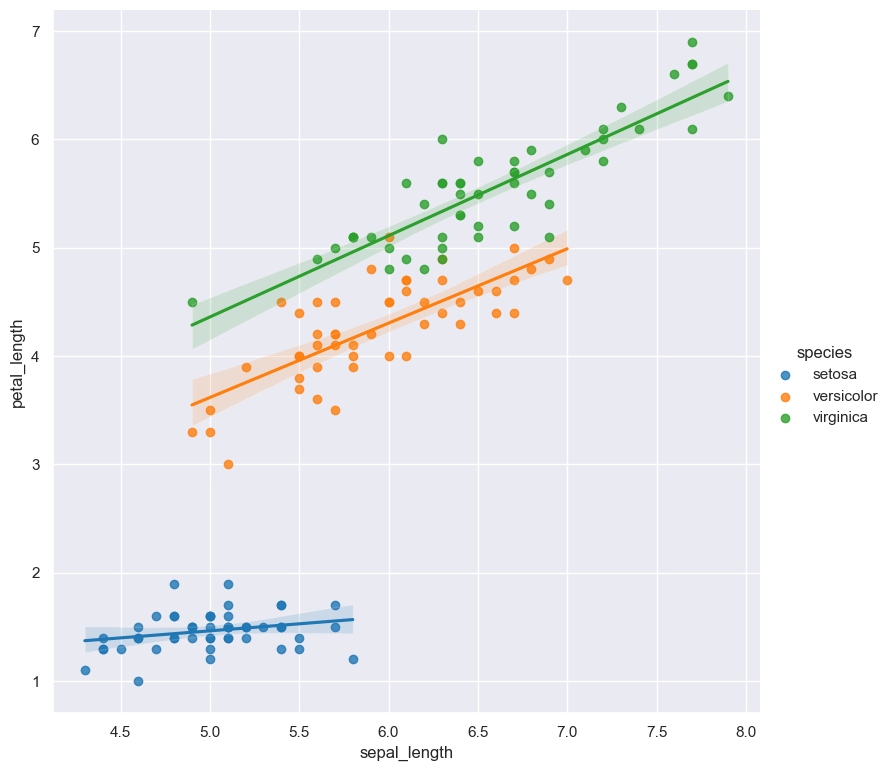
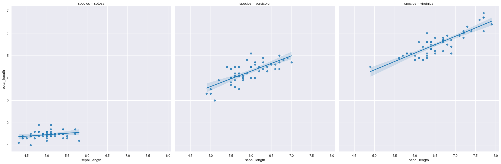

.. _lmplot:

lmplot
======

A scatter plot with a fitted linear model (linear regression).

.. code-block:: bash

    hatch lmplot <arguments>

Lmplots are based on Seaborn's `lmplot <https://seaborn.pydata.org/generated/seaborn.lmplot.html>`__ library function.

.. list-table::
   :widths: 25 20 10
   :header-rows: 1
   :class: tight-table

   * - Argument
     - Description
     - Reference
   * - ``-h``
     - display help
     - :ref:`help <lmplot_help>`
   * - * ``-x COLUMN``
       * ``--xaxis COLUMN``
     - select column for the X axis
     - :ref:`X axis <lmplot_column_selection>`
   * - * ``-y COLUMN``
       * ``--yaxis COLUMN``
     - select column for the Y axis
     - :ref:`Y axis <lmplot_column_selection>`
   * - ``--hue COLUMN``
     - group columns by hue
     - :ref:`hue <lmplot_hue>`
   * - ``--hueorder VALUE [VALUE ...]``
     - order of hue columns
     - :ref:`hue order <line_hueorder>`
   * - * ``--row COLUMN``
       * ``-r COLUMN``
     - column to use for facet rows
     - :ref:`facet rows <lmplot_facets>`
   * - * ``--col COLUMN``
       * ``-c COLUMN``
     - column to use for facet columns
     - :ref:`facet columns <lmplot_facets>`
   * - ``--colwrap INT``
     - wrap the facet column at this width, to span multiple rows
     - :ref:`facet wrap <lmplot_facets>`

Simple example
--------------

A lmplot showing the relationship between ``sepal_length`` and ``petal_length`` in the ``iris.csv`` data set:

.. code-block:: bash

    hatch lmplot -x sepal_length -y petal_length < iris.csv 

The output of the above command is written to ``lmplot.sepal_length.petal_length.png``.

|

.. _lmplot_help:

Getting help
------------

The full set of command line arguments for lmplots can be obtained with the ``-h`` or ``--help``
arguments:

.. code-block:: bash

    hatch lmplot -h

.. _lmplot_column_selection:

Selecting columns to plot
--------------------------

.. code-block::

  -x COLUMN, --xaxis COLUMN
  -y COLUMN, --yaxis COLUMN

The X and Y axes of an lmplot can be selected using ``-x`` (or ``--xaxis``) and ``-y`` (or ``--yaxis``).

Both axes in an lmplot must be numerical.

.. _lmplot_hue:

Grouping data points with hue
------------------------------

.. code-block::

  --hue COLUMN

The data points can be grouped by an additional numerical or categorical column with the ``--hue`` argument.
A linear model will be fitted to each separate group of points.

In the following example the data points in an lmplot comparing ``sepal_length`` and ``petal_length`` are
grouped by their corresponding categorical ``day`` value, and a linear model is fitted to both groups.

.. code-block:: bash

    hatch lmplot -x sepal_length -y petal_length --hue species < iris.csv

.. _lmplot_hueorder:

For categorical hue groups, the order displayed in the legend is determined from their occurrence in the input data. This can be overridden with the ``--hueorder`` argument, which allows you to specify the exact ordering of
the hue groups in the legend.

.. _lmplot_facets:

Facets
------

.. code-block::

 -r COLUMN, --row COLUMN
 -c COLUMN, --col COLUMN
 --colwrap INT

Lmplots can be further divided into facets, generating a matrix of plots, where a numerical value is
further categorised by up to 2 more categorical columns.

See the :doc:`facet documentation <facets/>` for more information on this feature.

For example the following command produces an lmplot comparing ``sepal_length`` with ``petal_length``, such that facet column is determined by the value of the ``species`` column.

.. code-block:: bash

    hatch lmplot -x sepal_length -y petal_length --col species < iris.csv 

|

