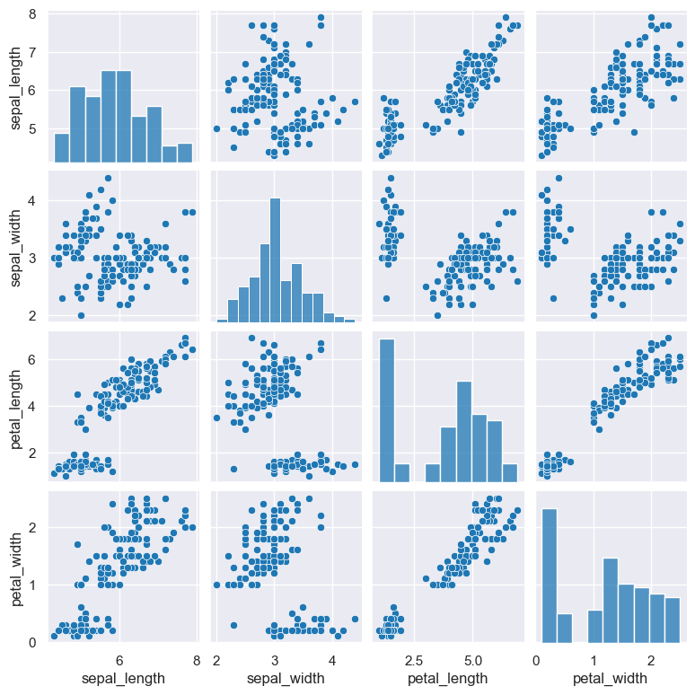

.. _pair:

pair
====

Plot relationships between pairs of variables on a grid of axes.

By default comparisons are made between
all numerical variables in the data, however it is possible to specify which variables to compare, including
categorical variables as well.

Pair plots are based on Seaborn's `pairplot <https://seaborn.pydata.org/generated/seaborn.pairplot.html>`_ library function.

.. code-block:: bash

    hatch pair <arguments>

.. list-table::
   :widths: 25 20 10
   :header-rows: 1
   :class: tight-table

   * - Argument
     - Description
     - Reference
   * - ``-h``
     - display help for this command
     - :ref:`help <pair_help>`
   * - * ``-c [FEATURE ...]``
       * ``--columns [FEATURE ...]``
     - select columns to compare 
     - :ref:`columns <pair_columns>`:

Simple example
--------------

The following example generates a pair plot comparing all the numerical features in the ``iris.csv`` data set. By default, if no column names are
specified, all the numerical columns will be compared.

.. code-block:: bash

    hatch pair < iris.csv

The output of the above command is written to ``pair.png``:

|

.. _pair_help:

Getting help
------------

The full set of command line arguments for pair plots can be obtained with the ``-h`` or ``--help``
arguments:

.. code-block:: bash

    hatch pair -h

.. _pair_columns:

Selecting columns to compare
----------------------------
