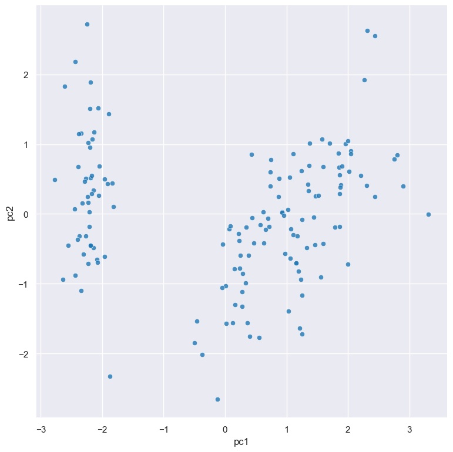

.. _pca:

pca
===

Perform `principal component analysis (PCA) <https://en.wikipedia.org/wiki/Principal_component_analysis>`_ on numerical columns in a dataset.

PCA is a popular dimensionality reduction technique. It transforms data into new coordinates such that most of the variation in the data is described with fewer dimensions than the original data.

The ``pca`` command adds new columns to the dataset representing the computed principal components.

Usage
-----

.. code-block:: text

    gurita pca [-h] [-c NAME [NAME ...]] [--prefix PREFIX] [-n COMPONENTS] 

Arguments
---------

.. list-table::
   :widths: 25 20 10
   :header-rows: 1
   :class: tight-table

   * - Argument
     - Description
     - Reference
   * - * ``-h``
       * ``--help``
     - display help for this command
     - :ref:`help <pca_help>`
   * - * ``-c COLUMN [COLUMN...]``
       * ``--columns COLUMN [COLUMN...]``
     - apply PCA to these columns 
     - :ref:`PCA columns <pca_columns>`
   * - * ``-n COMPONENTS``
       * ``--ncomps COMPONENTS`` 
     - number of principal components to generate (default: 2) 
     - :ref:`number of components <pca_ncomps>`
   * - ``--prefix PREFIX``
     - choose a column name prefix for new PCA columns (default: pc)
     - :ref:`new column name prefix <pca_prefix>`

Simple example
--------------

The following command computes the first two principal components of the numerical columns in the ``iris.csv`` file: 

.. code-block:: text

   gurita pca < iris.csv

The output is quite long so we can adjust the command to look at only the first few rows using the :doc:`head <head>` command:

.. code-block:: text

   gurita pca + head < iris.csv

The output of the above command is as follows:

.. code-block:: text

   sepal_length,sepal_width,petal_length,petal_width,species,pc1,pc2
   5.1,3.5,1.4,0.2,setosa,-2.2645417283948928,0.5057039027737834
   4.9,3.0,1.4,0.2,setosa,-2.0864255006161576,-0.6554047293691353
   4.7,3.2,1.3,0.2,setosa,-2.367950449062523,-0.3184773108472487
   4.6,3.1,1.5,0.2,setosa,-2.3041971611520085,-0.5753677125331953
   5.0,3.6,1.4,0.2,setosa,-2.388777493505642,0.6747673967025161

Two new columns are added to the output dataset, called ``pc1`` and ``pc2``, representing the first and second principal components
of the numerical columns in the input data.

It is useful to visualise the principal components in a :doc:`scatter plot <scatter/>`, which can be achieved by chaining
with the ``scatter`` command:

.. code-block:: text

    gurita pca + scatter -x pc1 -y pc2 < iris.csv

The output of the above command is written to ``scatter.pc1.pc2.png``:

|

.. _pca_help:

Getting help
------------

The full set of command line arguments for ``pca`` can be obtained with the ``-h`` or ``--help``
arguments:

.. code-block:: bash

    gurita pca -h

.. _pca_columns:

Perform PCA on specified columns
--------------------------------

.. code-block:: text

   -c NAME [NAME ...], --columns NAME [NAME ...]

By default, if no column names are specified, PCA be performed on all of the numerical columns in the dataset.

However it is possible to perform PCA on a specific subset of columns via the ``-c/--columns`` argument.

For example, the following command performs PCA on just the columns ``sepal_length``, ``sepal_width``,  and ``petal_length`` (and hence ignores the ``petal_width`` column):

.. code-block:: text

    gurita pca -c sepal_length sepal_width petal_length < iris.csv

.. note::

   Non-numeric columns will be ignored by ``pca`` even if they are specified as arguments to ``-c/--columns``.

.. _pca_ncomps:

Choose the number of principal components to generate 
-----------------------------------------------------

.. code-block:: text

   -n COMPONENTS, --ncomps COMPONENTS

By default the ``pca`` command will computer the first two principal components on the input dataset.

This can be adjusted using the ``-n/--ncomps`` argument.

For example, the following command generates the first three principal components of all the numerical columns in the ``iris.csv`` file:

.. code-block:: text

    gurita pca -n 3 < iris.csv

The output is quite long so we can adjust the command to look at only the first few rows using the :doc:`head <head>` command:

.. code-block:: text

   gurita pca -n 3 + head < iris.csv

The output of the above command is as follows:

.. code-block:: text

   sepal_length,sepal_width,petal_length,petal_width,species,pc1,pc2,pc3
   5.1,3.5,1.4,0.2,setosa,-2.2645417283948928,0.5057039027737834,-0.12194334778175248
   4.9,3.0,1.4,0.2,setosa,-2.0864255006161576,-0.6554047293691353,-0.2272508323992485
   4.7,3.2,1.3,0.2,setosa,-2.367950449062523,-0.3184773108472487,0.05147962364496831
   4.6,3.1,1.5,0.2,setosa,-2.3041971611520085,-0.5753677125331953,0.09886044443740284
   5.0,3.6,1.4,0.2,setosa,-2.388777493505642,0.6747673967025161,0.021427848973115345

.. note::
 
   Let N be the number of rows and C be the number of numerical columns considered in a PCA.

   Let M = minimum(N, C).

   The number of principal components must be <= M.

   An error message will be generated if this condition is not met.

   For example, there are 150 rows and 4 numerical columns in the ``iris.csv``. Therefore
   a PCA applied to all the numerical columns must not request more than 4
   principal components, because 4 is the minimum(150, 4). Thus the following 
   command will generate an error:

   .. code-block:: text

        gurita pca -n 5 < iris.csv 

.. _pca_prefix:

Choose a column name prefix for new PCA columns
-----------------------------------------------

.. code-block:: text

    --prefix PREFIX 

The ``pca`` command adds extra numerical columns to the dataset to store the values for the computed principal components. 

The principal components are integers from 1 upwards (1, 2, 3, ...). The names of these extra columns are constructed by adding the preix ``pca`` 
on to the number of the component, for example ``pc1`` for the first component, ``pc2`` for the second component and so on.

This can be changed with the ``--prefix`` argument.

The following command specifies that ``comp`` should be used as the prefix for the newly added columns:

.. code-block:: text

   gurita pca --prefix comp < iris.csv

By chaining this command with ``head`` we can inspect the first few rows of the output:

.. code-block:: text

   gurita pca --prefix comp + head < iris.csv

The output of the above command is as follows:

.. code-block:: text

    sepal_length,sepal_width,petal_length,petal_width,species,comp1,comp2
    5.1,3.5,1.4,0.2,setosa,-2.2645417283948928,0.5057039027737834
    4.9,3.0,1.4,0.2,setosa,-2.0864255006161576,-0.6554047293691353
    4.7,3.2,1.3,0.2,setosa,-2.367950449062523,-0.3184773108472487
    4.6,3.1,1.5,0.2,setosa,-2.3041971611520085,-0.5753677125331953
    5.0,3.6,1.4,0.2,setosa,-2.388777493505642,0.6747673967025161

Observe that the two new principal component columns are called ``comp1`` and ``comp2`` respectively.
