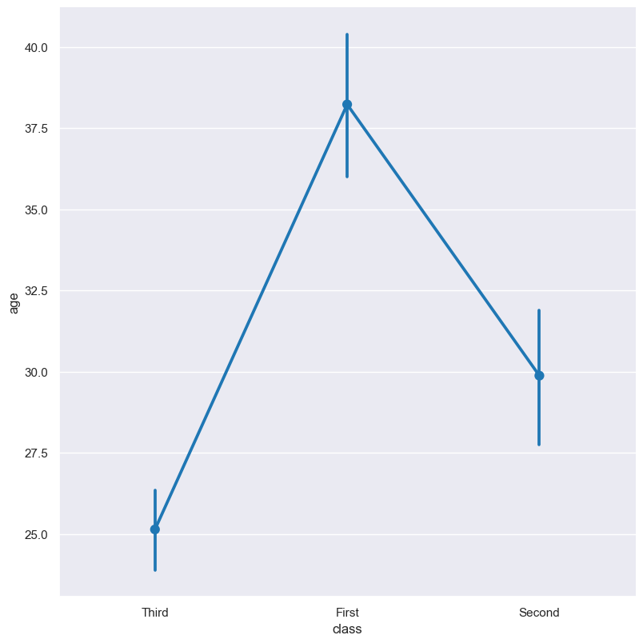
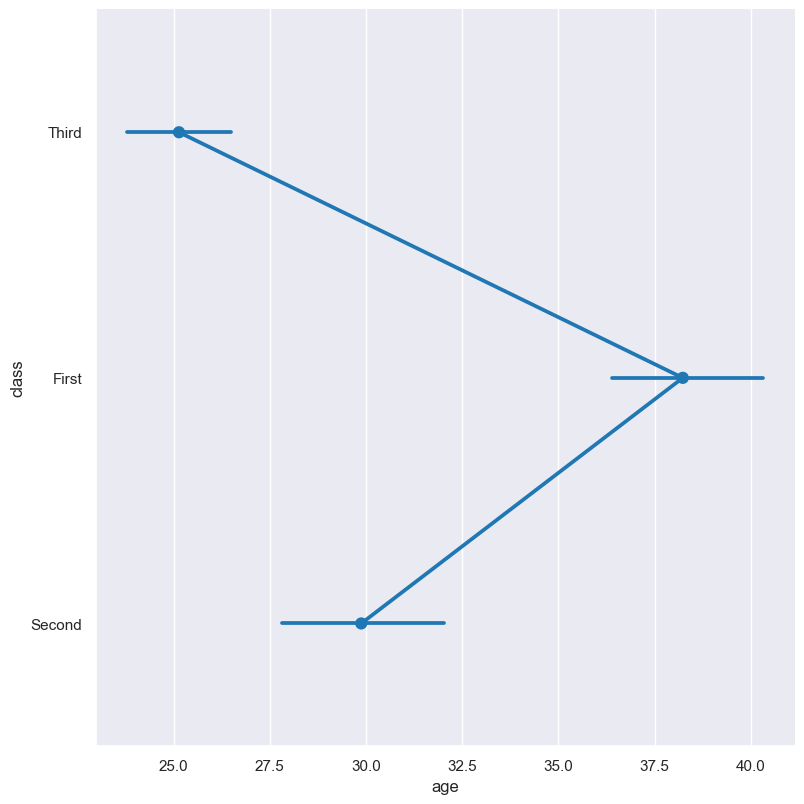
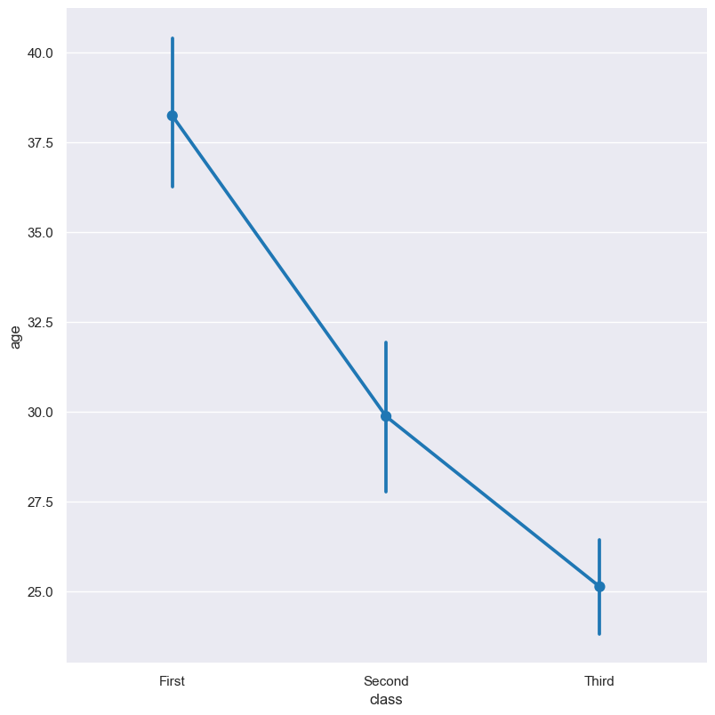
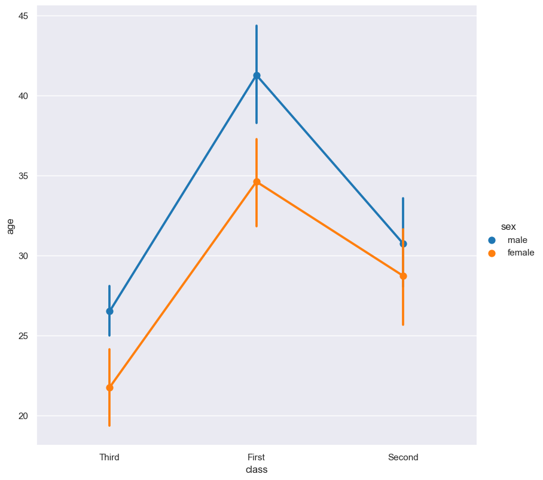
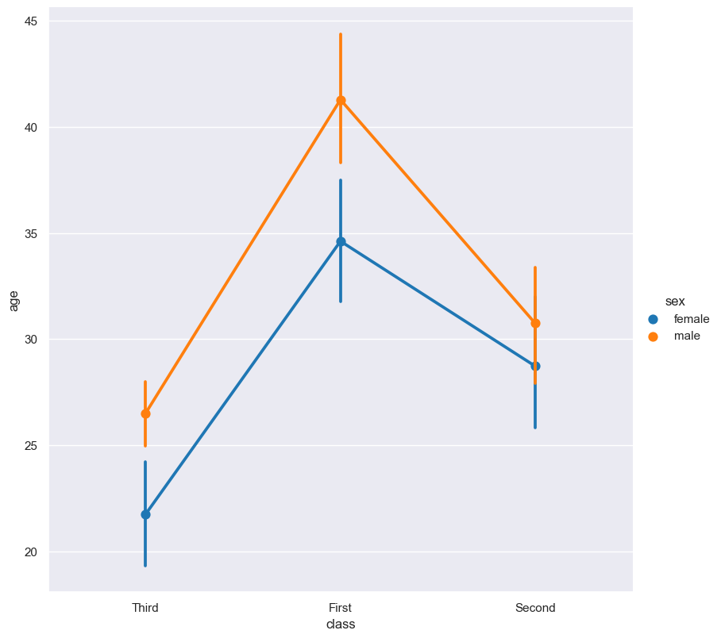
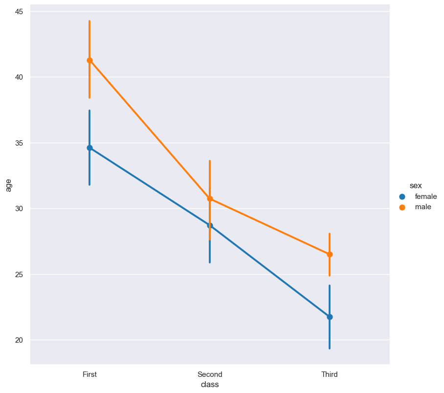

.. _point:

Point
*****

Point plots show the point estimates of the central tendency (mean) of numerical features with error bars. 

.. code-block:: bash

    hatch point <arguments>

Point plots are based on Seaborn's `catplot <https://seaborn.pydata.org/generated/seaborn.catplot.html>`_ library function, using the ``kind="point"`` option.

.. list-table::
   :widths: 1 2 1
   :header-rows: 1

   * - Argument
     - Description
     - Reference
   * - ``-h``
     - display help
     - :ref:`point_help`
   * - ``-x FEATURE [FEATURE ...], --xaxis FEATURE [FEATURE ...]``
     - select feature for the X axis
     - :ref:`point_feature_selection`
   * - ``-y FEATURE [FEATURE ...], --yaxis FEATURE [FEATURE ...]``
     - select feature for the Y axis
     - :ref:`point_feature_selection`
   * - ``--orient {v,h}``
     - Orientation of plot. Allowed values: v = vertical, h = horizontal. Default: v.
     - :ref:`Box orientation <point_orient>`
   * - ``--hue FEATURE [FEATURE ...]``
     - group features by hue
     - :ref:`point_hue`
   * - ``--hueorder FEATURE [FEATURE ...]``
     - order of hue features
     - :ref:`Hue order <point_hueorder>`
   * - ``--logy``
     - log scale Y axis 
     - :ref:`point_log`
   * - ``--xlim BOUND BOUND``
     - range limit X axis 
     - :ref:`point_range`
   * - ``--ylim BOUND BOUND``
     - range limit Y axis 
     - :ref:`point_range`
   * - ``--row FEATURE [FEATURE ...], -r FEATURE [FEATURE ...]``
     - feature to use for facet rows 
     - :ref:`point_facets`
   * - ``--col FEATURE [FEATURE ...], -c FEATURE [FEATURE ...]``
     - feature to use for facet columns 
     - :ref:`point_facets`
   * - ``--colwrap INT``
     - wrap the facet column at this width, to span multiple rows
     - :ref:`point_facets`

Similar functionality to point plots are provided by:

 * :doc:`Bar plots <boxen/>` 

Simple example
==============

Point plot showing the mean ``age`` for passengers on the titanic by passenger ``class``:

.. code-block:: bash

    hatch point -y age -x class -- titanic.csv 

The output of the above command is written to ``titanic.age.class.point.png``:

.. _point_help:

Getting help
============

The full set of command line arguments for point plots can be obtained with the ``-h`` or ``--help``
arguments:

.. code-block:: bash

    hatch point -h

.. _point_feature_selection:

Selecting features to plot
==========================

.. code-block:: 

  -x FEATURE [FEATURE ...], --xaxis FEATURE [FEATURE ...]
  -y FEATURE [FEATURE ...], --yaxis FEATURE [FEATURE ...]

Point plots can be plotted for numerical features and optionally grouped by categorical features.

If no categorical feature is specified, a single column point plot will be generated showing
the distribution of the numerical feature.

.. note:: 

    .. _point_orient:

    By default the orientation of the point plot is vertical. In this scenario
    the numerical feature is specified by ``-y``, and the (optional) categorical feature is specified
    by ``-x``.
    
    However, the orientation of the point plot can be made horizontal using the ``--orient h`` argument.
    In this case the sense of the X and Y axes are swapped from the default, and thus
    the numerical feature is specified by ``-x``, and the (optional) categorical feature is specified
    by ``-y``.

In the following example the distribution of ``age`` is shown for each value in the ``class`` feature,
where the boxes are plotted horizontally:

.. code-block:: bash

    hatch point -x age -y class --orient h -- titanic.csv

.. _point_order:

Controlling the order of the plotted point columns
==================================================

.. code-block:: 

    --order FEATURE [FEATURE ...]

By default the order of the categorical features displayed in the point plot is determined from their occurrence in the input data.
This can be overridden with the ``--order`` argument, which allows you to specify the exact ordering of columns based on their values. 

In the following example the point columns of the ``class`` feature are displayed in the order of ``First``, ``Second``, ``Third``:

.. code-block:: bash

    hatch point -y age -x class --order First Second Third -- titanic.csv

.. _point_hue:

Grouping features with hue 
==========================

.. code-block:: 

  --hue FEATURE [FEATURE ...]

The data can be further grouped by an additional categorical feature with the ``--hue`` argument.

In the following example the distribution of ``age`` is shown for each value in the ``class`` feature, and further sub-divided by the ``sex`` feature:

.. code-block:: bash

    hatch point -y age -x class --hue sex -- titanic.csv

.. _point_hueorder:

By default the order of the columns within each hue group is determined from their occurrence in the input data. 
This can be overridden with the ``--hueorder`` argument, which allows you to specify the exact ordering of columns within each hue group, based on their values. 

In the following example the ``sex`` values are displayed in the order of ``female``, ``male``: 

.. code-block:: bash

    hatch point -y age -x class --hue sex --hueorder female male -- titanic.csv

It is also possible to use both ``--order`` and ``--hueorder`` in the same command. For example, the following command controls
the order of both the ``class`` and ``sex`` categorical features:

.. code-block:: bash

    hatch point -y age -x class --order First Second Third --hue sex --hueorder female male -- titanic.csv

.. _point_log:

Log scale of numerical distribution 
===================================

.. code-block:: 

  --logx
  --logy

The distribution of numerical values can be displayed in log (base 10) scale with ``--logx`` and ``--logy``. 

It only makes sense to log-scale the numerical axis (and not the categorical axis). Therefore, ``--logx`` should be used when numerical features are selected with ``-x``, and
conversely, ``--logy`` should be used when numerical features are selected with ``-y``.

For example, you can display a log scale point plot for the ``age`` feature grouped by ``class`` (when the distribution of ``age`` is displayed on the Y axis) like so. Note carefully that the numerical data is displayed on the Y-axis (``-y``), therefore the ``--logy`` argument should be used to log-scale the numerical distribution:

.. code-block:: bash

    hatch point -y age -x class --logy -- titanic.csv 

.. _point_range:

Range limits
============

.. code-block:: 

  --xlim LOW HIGH 
  --ylim LOW HIGH

The range of displayed numerical distributions can be restricted with ``--xlim`` and ``--ylim``. Each of these flags takes two numerical values as arguments that represent the lower and upper bounds of the range to be displayed.

It only makes sense to range-limit the numerical axis (and not the categorical axis). Therefore, ``--xlim`` should be used when numerical features are selected with ``-x``, and
conversely, ``--ylim`` should be used when numerical features are selected with ``-y``.

For example, you can display range-limited range for the ``age`` feature grouped by ``class`` (when the distribution of ``age`` is displayed on the Y axis) like so.
Note carefully that the numerical 
data is displayed on the Y-axis (``-y``), therefore the ``--ylim`` argument should be used to range-limit the distribution: 

.. code-block:: bash

    hatch point -y age -x class --ylim 10 30 -- titanic.csv

.. _point_facets:

Facets
======

.. code-block:: 

 --row FEATURE [FEATURE ...], -r FEATURE [FEATURE ...]
 --col FEATURE [FEATURE ...], -c FEATURE [FEATURE ...]
 --colwrap INT

Point plots can be further divided into facets, generating a matrix of point plots, where a numerical value is
further categorised by up to 2 more categorical features.

See the :doc:`facet documentation <facets/>` for more information on this feature.
