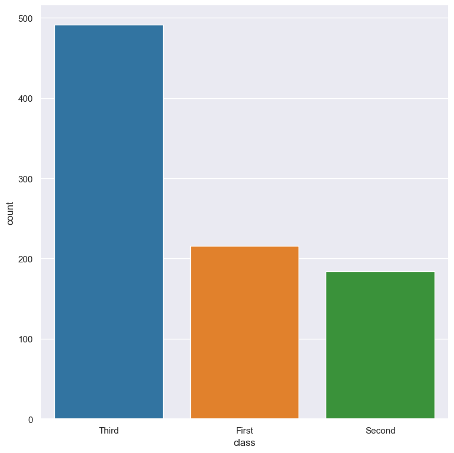
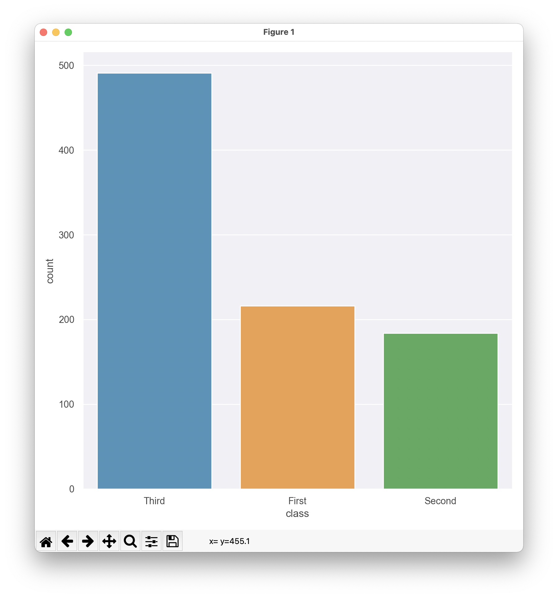

Saving and viewing plots
************************

Gurita provides several :ref:`plotting commands <plotting_command_list>` for visualising data as plots. 

Plots can be saved to files or viewed interactively.

Plots are saved to a file by default
------------------------------------

Gurita's default behaviour for plotting commands is to save the resulting image to a file in PNG format. 

For example, the following command generates a count plot of the ``class`` column from the input file ``titanic.csv`` and saves the resulting plot to a file called ``count.class.png``:

.. code-block:: text

    gurita count -x class < titanic.csv

The image below shows the resulting plot:

|

The default output plot file name is chosen using the following information:

 * The type of plot being generated (e.g. hist, scatter, count, etc). 
 * The name(s) of the columns that have been selected for plotting on the axes.
 * Optionally the names of columns that have been selected for grouping (specifically ``--hue`` and ``--row`` and ``--col`` for facet plots).
 * The file name extension is based on the format of the output file. By default this is ``png``, but it can be overridden with the ``--format`` option. 

As a slightly more complex example, consider the command below:

.. code-block:: text

   gurita scatter -x sepal_length -y petal_length --hue species < iris.csv

Gurita will save the output plot in a file called ``scatter.sepal_length.petal_length.species.png``. 

.. note::

   Gurita will avoid using the name of a file that already exists when choosing a default output file name for a plot.

   For example, if the file ``count.class.png`` already exists in the current directory Gurita will try to
   find a new unique name by appending a number, e.g. ``count.class_1.png``. If that file name exists
   it will increment the number and try again, e.g. ``count.class_2.png``, and so on.

   This avoids overwriting an existing file by accident.

   If you don't want this behaviour then you can specify a file name yourself and Gurita will write the
   plot to that file regardless of whether it already exists.

Specifying an output file name explicitly
-----------------------------------------

You can override the default behaviour and specify the name of the file to use with the ``-o <filename>`` or ``--out <filename>`` option. 

For example, the following command saves the output plot to a file called ``example.png``:

.. code-block:: text

    gurita count -x class -o example.png < titanic.csv

.. warning::

   If you tell Gurita to save a plot to a specific file name, and that file already exists, Gurita will overwrite the contents of the
   file with the new plot. This will lose old contents of the file.

.. _format:

Output plot graphics file format 
--------------------------------

By default Gurita will save output plots in the PNG file format. However, this can be overridden with the ``--format {png,jpg,pdf,svg}`` option.

Supported file formats:
=======================

Gurita supports the following file formats when saving plots to file:

 * `PNG <https://en.wikipedia.org/wiki/Portable_Network_Graphics>`_: ``--format png`` (this is the default format used by Gurita)
 * `JPEG <https://en.wikipedia.org/wiki/JPEG>`_: ``--format jpg``
 * `PDF <https://en.wikipedia.org/wiki/PDF>`_: ``--format pdf``
 * `SVG <https://en.wikipedia.org/wiki/SVG>`_: ``--format svg``

For example, the following command saves the output plot in SVG format, to a file called ``titanic.class.count.svg``:

.. code-block:: text

    gurita count -x class --format svg titanic.csv

.. note::

    If you use ``-o`` (or ``--out``) to specify an output file name, Gurita will use that name verbatim and will not append a suffix to the file name indicating the file type. Of course you may include a suffix in your own chosen name, however, this suffix does not influence the type of graphics format used. The only way to change the output graphics file format is with the ``--format`` option (otherwise the default ``png`` type is used).

.. _show:

Interactive plots
-----------------

The ``--show`` option overrides the default behaviour and causes the plot to be displayed in an interactive window (and not saved to a file). This assumes you are using Gurita in an environment with a graphics display.

This is illustrated below:

.. code-block:: text

    gurita count -x class --show titanic.csv

The plot will appear in an interactive window like so: 

|

Note that interactive plot commands pause the computation in a command chain. This is significant when the interactive plot is not the last command in the chain. For example, suppose you have a command like so:

.. code-block:: text

    gurita ... + count -x class --show + ... <rest of the command chain>

In this circumstance the command chain will pause while the interactive ``count`` plot is 
open. The rest of the command chain will resume when the plot is closed. 

Therefore, if a command chain contains multiple interactive plots, only one plot will be shown at a time.

