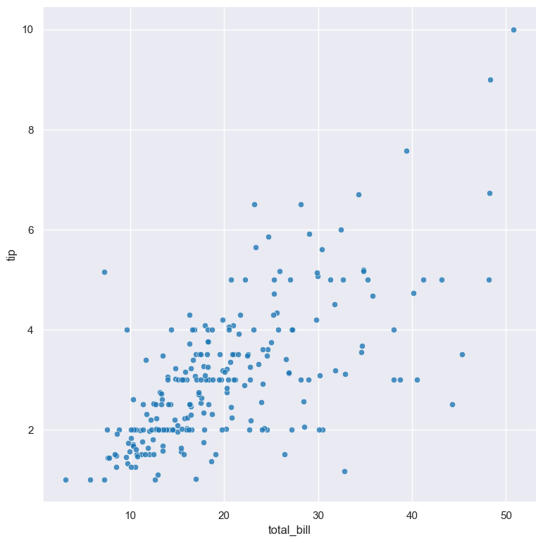
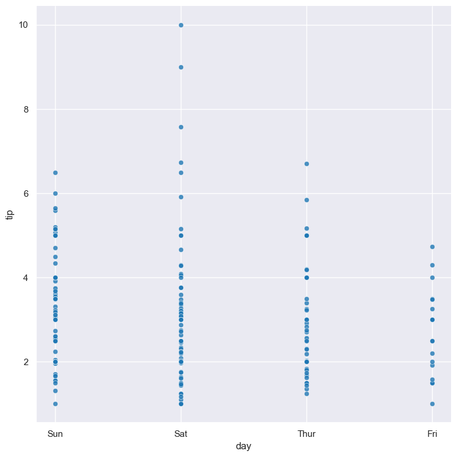
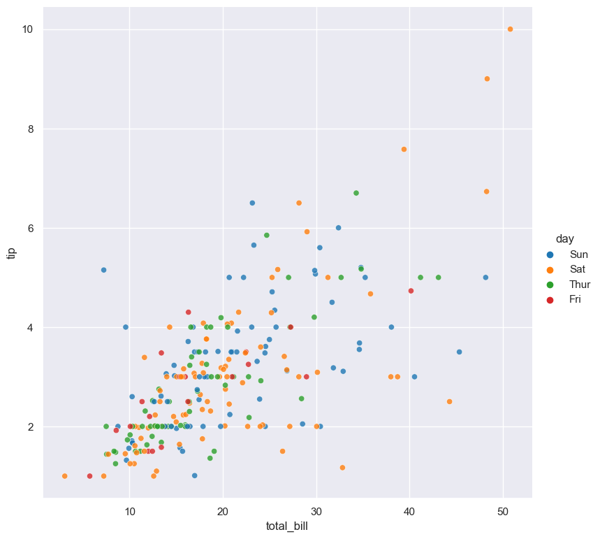
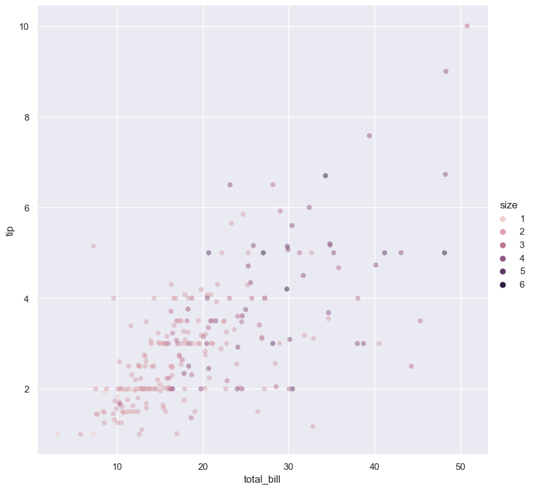
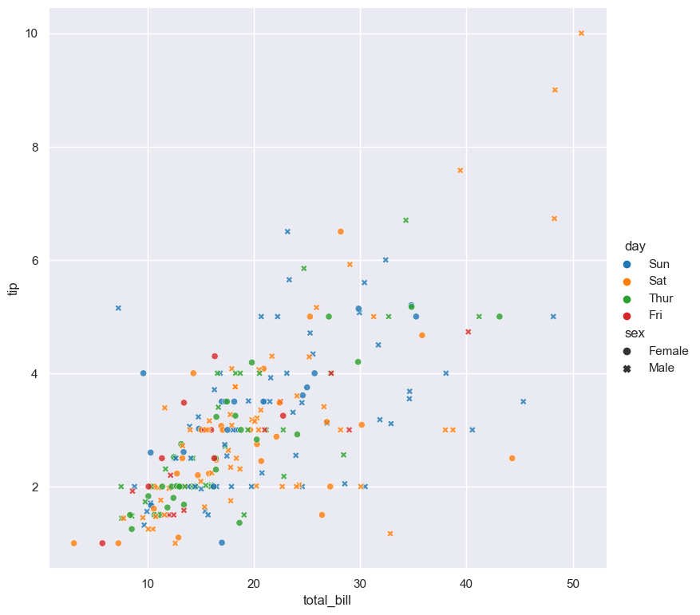
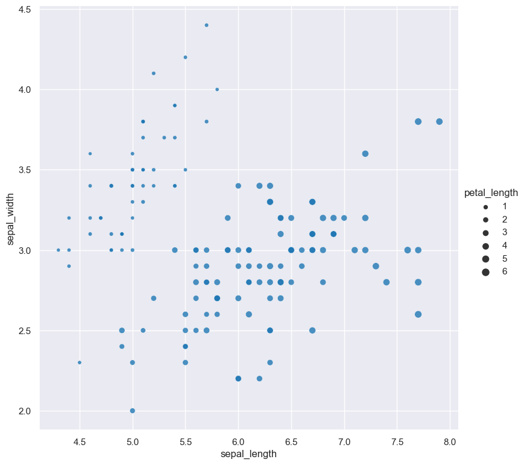
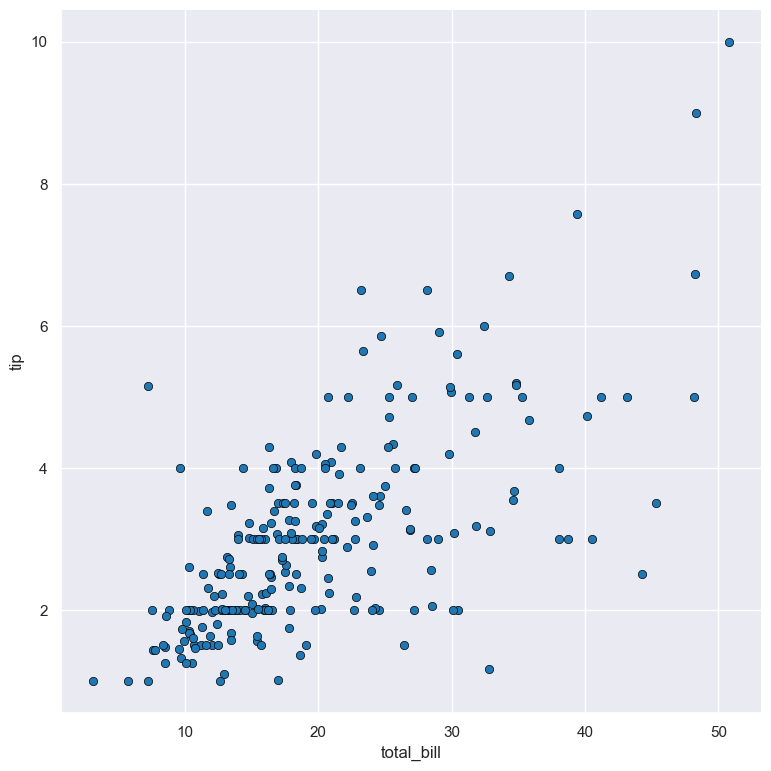
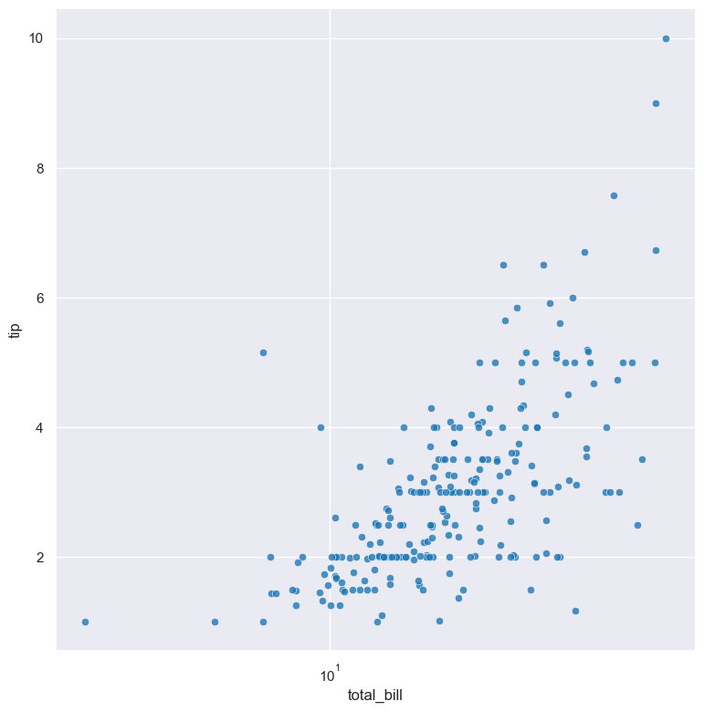
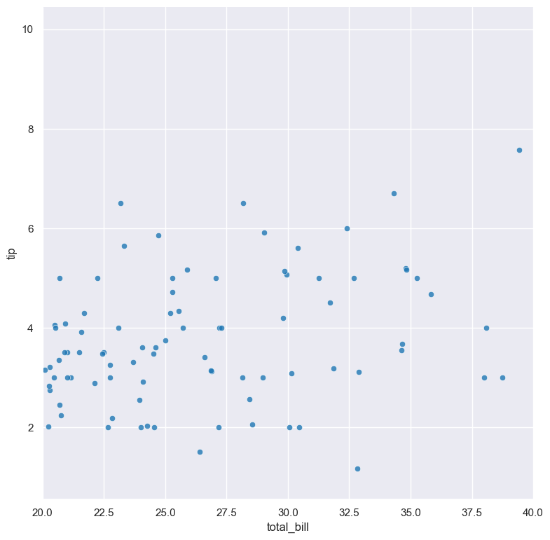
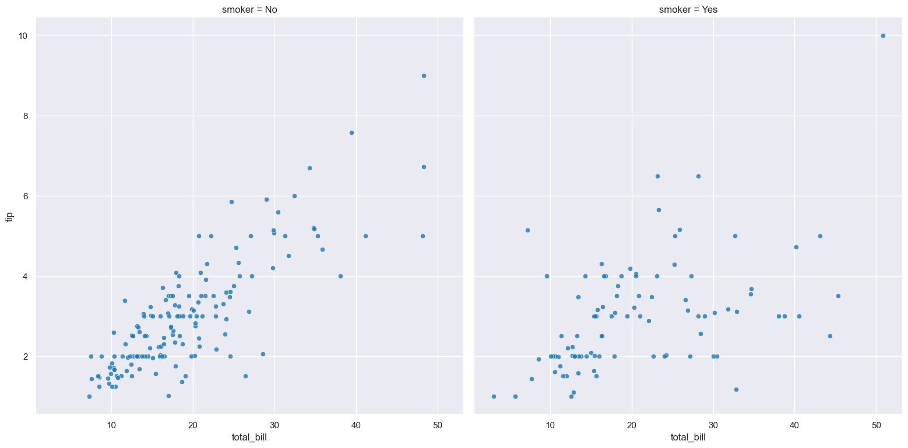

.. _scatter:

scatter
=======

Scatter plots show the relationship between two features as a scatter of data points.

.. code-block:: bash

    hatch scatter <arguments>

When one of the two features being compared is a categorical value the scatter plot is similar to
:doc:`strip plot <strip/>`.

Scatter plots are based on Seaborn's `relplot <https://seaborn.pydata.org/generated/seaborn.relplot.html>`_ library function, using the ``kind="scatter"`` option.

.. list-table::
   :widths: 25 20 10
   :header-rows: 1
   :class: tight-table 

   * - Argument
     - Description
     - Reference
   * - ``-h``
     - display help
     - :ref:`help <scatter_help>`
   * - * ``-x COLUMN``
       * ``--xaxis COLUMN``
     - select feature for the X axis
     - :ref:`X axis <scatter_feature_selection>`
   * - * ``-y COLUMN``
       * ``--yaxis COLUMN``
     - select feature for the Y axis
     - :ref:`Y axis <scatter_feature_selection>`
   * - ``--hue COLUMN``
     - group features by hue
     - :ref:`hue <scatter_hue>`
   * - ``--hueorder VALUE [VALUE ...]``
     - order of hue features
     - :ref:`hue order <scatter_hueorder>`
   * - ``--dotstyle COLUMN``
     - name of categorical feature to use for plotted dot marker style
     - :ref:`dot style <scatter_dotstyle>`
   * - ``--dotsize COLUMN``
     - scale the size of plotted dots based on a feature 
     - :ref:`dot size <scatter_dotsize>`
   * - ``--dotsizerange LOW HIGH``
     - size range for plotted point size
     - :ref:`dot size range <scatter_dotsize>`
   * - ``--dotalpha ALPHA``
     - alpha value for plotted points, default: 0.8  
     - :ref:`dot alpha <scatter_dotalpha_linewidth_linecolour>`
   * - ``--dotlinewidth WIDTH``
     - border line width value for plotted points
     - :ref:`dot line width <scatter_dotalpha_linewidth_linecolour>`
   * - ``--dotlinecolour COLOUR``
     - border line colour plotted point  
     - :ref:`dot border colour <scatter_dotalpha_linewidth_linecolour>`
   * - ``--logx``
     - log scale X axis 
     - :ref:`log X axis <scatter_log>`
   * - ``--logy``
     - log scale Y axis 
     - :ref:`log Y axis <scatter_log>`
   * - ``--xlim BOUND BOUND``
     - range limit X axis 
     - :ref:`limit X axis <scatter_range>`
   * - ``--ylim BOUND BOUND``
     - range limit Y axis 
     - :ref:`limit Y axis <scatter_range>`
   * - * ``-r COLUMN``
       * ``--row COLUMN``
     - feature to use for facet rows 
     - :ref:`facet rows <scatter_facets>`
   * - * ``-c COLUMN``
       * ``--col COLUMN``
     - feature to use for facet columns 
     - :ref:`facet columns <scatter_facets>`
   * - ``--colwrap INT``
     - wrap the facet column at this width, to span multiple rows
     - :ref:`facet wrap <scatter_facets>`

.. _scatter_example:

Simple example
--------------

Scatter plot of the ``tip`` numerical feature compared to the ``total_bill`` numerical feature from the ``tips.csv`` input file:

.. code-block:: bash

    hatch scatter -x total_bill -y tip < tips.csv 

The output of the above command is written to ``scatter.total_bill.tip.png``:

|

.. _scatter_help:

Getting help
------------

The full set of command line arguments for scatter plots can be obtained with the ``-h`` or ``--help``
arguments:

.. code-block:: bash

    hatch scatter -h

.. _scatter_feature_selection:

Selecting features to plot
--------------------------

.. code-block:: 

  -x COLUMN, --xaxis COLUMN
  -y COLUMN, --yaxis COLUMN

Scatter plots can be plotted for two numerical features as illustrated in the :ref:`example above <scatter_example>`, one on each of the axes.

Scatter plots can also be used to compare a numerical feature against a categorical feature. In the example below, the numerical ``tip`` feature is compared with the categorical ``day`` feature in the ``tips.csv`` dataset:

.. code-block::

    hatch scatter -x day -y tip < tips.csv

|

It should be noted that :doc:`strip plots <strip/>` achieve a similar result as above, and may be preferable over scatter plots when comparing numerical and categorical data. 

Swapping ``-x`` and ``-y`` in the above command would result in a horizontal plot instead of a vertical plot.

.. _scatter_hue:

Colouring data points with hue 
------------------------------

.. code-block:: 

  --hue COLUMN

The data points can be coloured by an additional numerical or categorical feature with the ``--hue`` argument.

In the following example the data points in a scatter plot comparing ``tip`` and ``total_bill`` are
coloured by their corresponding categorical ``day`` value: 

.. code-block:: bash

    hatch scatter -x total_bill -y tip --hue day < tips.csv 

|

When the ``--hue`` paramter specifies a numerical feature the colour scale is graduated.
For example, in the following scatter plot the numerical ``size`` feature is used for the ``--hue``
argument:

.. code-block:: bash

    hatch scatter -x total_bill -y tip --hue size < tips.csv 

|

.. _scatter_hueorder:

For categorical hue groups, the order displayed in the legend is determined from their occurrence in the input data. This can be overridden with the ``--hueorder`` argument, which allows you to specify the exact ordering of 
the hue groups in the legend.

.. _scatter_dotstyle:

Dot style 
---------

.. code-block:: 

    --dotstyle COLUMN 

By default dots in scatter plots are drawn as circles.

The ``--dotstyle`` argument lets you change the shape of dots based on a categorical feature.

.. code-block:: bash

    hatch scatter -x total_bill -y tip --hue day --dotstyle sex < tips.csv

|

In the above example the hue of dots is determined by the ``day`` feature and the dot marker style is determined by the ``sex`` feature. In this case ``male`` dots use a cross marker and ``female`` dots use a circle marker.

It is acceptable for both the ``--hue`` and ``--dotstyle`` arguments to be based on the same (categorical) feature in the data set. In such cases both the colour and marker shape will vary with 
the underlying feature.

.. _scatter_dotsize:

Dot size
--------

.. code-block:: 

    --dotsize COLUMN 
    --dotsizerange LOW HIGH

The size of plotted dots in the scatter plot can be scaled according the a numerical feature with the ``--dotsize`` argument.

The following example generates a scatter plot comparing ``sepal_length`` to ``sepal_width`` using the ``iris.csv`` dataset. The size of dots in the
plot is scaled according to the ``petal_length`` feature.

.. code-block:: bash

    hatch scatter -x sepal_length -y sepal_width --dotsize petal_length < iris.csv  

|

The range of dot sizes can be adjusted with ``--dotsizerange LOW HIGH``.

.. code-block:: bash

    hatch scatter -x sepal_length -y sepal_width --dotsize petal_length --dotsizerange 10 200 < iris.csv

.. image:: ../images/scatter.sepal_length.sepal_width.sizerange.png 
       :width: 600px 
       :height: 500px 
       :align: center
       :alt: Scatter plot comparing sepal_length and sepal_width with dot size scaled by petal_length using the iris.csv dataset, where the size range of dots is set between 10 and 200

|

.. _scatter_dotalpha_linewidth_linecolour:

Dot transparency, border line width, border line colour
-------------------------------------------------------

.. code-block:: 

    --dotalpha ALPHA 
    --dotlinewidth WIDTH
    --dotlinecolour COLOUR

The transparency of dots is defined by the *dot alpha* value, which is a number ranging from 0 to 1, where 0 is fully transparent and 1 is
fully opaque.

By default the alpha transparency value of scatter plot dots is 0.8. This can be
overridden with ``--dotalpha``.

Dots are plotted with a thin white border by default. The border line width can be changed with ``--dotlinewidth`` and the border line colour can 
be changed with ``--dotlinecolour``.

In the following example, the dot alpha is set to 1 (fully opaque), the border line width is set to 0.5, and the border line colour is set to black.

.. code-block:: bash

    hatch scatter -x total_bill -y tip --dotalpha 1 --dotlinewidth 0.5 --dotlinecolour black < tips.csv

|

.. _scatter_log:

Log scale
---------

.. code-block:: 

  --logx
  --logy

The distribution of numerical values can be displayed in log (base 10) scale with ``--logx`` and ``--logy``. 

For example the following command produces a scatter plot comparing ``total_bill`` with ``tip``, such that ``total_bill`` on the X axis is plotted in log scale:

.. code-block:: bash

    hatch scatter -x total_bill -y tip --logx < tips.csv 

|

.. _scatter_range:

Axis range limits
-----------------

.. code-block:: 

  --xlim LOW HIGH 
  --ylim LOW HIGH

The range of displayed numerical distributions can be restricted with ``--xlim`` and ``--ylim``. Each of these flags takes two numerical values as arguments that represent the lower and upper bounds of the (inclusive) range to be displayed.

For example the following command produces a scatter plot comparing ``total_bill`` with ``tip``, such that the range of ``total_bill`` on the X axis is limited to values between 20 and 40 inclusive: 

.. code-block:: bash

    hatch scatter -x total_bill -y tip --xlim 20 40 < tips.csv 

|

.. _scatter_facets:

Facets
------

.. code-block:: 

 -r COLUMN, --row COLUMN  
 -c COLUMN, --col COLUMN
 --colwrap INT

Scatter plots can be further divided into facets, generating a matrix of scatter plots, where a numerical value is
further categorised by up to 2 more categorical features.

See the :doc:`facet documentation <facets/>` for more information on this feature.

For example the following command produces a scatter plot comparing ``total_bill`` with ``tip``, such that facet column is determined by the value of the ``smoker`` feature. 

.. code-block:: bash

    hatch scatter -x total_bill -y tip --col smoker < tips.csv

|
