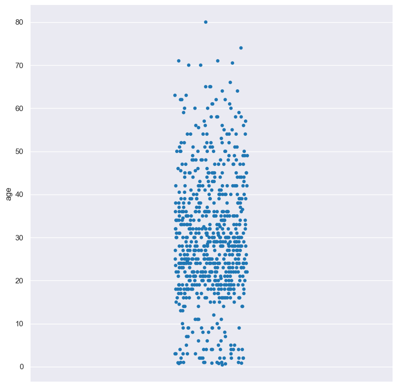
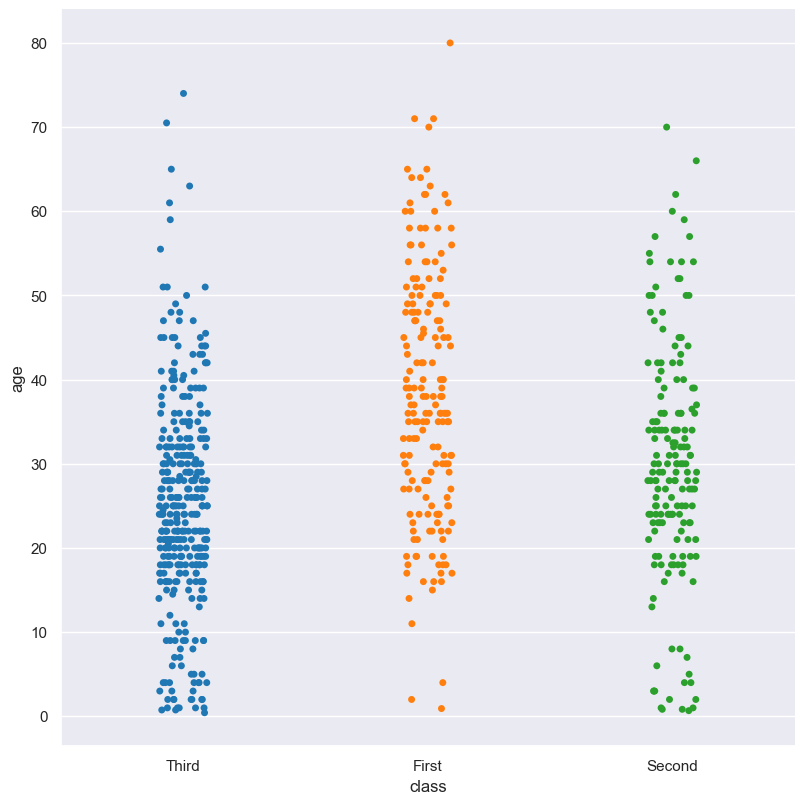
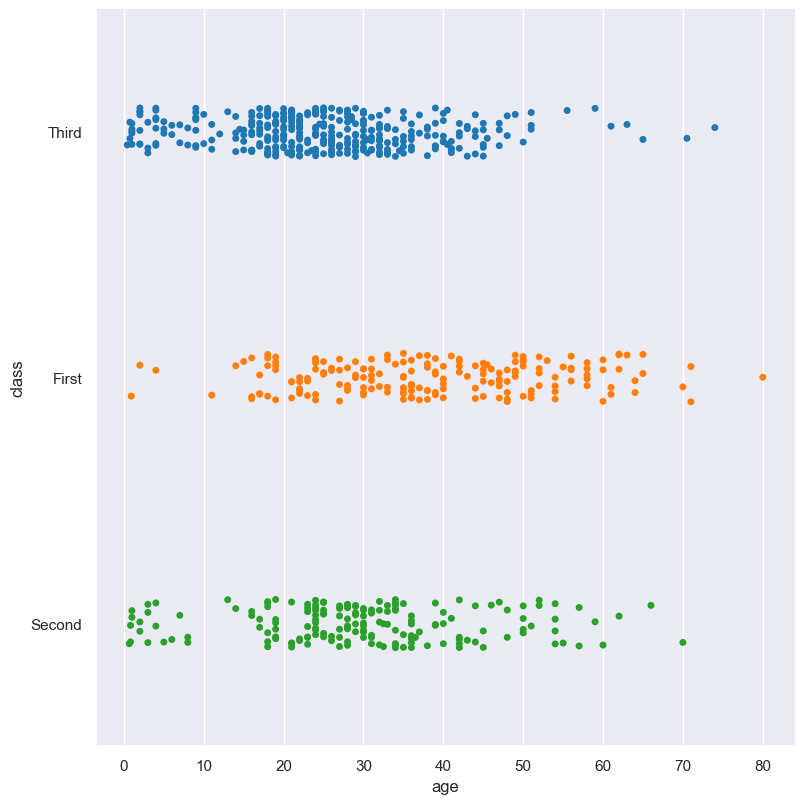
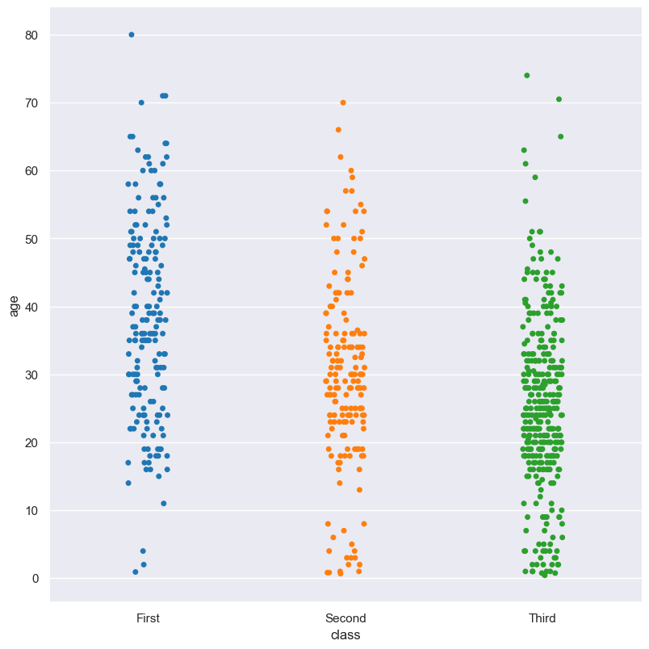
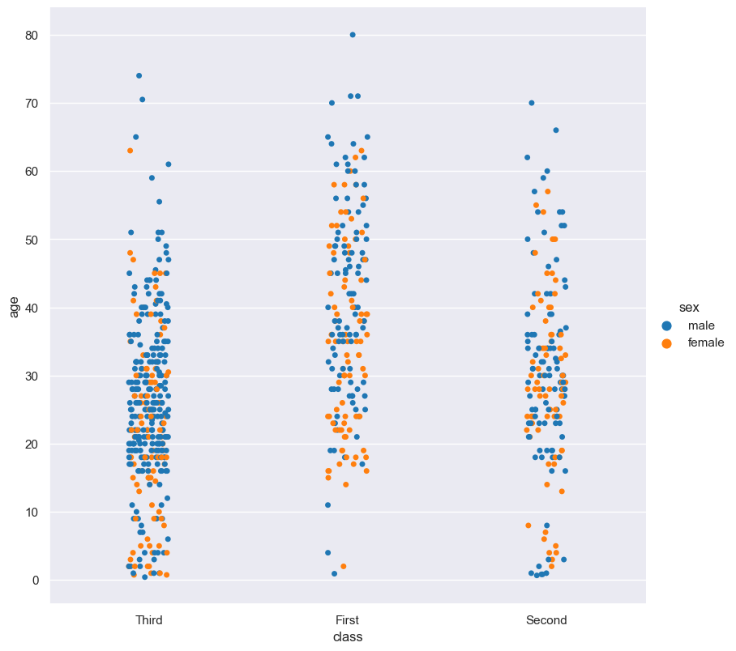
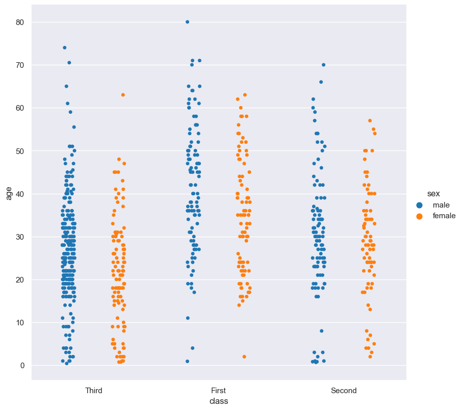
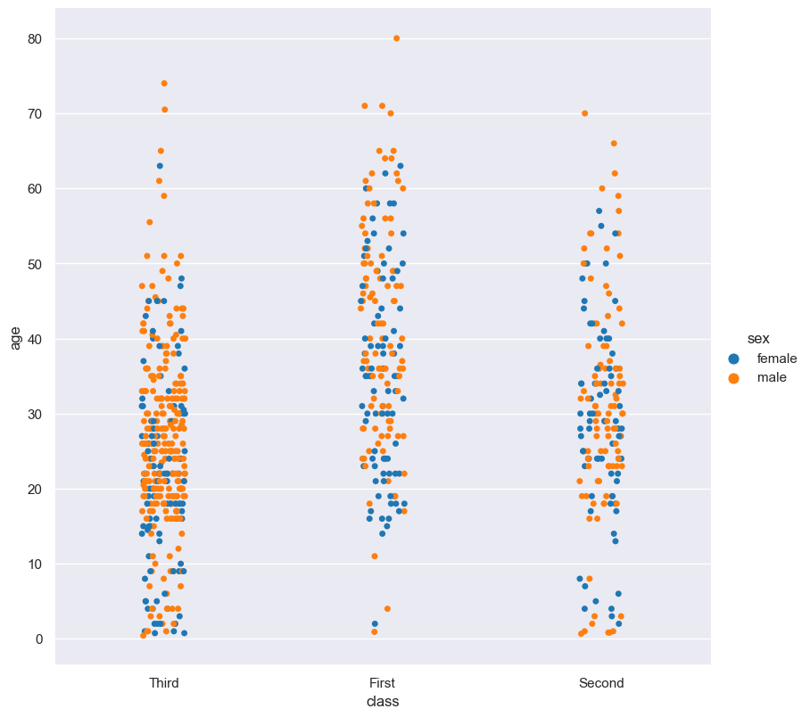
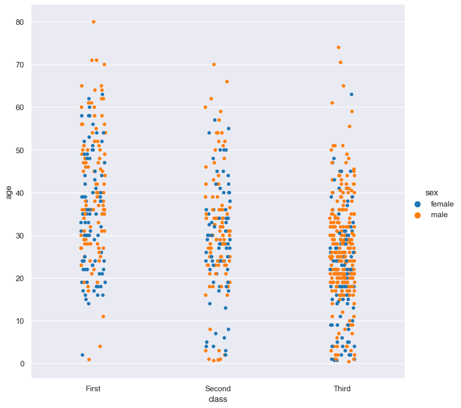

Strip
*****

Strip plots show the distribution of values in a numerical feature optionally grouped by categorical features.

.. code-block:: bash

    hatch strip <arguments>

Strip plots are based on Seaborn's `catplot <https://seaborn.pydata.org/generated/seaborn.catplot.html>`_ library function, using the ``kind="strip"`` option.

.. list-table::
   :widths: 1 2 1
   :header-rows: 1

   * - Argument
     - Description
     - Reference
   * - ``-h``
     - display help
     - :ref:`strip_help`
   * - ``-x FEATURE, --xaxis FEATURE``
     - select feature for the X axis
     - :ref:`strip_feature_selection`
   * - ``-y FEATURE, --yaxis FEATURE``
     - select feature for the Y axis
     - :ref:`strip_feature_selection`
   * - ``--orient {v,h}``
     - Orientation of plot. Allowed values: v = vertical, h = horizontal. Default: v.
     - :ref:`Box orientation <strip_orient>`
   * - ``--hue FEATURE``
     - group features by hue
     - :ref:`strip_hue`
   * - ``--dodge``
     - separate hue levels along the categorical axis  
     - :ref:`dodge <strip_dodge>`
   * - ``--hueorder FEATURE [FEATURE ...]``
     - order of hue features
     - :ref:`Hue order <strip_hueorder>`
   * - ``--logy``
     - log scale Y axis 
     - :ref:`strip_log`
   * - ``--xlim BOUND BOUND``
     - range limit X axis 
     - :ref:`strip_range`
   * - ``--ylim BOUND BOUND``
     - range limit Y axis 
     - :ref:`strip_range`
   * - ``--row FEATURE, -r FEATURE``
     - feature to use for facet rows 
     - :ref:`strip_facets`
   * - ``--col FEATURE, -c FEATURE``
     - feature to use for facet columns 
     - :ref:`strip_facets`
   * - ``--colwrap INT``
     - wrap the facet column at this width, to span multiple rows
     - :ref:`strip_facets`

Similar functionality to strip plots are provided by:

 * :doc:`Box plots <box/>`
 * :doc:`Violin plots <violin/>`
 * :doc:`Swarm plots <swarm/>` 
 * :doc:`Boxen plots <boxen/>` 

Simple example
==============

Strip plot of the ``age`` numerical feature from the ``titanic.csv`` input file:

.. code-block:: bash

    hatch strip -y age -- titanic.csv 

The output of the above command is written to ``titanic.age.strip.png``:

The plotted numerical feature can be divided into groups based on a categorical feature.
In the following example the distribution of ``age`` is shown for each value in the ``class`` feature:

.. code-block:: bash

    hatch strip -y age -x class -- titanic.csv 

The output of the above command is written to ``titanic.age.class.strip.png``:

.. _strip_help:

Getting help
============

The full set of command line arguments for strip plots can be obtained with the ``-h`` or ``--help``
arguments:

.. code-block:: bash

    hatch strip -h

.. _strip_feature_selection:

Selecting features to plot
==========================

.. code-block:: 

  -x FEATURE [FEATURE ...], --xaxis FEATURE [FEATURE ...]
  -y FEATURE [FEATURE ...], --yaxis FEATURE [FEATURE ...]

Strip plots can be plotted for numerical features and optionally grouped by categorical features.

If no categorical feature is specified, a single column strip plot will be generated showing
the distribution of the numerical feature.

.. note:: 

    .. _strip_orient:

    By default the orientation of the strip plot is vertical. In this scenario
    the numerical feature is specified by ``-y``, and the (optional) categorical feature is specified
    by ``-x``.
    
    However, the orientation of the strip plot can be made horizontal using the ``--orient h`` argument.
    In this case the sense of the X and Y axes are swapped from the default, and thus
    the numerical feature is specified by ``-x``, and the (optional) categorical feature is specified
    by ``-y``.

In the following example the distribution of ``age`` is shown for each value in the ``class`` feature,
where the boxes are plotted horizontally:

.. code-block:: bash

    hatch strip -x age -y class --orient h -- titanic.csv

.. _strip_order:

Controlling the order of the plotted strip columns
==================================================

.. code-block:: 

    --order FEATURE [FEATURE ...]

By default the order of the categorical features displayed in the strip plot is determined from their occurrence in the input data.
This can be overridden with the ``--order`` argument, which allows you to specify the exact ordering of columns based on their values. 

In the following example the strip columns of the ``class`` feature are displayed in the order of ``First``, ``Second``, ``Third``:

.. code-block:: bash

    hatch strip -y age -x class --order First Second Third -- titanic.csv

.. _strip_hue:

Grouping features with hue 
==========================

.. code-block:: 

  --hue FEATURE

The data can be further grouped by an additional categorical feature with the ``--hue`` argument.

In the following example the distribution of ``age`` is shown for each value in the ``class`` feature, and further sub-divided by the ``sex`` feature:

.. code-block:: bash

    hatch strip -y age -x class --hue sex -- titanic.csv

.. _strip_dodge:

As the previous example demonstrates, when ``--hue`` is used, by default all hue levels are shown mixed together in the same strip.
However, you might want to show each hue level in its own strip. This can be achieved with the ``--dodge`` command.

The ``--dodge`` argument will separate hue levels along the categorical axis, rather than mix them together:

.. code-block:: bash

    hatch strip -y age -x class --hue sex --dodge -- titanic.csv

.. _strip_hueorder:

By default the order of the columns within each hue group is determined from their occurrence in the input data. 
This can be overridden with the ``--hueorder`` argument, which allows you to specify the exact ordering of columns within each hue group, based on their values. 

In the following example the ``sex`` values are displayed in the order of ``female``, ``male``: 

.. code-block:: bash

    hatch strip -y age -x class --hue sex --hueorder female male -- titanic.csv

It is also possible to use both ``--order`` and ``--hueorder`` in the same command. For example, the following command controls
the order of both the ``class`` and ``sex`` categorical features:

.. code-block:: bash

    hatch strip -y age -x class --order First Second Third --hue sex --hueorder female male -- titanic.csv

.. _strip_log:

Log scale of numerical distribution 
===================================

.. code-block:: 

  --logx
  --logy

The distribution of numerical values can be displayed in log (base 10) scale with ``--logx`` and ``--logy``. 

It only makes sense to log-scale the numerical axis (and not the categorical axis). Therefore, ``--logx`` should be used when numerical features are selected with ``-x``, and
conversely, ``--logy`` should be used when numerical features are selected with ``-y``.

For example, you can display a log scale strip plot for the ``age`` feature grouped by ``class`` (when the distribution of ``age`` is displayed on the Y axis) like so. Note carefully that the numerical data is displayed on the Y-axis (``-y``), therefore the ``--logy`` argument should be used to log-scale the numerical distribution:

.. code-block:: bash

    hatch strip -y age -x class --logy -- titanic.csv 

.. _strip_range:

Range limits
============

.. code-block:: 

  --xlim LOW HIGH 
  --ylim LOW HIGH

The range of displayed numerical distributions can be restricted with ``--xlim`` and ``--ylim``. Each of these flags takes two numerical values as arguments that represent the lower and upper bounds of the range to be displayed.

It only makes sense to range-limit the numerical axis (and not the categorical axis). Therefore, ``--xlim`` should be used when numerical features are selected with ``-x``, and
conversely, ``--ylim`` should be used when numerical features are selected with ``-y``.

For example, you can display range-limited range for the ``age`` feature grouped by ``class`` (when the distribution of ``age`` is displayed on the Y axis) like so.
Note carefully that the numerical 
data is displayed on the Y-axis (``-y``), therefore the ``--ylim`` argument should be used to range-limit the distribution: 

.. code-block:: bash

    hatch strip -y age -x class --ylim 10 30 -- titanic.csv

.. _strip_facets:

Facets
======

.. code-block:: 

 --row FEATURE [FEATURE ...], -r FEATURE [FEATURE ...]
 --col FEATURE [FEATURE ...], -c FEATURE [FEATURE ...]
 --colwrap INT

Strip plots can be further divided into facets, generating a matrix of strip plots, where a numerical value is
further categorised by up to 2 more categorical features.

See the :doc:`facet documentation <facets/>` for more information on this feature.
